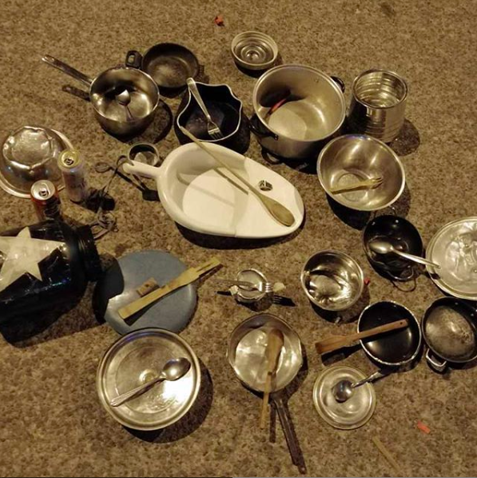

#### FOLIO: LRE1
# Asamblea Plaza Chile-Perú

[instagram](https://www.instagram.com/lareinadesperto/)
[facebook](https://www.facebook.com/lareinadesperto/)

---

### Representantes
#### No tienen representantes.

---
### Interacciones frecuentes
#### 
* La Reina Organizada
* Asamblea de jovenes la reina

### Redes sociales
#### ¿Para qué se utiliza la red social?
| Instagram | Facebook |
|---|---|---|---|
|Difusión de actividades e informaciones varias |Videos en vivo y difusión de información|

### **Instagram**
| seguidores | seguidos | publicaciones | hashtag 
|---|---|---|---|
|815|604|52| 0

* Primera Publicación IG: 15/11/2019

---
### Frecuencia de publicación.

Publicaciones: 
* Feed: Dos veces al mes.
* Historias: semanalmente.
Actividades: Una vez al mes.

---
### Ubicación
* Plaza Chile-Perú

---
### Describir temas de interés y/o trabajo
* Organización vecinal
* Derechos humanos
* Medioambiente

---
### Describir la imagen ideal por la cual se trabaja.
####
* Unidad, apoyo y colaboración vecinal
* Contribuir a la construcción de un chile mejor, más justo y sustentable

---
### ¿Que se hace?
####
* Huerto urbano comunitario [Link](https://www.instagram.com/p/CGQmyf1JrEc/)
* Actividades conmemorativas 
* Asambleas con otras asambleas del sector
* Reuniones vecinales
* Talleres y conversatorios de diversas tematicas como proceso constituyente, medio ambiente, feminismo.
* Cabildos tematicos
* Difusión de actividades que no pertenecen a la asamblea pero que son interesantes para la comunidad
* Intervenciones callejeras
* Manifestaciones
    * Cacerolazos
    * Marchas territoriales
* Escuela popular constituyente
* Malones y actividades culturales para la familia
* Cuecazos comunales

---
### Describir y distinguir demandas más reivindicativas de espacios sin relación con lo contencioso o con lo político mas prefigurativo
#### 
* Vecinos que trabajan y colaboran juntos
> Vecin@s que se miran a la cara, que hablan en la calle, que se ponen acuerdo, que luchan por la dignidad. Construyendo un Chile nuestro y democrático. ¡No pararemos hasta lograrlo!
* Abrir espacios de formación, educación y comunicación entre vecinos.

---
### Tipo de organización interna.
#### Asambleismo

---
### Describir los temas / imágenes- iconos / conceptos mas habitualmente presentes en sus publicaciones. Describir cambios/ transformaciones en los contenidos desde Octubre.
Sus contenidos tienen temas similares, varian la cantidad de posteos después del llamado a cuarentena nacional. Luego vuelven con publicaciones ligadas a actividades virtuales y proceso constituyente.

**Iconos:**
No tienen icono ni logo, su imagen de instagram es una foto de las cacerolas y sus cucharas.

**Diseño estético:**
No tienen un diseño estético fijo, suben imagenes e informaciones en todos los formatos. También suben imagenes o videos para dar a conocer las diversas informaciones.

---
### Percepciones que se tiene del Estado
#### (Aparato burocrático)
> No hay establecidas percepciones sobre el Estado.

| Declaraciones | Link | 
|---|---|
|Anotar los comunicados | [Link]() |

---
### Percepciones que se tiene de las Fuerzas de Orden
#### (Aparato represivo)
> No hay establecidas percepciones sobre las fuerzas de orden.

| Declaraciones | Link | 
|---|---|
|Anotar los comunicados | [Link]() |

---
### Incorporar aca notas, citas textuales, links, etc. extra a los ya incorporados, que sean de interés para comprender tanto la forma como los contenidos asociados a la organización.
* Declaración pública por amenazas a integrantes de la asamblea [Link](https://www.instagram.com/p/B5v6M4PBohT/)
* Podcast sobre el proceso de los vecinos de la reina [link](https://www.instagram.com/p/B_N_7d1JVKK/)
* Árbol de Dignidad e Intervención de Mujeres de Villa La Reina y de la Agrupación Cultural Violeta Parra [link](https://www.instagram.com/p/B6eWnwqBKuH/)