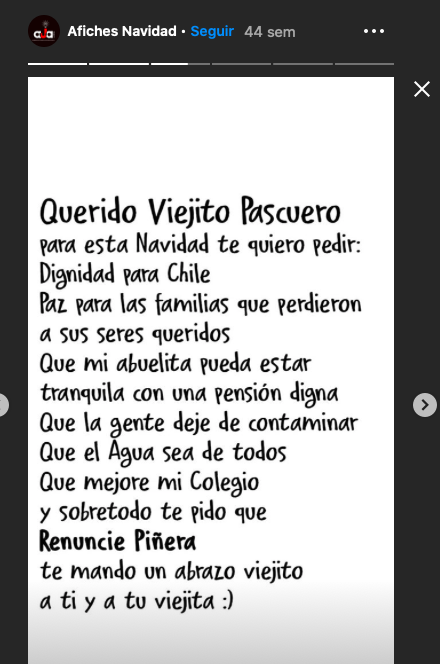
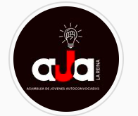

#### FOLIO: LRE2
# Asamblea Jovenes La Reina

[instagram](https://www.instagram.com/asambleajoveneslr/)
[facebook](https://www.facebook.com/Asamblea-de-Jóvenes-Autoconvocadxs-de-La-Reina-124243019375868/)
[spotify](https://open.spotify.com/show/5121VPGLjsF0YFOHGMFmtC)
<asambleajoveneslr@gmail.com>
---

### Representantes
#### No tienen representantes.

---
### Interacciones frecuentes
#### 
* La reina organizada
* Feministas la reina
* agrupacion cultural violeta parra villa la reina
* unidad social la reina

### Redes sociales
#### ¿Para qué se utiliza la red social?
| Instagram | Facebook | Spotify | Otra 
|---|---|---|---|
|Información y difusión de actividades |Información y difusión de actividades| Informaciones y conversaciones sobre diversos temas| 0|

### **Instagram**
| seguidores | seguidos | publicaciones | hashtag 
|---|---|---|---|
|1.128|1.405|122| 0

* Primera Publicación IG: 16/11/2019

---
### Frecuencia de publicación.

Publicaciones:
* Feed: semanalmente
* Historias: semanalmente

Actividades: dos veces al mes.

---
### Ubicación
* Villa La Reina 

---
### Describir temas de interés y/o trabajo
* Acciones de apoyo y solidaridad hacia los vecinos
* Difusión de información de actualidad
* Derechos humanos

---
### Describir la imagen ideal por la cual se trabaja.
#### (El horizonte hacia el cual se quiere avanzar.)
* Organización territorial
* Dignidad

---
### ¿Que se hace?
#### 
* Podcast
* Difusión de actividades de la asamblea y otras organizaciones
* Muralismo
* Conmemoración de feriados o fechas importantes
* Cabildos y reuniones de discusión virtuales
* Rifas solidarias AJA
* Infografías sobre temas como violencia de género, derechos humanos, medioambiente, entre otros.
* Comunicados de transparencia sobre las donaciones a ollas comunes o colectas solidarias
* Manifestaciones
    * Cacerolazos
    * Marchas territoriales
* Jornadas culturales familiares
    * Talleres para niñes
    * Pasatiempos
    * Musica en vivo
* Completadas a beneficio
* Jornadas informativas del proceso constituyente
* Asambleas feministas

---
### Describir y distinguir demandas más reivindicativas de espacios sin relación con lo contencioso o con lo político mas prefigurativo
#### (lo contencioso; demanda al Estado, a alguna autoridad, privados, etc), (prefigurativo, transformación desde lo cotidiano, etc.).
**CONSIGNA**
* Hasta que la dignidad se haga costumbre. aun no hemos ganado nada.
* Apoyo mutuo solidario entre vecinos *"A traves de la organización podemos colaborar y apoyar a nuestros vecinos"*

---
### Tipo de organización interna.
#### Asambleísmo

---
### Describir los temas / imágenes- iconos / conceptos mas habitualmente presentes en sus publicaciones. Describir cambios/ transformaciones en los contenidos desde Octubre.

**Iconos:**
Fondo negro, unas letras blanca y rojas. Hay un puño dentro de una ampolleta.

**Diseño estético:**
Utilización del color rojo/negro. Tienen un diseño constante y que se distingue cuando suben información sobre actividades que no son de la asamblea. Se nota un progreso del diseño estético.

---
### Percepciones que se tiene del Estado
#### (Aparato burocrático)
> Gobierno descriteriado que no piensa en los trabajadores. Proteccion a FFEE y empresarios, no a los trabajadores. 

| Declaraciones | Link | 
|---|---|
|HUELGA GENERAL INDEFINIDA si no hay cuarentena | [Link](https://www.instagram.com/p/B9-h3ObnuWX/) |

---
### Percepciones que se tiene de las Fuerzas de Orden
#### (Aparato represivo)
> Repudian a la institucion, abuso de poder y violencia desmedida contra manifestantes. Destitución de Mario Rozas, reformulación de fuerzas policiales y renuncia de Perez.

| Declaraciones | Link | 
|---|---|
|Comunicado 04/10 | [Link](https://www.instagram.com/p/CF8iWsBpv7n/) |

---
### Incorporar aca notas, citas textuales, links, etc. extra a los ya incorporados, que sean de interés para comprender tanto la forma como los contenidos asociados a la organización.
