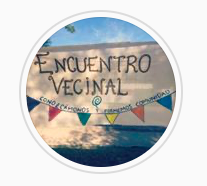

#### FOLIO: LRE3
# La Reina Organizada

[instagram](https://www.instagram.com/lareina.organizada/)

---

### Representantes
#### No señalan tener representantes.

---
### Interacciones frecuentes
#### 
* La reina despertó
* unidas social la reina
* centro cultural violeta parria

### Redes sociales
#### ¿Para qué se utiliza la red social?
| Instagram | 
|---|
|Difusión de información, actividades y otras cosas|

### **Instagram**
| seguidores | seguidos | publicaciones | hashtag 
|---|---|---|---|
|1.378|973|147| 0

* Primera Publicación IG: 27/10/2019

---
### Frecuencia de publicación.

Publicaciones:
* Feed: Una vez al mes
* Historias: semanalmente

Actividades: Una vez al mes

---
### Ubicación
* Villa La Reina

---
### Describir temas de interés y/o trabajo
* Organización vecinal
* Incidencia en las politicas municipales
* Apoyo y colaboración vecinal
* Medioambiente
* Feminismo

---
### Describir la imagen ideal por la cual se trabaja.
#### (El horizonte hacia el cual se quiere avanzar.)
* Constuir una sociedad más justa e igualitaria
* Dignidad de la vida

---
### ¿Que se hace?
#### (Manifestaciones, marchas, intervenciones, actividades culturales, conversatorios, intercambio de saberes, actividades solidarias o de apoyo mutuo, abastecimiento, contra información, emplazamiento a autoridades etc.)
* Incidencia en la toma de decisiones municipales
* Encuentros vecinales
* Difusión de información y actividades de todo ámbito
* Jornadas de información sobre el proceso constituyente
* Rifas solidarias para vecinos
* Asambleas y reuniones informativas
* Conmemoración de sucesos historicos
* Manifestaciones
    * Cacerolazos
    * Marchas territoriales
    * Pañuelazos
* Talleres y actividades recreativas para vecinos
* Encuentro de mujeres / asambleas feministas
* Jornadas artisticas por la dignidad
* Cabildos

---
### Describir y distinguir demandas más reivindicativas de espacios sin relación con lo contencioso o con lo político mas prefigurativo
#### (lo contencioso; demanda al Estado, a alguna autoridad, privados, etc), (prefigurativo, transformación desde lo cotidiano, etc.).
* Poder incidir en la construcción de la ciudad
* Colaboración mutuo 

---
### Tipo de organización interna.
#### Asambleismo

---
### Describir los temas / imágenes- iconos / conceptos mas habitualmente presentes en sus publicaciones. Describir cambios/ transformaciones en los contenidos desde Octubre.
El contenido se ha transformado a partir de los sucesos de la actualidad nacional. 

**Iconos:**
No tienen logo, su icono de instagram es una foto de un encuentro vecinal.

**Diseño estético:**
No tienen un diseño estetico fijo, suben imagenes informativas o fotografías.

---
### Percepciones que se tiene del Estado
#### (Aparato burocrático)
> No hay establecidas percepciones sobre el aparato burocratico.

| Declaraciones | Link | 
|---|---|
|Anotar los comunicados | [Link]() |

---
### Percepciones que se tiene de las Fuerzas de Orden
#### (Aparato represivo)
> No hay establecidas percepciones sobre las fuerzas de orden.

| Declaraciones | Link | 
|---|---|
|Anotar los comunicados | [Link]() |

---
### Incorporar aca notas, citas textuales, links, etc. extra a los ya incorporados, que sean de interés para comprender tanto la forma como los contenidos asociados a la organización.
