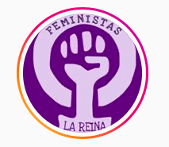

#### FOLIO: LRE4
# Feministas La Reina

[instagram](https://www.instagram.com/feministas.lareina/)
[youtube](https://www.youtube.com/channel/UC82C5VvyAQFcPdKfCFuVFGw)
---

### Representantes
#### 
No señalan tener representantes.

---
### Interacciones frecuentes
####
* La Reina unida
* Agrupación memorial aerodromo de tobalaba
* Awka futbol 
* La Reina organizada
* Cabildo loreley y echeñique 

### Redes sociales
#### ¿Para qué se utiliza la red social?
| Instagram | Youtube | 
|---|---|
|Difusión de actividades e información | Transmisión en vivo de conversatorios, charlas y talleres |

### **Instagram**
| seguidores | seguidos | publicaciones | hashtag 
|---|---|---|---|
|2.626|2.121|100| 0

* Primera Publicación IG: 20/11/2019

---
### Frecuencia de publicación.

Publicaciones:
* Feed: Tres o cuatro veces al mes
* Historias: Una o dos veces a la semana

Actividades: Mensuales.

---
### Ubicación
* Plaza gabriela mistral

---
### Describir temas de interés y/o trabajo
* Feminismo
* Disidencias
* Organizacion territorial feminista

---
### Describir la imagen ideal por la cual se trabaja.
#### (El horizonte hacia el cual se quiere avanzar.)
* Justicia con real perspectiva de género
* Sociedad feminista
* Derechos sexuales y reproductivos para las mujeres

---
### ¿Que se hace?
#### (Manifestaciones, marchas, intervenciones, actividades culturales, conversatorios, intercambio de saberes, actividades solidarias o de apoyo mutuo, abastecimiento, contra información, emplazamiento a autoridades etc.)
* Manifestaciones
    * Cacerolazos
    * Intervenciones
    * Velatones
    * Marchas
* Propaganda proceso constituyente a favor del apruebo y la convención constitucional
* Ciclos de talleres constituyentes
* Talleres de autoformación feminista
* Asambleas virtuales y presenciales
* Actividades conmemorativas
* Comunicados y declaraciones en torno a hechos noticiosos que involucran violencia, discriminación o asesinato de mujeres o disidencias
* Manifestaciones virtuales como twittazos
* Almuerzos comunitarios
* Difusión de pymes de mujeres de la reina

---
### Describir y distinguir demandas más reivindicativas de espacios sin relación con lo contencioso o con lo político mas prefigurativo
#### (lo contencioso; demanda al Estado, a alguna autoridad, privados, etc), (prefigurativo, transformación desde lo cotidiano, etc.).
* Organizacion entre mujeres en el territorio
* Vinculación y apoyo mutuo

---
### Tipo de organización interna.
#### 
Asambleismo y horizontalidad.

---
### Describir los temas / imágenes- iconos / conceptos mas habitualmente presentes en sus publicaciones. Describir cambios/ transformaciones en los contenidos desde Octubre.

**Iconos:**
Su icono de instagram, que también es su logo es un puño que representa el signo de "femenino" en colores morados.

**Diseño estético:**
Tienen un diseño estético similar en cada una de sus publicaciones, exceptuando cuando suben fotografías. Utilizan principalmente los colores morado y rosado. 

---
### Percepciones que se tiene del Estado
#### (Aparato burocrático)
> Estado complice de las violaciones a los ddhh. 

| Declaraciones | Link | 
|---|---|
|Anotar los comunicados | [Link]() |

---
### Percepciones que se tiene de las Fuerzas de Orden
#### (Aparato represivo)
> Complices y represivos de la acción estatal. 

| Declaraciones | Link | 
|---|---|
|Anotar los comunicados | [Link]() |

---
### Incorporar aca notas, citas textuales, links, etc. extra a los ya incorporados, que sean de interés para comprender tanto la forma como los contenidos asociados a la organización.
