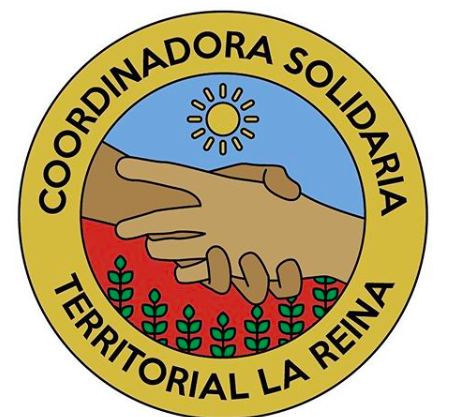
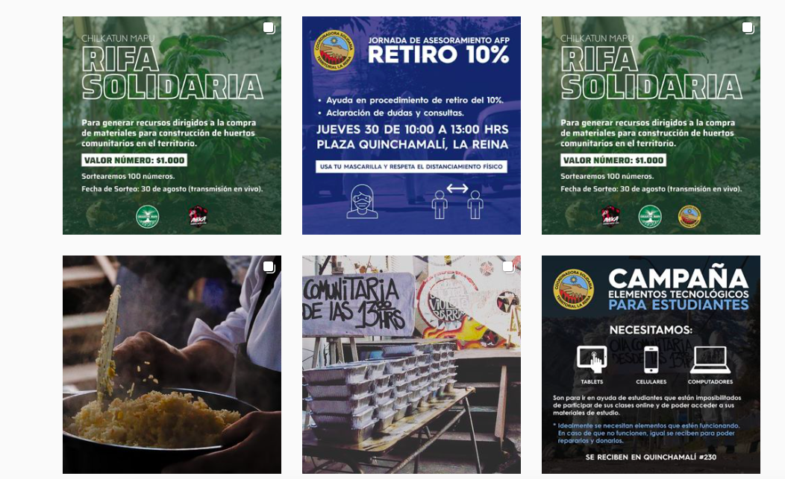

#### FOLIO: LRE5
# Coordinadora Solidaria Territorial La Reina

[instagram](https://www.instagram.com/coordinadoraderesistencia/)
<cstlareina@gmail.com>
---

### Representantes
#### No señalan tener representantes.

---
### Interacciones frecuentes
#### 
* Chillkatun mapu [link](https://www.instagram.com/chilkatun_mapu/)
* La Reina sin censura

### Redes sociales
#### ¿Para qué se utiliza la red social?
| Instagram | 
|---|
|Difusión de iniciativas y actividades en el territorio|

### **Instagram**
| seguidores | seguidos | publicaciones | hashtag 
|---|---|---|---|
|1.090|713|90| 0

* Primera Publicación IG: 24/05/2020

---
### Frecuencia de publicación.

Publicaciones: 
* Feed: dos veces al mes
* Historias: semanalmente

Actividades: Todas las semanas hay olla común en diversos sectores de la Villa La Reina.

---
### Ubicación
* Villa La Reina / Plaza de la resistencia

---
### Describir temas de interés y/o trabajo
* Apoyo mutuo
* Solidaridad barrial
* Medioambiente
* Alimentación

---
### Describir la imagen ideal por la cual se trabaja.
#### (El horizonte hacia el cual se quiere avanzar.)
* Colaboracion entre organizaciones territoriales para el bienestar de los vecinos
* Cambiar el modelo y organizarse como vecinos

---
### ¿Que se hace?
#### (Manifestaciones, marchas, intervenciones, actividades culturales, conversatorios, intercambio de saberes, actividades solidarias o de apoyo mutuo, abastecimiento, contra información, emplazamiento a autoridades etc.)
* Campañas de acopio de insumos
    * Alimentos y elementos de aseo e higiene
    * Articulos para entregar comidas
    * Aparatos tecnologicos para los estudiantes del sector
* Olla común
* Difusión ollas comunes
* Onces solidarias
* Difusión protocolos de seguridad
* Donaciones monetarias (transferencia o efectivo)
* Entrega de alimentos en las casas
* Jornadas de inscripcion de vecinos en el registro social de hogares
* Manifestaciones
    * Velatones
    * Caceroleos
* Conversatorios sobre la crisis alimentaria y la organizacion territorial
* Transparencia y rendicion de cuentas
* Asesoramiento por el retiro del 10%
* Rifas solidarias

---
### Describir y distinguir demandas más reivindicativas de espacios sin relación con lo contencioso o con lo político mas prefigurativo
#### (lo contencioso; demanda al Estado, a alguna autoridad, privados, etc), (prefigurativo, transformación desde lo cotidiano, etc.).
**CONSIGNA**: Solo el pueblo ayuda al pueblo. Solo confiamos en el pueblo.
* Organizacion colaborativa territorial
* Autogestión territorial para el bienestar vecinal

---
### Tipo de organización interna.
#### Asambleismo y horizontalidad.
---
### Describir los temas / imágenes- iconos / conceptos mas habitualmente presentes en sus publicaciones. Describir cambios/ transformaciones en los contenidos desde Octubre.
El contenido focalizado inicialmente en actividades vinculadas a la situación de hambruna se fueron transformando a manifestaciones y declaraciones publicas, como también a dar cuenta de las actividades que están realizando colectivamente.

**Iconos:**
Utilizan un icono que tiene dibujos de ds manos, arboles y un sol con colores distintivos.

**Diseño estético:**
No tienen un diseño estetico continuo, sin embargo, utilizan casi siempre su logo y colores como rojo, negro, azul y blanco. También suben fotografias que dan cuenta del trabajo realizado. 

---
### Percepciones que se tiene del Estado
#### (Aparato burocrático)
> Juicio y castigo a Piñera #renunciapiñera. Desconexión del gobierno con la situación de hambruna del pueblo. 

| Declaraciones | Link | 
|---|---|
|Anotar los comunicados | [Link]() |

---
### Percepciones que se tiene de las Fuerzas de Orden
#### (Aparato represivo)
> Disolver las politicas politicas y asesinas. 

| Declaraciones | Link | 
|---|---|
|Anotar los comunicados | [Link]() |

---
### Incorporar aca notas, citas textuales, links, etc. extra a los ya incorporados, que sean de interés para comprender tanto la forma como los contenidos asociados a la organización.
* Creación de huerta comunitaria y compost [Link](https://www.instagram.com/p/CCCM6dfJ2al/)
* Registro del proceso de trabajo y organizacion en torno a las ollas comunes del sector Villa La Reina [Link](https://www.instagram.com/p/CCkBzq7pyBO/)
* Conflicto territorial por haber aceptado donaciones a dirigientes sociales por parte de la municipalidad [Link](https://www.instagram.com/p/CCqbJkzpSZD/)