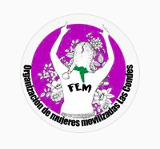
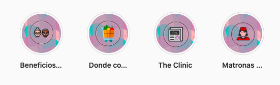

#### FOLIO: LCO1
# Organización de mujeres movilizadas Las Condes

[instagram](https://www.instagram.com/femlascondes/)
[facebook](https://www.facebook.com/femlascondes)
[página web](https://linktr.ee/femlascondes)
---

### Representantes
#### No señalan tener representantes.

---
### Interacciones frecuentes
#### 
* Feministas la reina

### Redes sociales
#### ¿Para qué se utiliza la red social?
| Instagram | Facebook | Página web 
|---|---|---|---|
|Difusión de información y actividades | Difusión de información y actividades | Concentración de información

### **Instagram**
| seguidores | seguidos | publicaciones | hashtag 
|---|---|---|---|
|1.470|263|127| 0

* Primera Publicación IG: 22/11/2019

---
### Frecuencia de publicación.

Publicaciones:
* Feed e historias: pararon de publicar el 09/10, tomaron decision de parar sus publicaciones y actividades por la pandemia de manera indefinida.

Actividades: Suspendieron las actividades por pandemia. 

---
### Ubicación
* Colon / Padre Hurtado

---
### Describir temas de interés y/o trabajo
* Colaboración vecinal feminista
* Democratización de la información

---
### Describir la imagen ideal por la cual se trabaja.
#### (El horizonte hacia el cual se quiere avanzar.)
* Sociedad feminista
* Apoyo y colaboración mutua entre vecinas
* Vivir sin violencias

---
### ¿Que se hace?
#### (Manifestaciones, marchas, intervenciones, actividades culturales, conversatorios, intercambio de saberes, actividades solidarias o de apoyo mutuo, abastecimiento, contra información, emplazamiento a autoridades etc.)
* Manifestaciones
* Intervenciones
* Actividades conmemorativas
* Declaraciones y emplazamiento a autoridades
* Información sobre actividades de cuarentena
    * Cine en cuarentena
    * Libros en cuarentena (Biblioteca Libre)
* Información sobre denuncia de violencia de género
* Información orientadora y de ayuda ante diversos sentimientos o sentires por la cuarentena

---
### Describir y distinguir demandas más reivindicativas de espacios sin relación con lo contencioso o con lo político mas prefigurativo
#### (lo contencioso; demanda al Estado, a alguna autoridad, privados, etc), (prefigurativo, transformación desde lo cotidiano, etc.).
* Reconocimiento al rol politico de la mujer
* Acompañamiento y colaboración
* Democratización del conocimiento

---
### Tipo de organización interna.
#### Asambleismo.

---
### Describir los temas / imágenes- iconos / conceptos mas habitualmente presentes en sus publicaciones. Describir cambios/ transformaciones en los contenidos desde Octubre.
No tienen contenido politico definido desde sus redes sociales, no manifiestan posturas politicas claras ante ciertos sucesos que han ocurrido en el país. Generan contenido informativo más que reflexivo y critico. La pandemia entorpeció la organización.

**Iconos:**
Tienen un icono especifico en instagram y utilian un logo en sus imagenes informativas.

**Diseño estético:**
Utilizan colores como el morado y el rosado. No tienen un diseño estético fijo pero si una paleta de colores fija.

---
### Percepciones que se tiene del Estado
#### (Aparato burocrático)
> "El estado opresor es un macho violador".

| Declaraciones | Link | 
|---|---|
|Anotar los comunicados | [Link]() |

---
### Percepciones que se tiene de las Fuerzas de Orden
#### (Aparato represivo)
> No señalan percepción sobre las fuerzas de orden.

| Declaraciones | Link | 
|---|---|
|Anotar los comunicados | [Link]() |

---
### Incorporar aca notas, citas textuales, links, etc. extra a los ya incorporados, que sean de interés para comprender tanto la forma como los contenidos asociados a la organización.
* En su instagram incorporan historias con información de beneficios, emprendimientos, matronas y sobre la entrevista de the clinic que les hicieron como organización.

