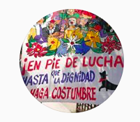

#### FOLIO: LCO2
# Pobladores de las condes

[instagram](https://www.instagram.com/pobladores.de.las.condes/)
[facebook](https://www.facebook.com/pobladores.lascondes/)
<pobladores.lascondes@gmail.com>
---

### Representantes
#### No señala tener representantes.

---
### Interacciones frecuentes
#### 
* El despertar las condes
* Movimiento secundario independiente
* Que chile decida las condes

### Redes sociales
#### ¿Para qué se utiliza la red social?
| Instagram | Facebook | 
|---|---|
|Difusión de información de actividades e informaciones |Difusión de videos de actividades y manifestaciones|

### **Instagram**
| seguidores | seguidos | publicaciones | hashtag 
|---|---|---|---|
|613|33|52| 0

* Primera Publicación IG: 19/01/2020

---
### Frecuencia de publicación.

* Publicaciones: Semanalmente
* Actividades: Semanalmente

---
### Ubicación
* Colón oriente / Paul Harris

---
### Describir temas de interés y/o trabajo
* Colaboración vecinal
* Organizacion vecinal
* Alimentación

---
### Describir la imagen ideal por la cual se trabaja.
#### (El horizonte hacia el cual se quiere avanzar.)
* Una sociedad donde la vida sea digna
* Colaboración y apoyo mutuo vecinal

---
### ¿Que se hace?
#### (Manifestaciones, marchas, intervenciones, actividades culturales, conversatorios, intercambio de saberes, actividades solidarias o de apoyo mutuo, abastecimiento, contra información, emplazamiento a autoridades etc.)
* Propaganda apruebo y convencion constitucional
* Jornadas de manifestación y campaña
    * Caravanas
    * Banderazos
    * Cicletadas
    * Marchas
* actividades conmemorativas
* Olla comun
* Donaciones para la olla comun y vecinos
* Videos informativos
* Rifas solidarias

---
### Describir y distinguir demandas más reivindicativas de espacios sin relación con lo contencioso o con lo político mas prefigurativo
#### (lo contencioso; demanda al Estado, a alguna autoridad, privados, etc), (prefigurativo, transformación desde lo cotidiano, etc.).
**CONSIGNA**: Hasta que la dignidad se haga costumbre. Es el nombre del colectivo.
* Apoyo mutuo entre vecinos

---
### Tipo de organización interna.
#### 
Asambleismo, vocerias y horizontalidad.

---
### Describir los temas / imágenes- iconos / conceptos mas habitualmente presentes en sus publicaciones. Describir cambios/ transformaciones en los contenidos desde Octubre.
Utilizan más la red social facebook. Su contenido se focaliza en el tema alimenticio y donaciones para sustentarlo. Varia su contenido en fechas previas al plebiscito donde la roganizacion comienza a hacer campaña por el apruebo y convención constitucional. 

**Iconos:**
No tienen logos, su icono es una foto de un lienzo.

**Diseño estético:**
No tienen diseño estetico fijo, fotos con informaciones más que solo infografías. 

---
### Percepciones que se tiene del Estado
#### (Aparato burocrático)
> Asesinos e incompetentes. no les importa el pueblo sino los empresarios. 

| Declaraciones | Link | 
|---|---|
|Anotar los comunicados | [Link]() |

---
### Percepciones que se tiene de las Fuerzas de Orden
#### (Aparato represivo)
> Cometen abusos y mal utilización de la fuerza.

| Declaraciones | Link | 
|---|---|
|Anotar los comunicados | [Link]() |

---
### Incorporar aca notas, citas textuales, links, etc. extra a los ya incorporados, que sean de interés para comprender tanto la forma como los contenidos asociados a la organización.
* Les hicieron una nota de la prensa (chv) a la olla común [link](https://www.instagram.com/p/B_1OwislwJM/)