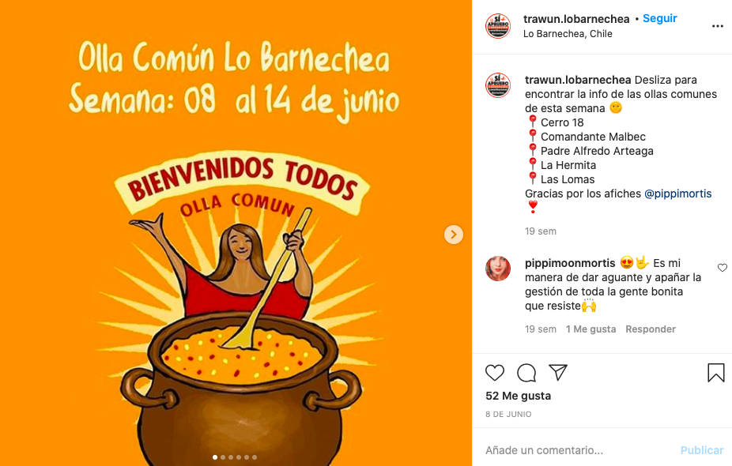
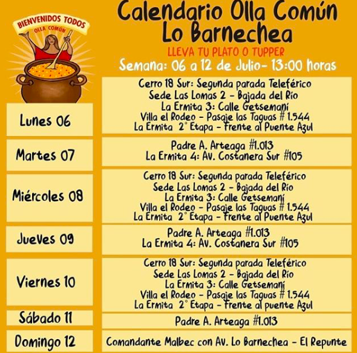
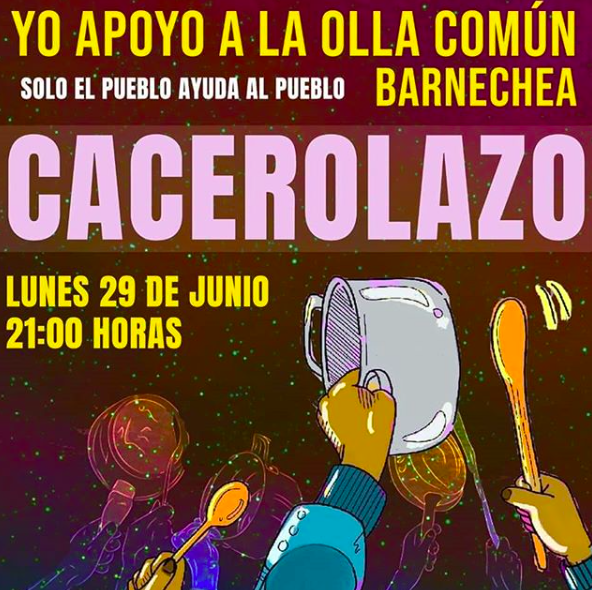
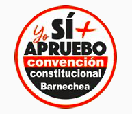

#### FOLIO: LBA1
# TRAWUN DE LO BARNECHEA - ASAMBLEA TERRITORIAL DE VECINXS PUEBLO LO BARNECHEA

[instagram](https://www.instagram.com/trawun.lobarnechea/)

---

### Representantes
#### No tiene representantes.

---
### Interacciones frecuentes
#### 
* Unión de asambleas Santiago Oriente

### Redes sociales
#### ¿Para qué se utiliza la red social?
| Instagram | 
|---|---|---|---|
|Difusión de información y actividades |

### **Instagram**
| seguidores | seguidos | publicaciones | hashtag 
|---|---|---|---|
|609|570|54| 9

* Primera Publicación IG: 25/11/2019

---
### Frecuencia de publicación.

Publicaciones: 
* Feed: dos veces al mes. 
* Historias: una vez a la semana.

Actividades:
* Receso de actividades por la pandemia
* Ollas comunes todos los dias de la semana

---
### Ubicación
* Plaza Nido de Aguilas, Lo Barnechea

---
### Describir temas de interés y/o trabajo
* Recuperacion de espacios para la familia
* Apoyo mutuo 
* Colaboración vecinal

---
### Describir la imagen ideal por la cual se trabaja.
#### (El horizonte hacia el cual se quiere avanzar.)
* *nos manifestamos hasta que la dignidad sea costumbre*
* Solo el pueblo ayuda al pueblo
* Apoyo entre vecinos

> lucha, consciencia y pelea... somos de barnechea

---
### ¿Que se hace?
#### (Manifestaciones, marchas, intervenciones, actividades culturales, conversatorios, intercambio de saberes, actividades solidarias o de apoyo mutuo, abastecimiento, contra información, emplazamiento a autoridades etc.)
* Actividades para la familia
    * Cine al aire libre
    * Juegos en la cancha
    * Cicletadas familiares
* Campaña por el proceso constituyente apruebo y convención constitucional
    * Caravanas
    * "Fiesta familiar por el apruebo"
* Manifestaciones
    * Cacerolazos
    * Velatones
    * Conmemoraciones
* Manifestaciones como territorio en plaza Dignidad (ex plaza italia)
* Intervenciones de un violador en tu camino
* Intervenciones en protesta en el mall
* Conversatorios e intervenciones 8M
* Olla común
    * Donaciones
    * Alimentación
    * Entrega de alimentos
    * Rifas solidarias
    * Difusión de funcionamiento semanal de ollas comunes
    * Difusión de ollas comunes [Link](https://www.instagram.com/p/CBLeeO_leY9/)

---
### Describir y distinguir demandas más reivindicativas de espacios sin relación con lo contencioso o con lo político mas prefigurativo
#### (lo contencioso; demanda al Estado, a alguna autoridad, privados, etc), (prefigurativo, transformación desde lo cotidiano, etc.).
* Recuperación de los espacios
* Organización y apoyo mutuo vecinal

---
### Tipo de organización interna.
#### 
Asambleismo y horizontalidad. Las donaciones monetarias para ollas comunes están a cargo de una persona en particular.

---
### Describir los temas / imágenes- iconos / conceptos mas habitualmente presentes en sus publicaciones. Describir cambios/ transformaciones en los contenidos desde Octubre.
Tuvieron un receso de información después que comenzó la pandemia. Ahí el contenido se transformo en acciones directas para colaborar con ollas comunes del sector.

**Iconos:**
No tienen un icono fijo, sin embargo, en linea a su propaganda del proceso constituyente, tiene una imagen que señala que Barnechea Aprueba.

**Diseño estético:**
No tienen un diseño estetico fijo, suben informaciones en imagenes y videos y fotos de manifestaciones. Para las imagenes diseñadas utilizan colores vivos como amarillo, rojo, rosado, entre otros.

---
### Percepciones que se tiene del Estado
#### (Aparato burocrático)
> No señalan percepciones del Estado.

| Declaraciones | Link | 
|---|---|
|Anotar los comunicados | [Link]() |

---
### Percepciones que se tiene de las Fuerzas de Orden
#### (Aparato represivo)
> Agresividad intenta contra los manifestantes del sector. Violencia desmedida. 

| Declaraciones | Link | 
|---|---|
|Violencia desmedida de las fuerzas de orden | [Link](https://www.instagram.com/p/B5Xyl-DnBeC/) |

---
### Incorporar aca notas, citas textuales, links, etc. extra a los ya incorporados, que sean de interés para comprender tanto la forma como los contenidos asociados a la organización.

* Intentos de ataque a manifestantes en Lo Barnechea [link](https://www.instagram.com/p/B5WgVujHVLn/)

* Re-organización de la asamblea en torno a la olla común y el apoyo mutuo vecinal [link](https://www.instagram.com/p/CGDEWY8F0aL/)