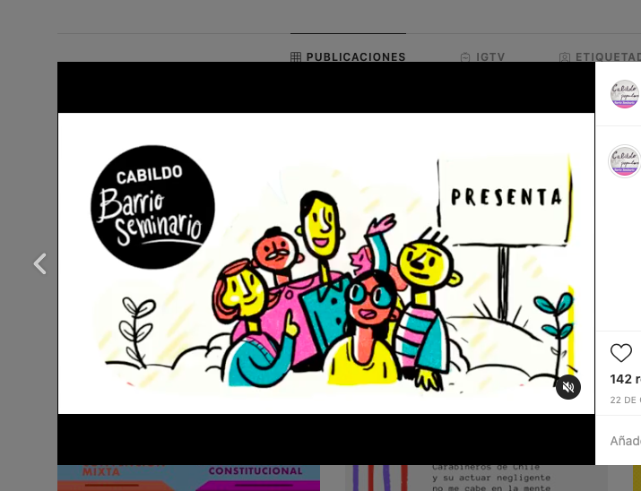

#### FOLIO: PRO1
# Cabildo Barrio Seminario

[instagram](https://www.instagram.com/cabildoseminario/)

---

### Representantes
#### 
No señalan tener representantes.

---
### Interacciones frecuentes
#### 
* Asambleas eje dignidad
* Cabildos y asambleas providencia

### Redes sociales
#### ¿Para qué se utiliza la red social?
| Instagram |  
|---|---|---|---|
|Difusión de información y actividadesy|

### **Instagram**
| seguidores | seguidos | publicaciones | hashtag 
|---|---|---|---|
|915|406|74| 0

* Primera Publicación IG: 01/11/2019

---
### Frecuencia de publicación.

Publicaciones:
* Feed: semanalmente
* Historias: dos veces por semana

Actividades: Mensualmente

---
### Ubicación
* Plazuela bernarda morin

---
### Describir temas de interés y/o trabajo
* Apoyo mutuo y organización barrial
* Proceso constituyente

---
### Describir la imagen ideal por la cual se trabaja.
#### (El horizonte hacia el cual se quiere avanzar.)
* Solucionar comunitariamente la crisis social
* Cambio de paragidma que apunte a la solidaridad y el altruismo

---
### ¿Que se hace?
#### (Manifestaciones, marchas, intervenciones, actividades culturales, conversatorios, intercambio de saberes, actividades solidarias o de apoyo mutuo, abastecimiento, contra información, emplazamiento a autoridades etc.)
* Manifestaciones
    * Cacerolazos
    * Velatones
    * Marchas territoriales
* Actividades conmemorativas
* Intervenciones artisticas culturales y politicas
* Jornadas culturales familiares interbarriales
* Emplazamiento a autoridades como asambleas territoriales
* Comunicados sobre acontecimientos barriales
* Difusión de actividades
* Recomendaciones de peliculas para la cuarentena
* Actividad "decimas constituyentes"

---
### Describir y distinguir demandas más reivindicativas de espacios sin relación con lo contencioso o con lo político mas prefigurativo
#### (lo contencioso; demanda al Estado, a alguna autoridad, privados, etc), (prefigurativo, transformación desde lo cotidiano, etc.).
* Apoyo mutuo y colaboracion barrial
* Dialogo y debate para la construicción de comunidad y barrio

---
### Tipo de organización interna.
#### 
Asambleismo y horizontalidad.

---
### Describir los temas / imágenes- iconos / conceptos mas habitualmente presentes en sus publicaciones. Describir cambios/ transformaciones en los contenidos desde Octubre.
Tuvieron una pausa grande de contenido, sin embargo, se volvieron a reunir como asamblea (de manera virtual)

 y volvieron a subir contenido. Se concentraron ultimamente en panoramas para la cuarentena y en el proceso constituyente.

**Iconos:**
Su icono son unos dibujos de edificios con letras negras que dicen cabildo popular. Su logo es un circulo que dice cabildo seminario.

**Diseño estético:**
No tienen un diseño estetico fijo, más aun porque suben contenido desde otras organizaciones de las cuales son parte. Igualmente su diseño estetico se vincula a ilustraciones comunitarias y colores vivos como rojo, amarillo, naranjo, etc.

---
### Percepciones que se tiene del Estado
#### (Aparato burocrático)
> Autoridades desconectadas de la realidad social. No se preocupan por las personas sino por los itnereses economicos. 

| Declaraciones | Link | 
|---|---|
|Declaracion crisis sociosanitaria | [Link](https://www.instagram.com/p/B-IjiO3Jnis/) |

---
### Percepciones que se tiene de las Fuerzas de Orden
#### (Aparato represivo)
> Rechazan presencia constante de carabileros en los barrios con actuares represivos, violentos y desproporcionados. 

| Declaraciones | Link | 
|---|---|
|Declaracion conjunta asambleas eje dignidad 05/03/2020 | [Link](https://www.instagram.com/p/B9WqAtJpGzq/) |

---
### Incorporar aca notas, citas textuales, links, etc. extra a los ya incorporados, que sean de interés para comprender tanto la forma como los contenidos asociados a la organización.
