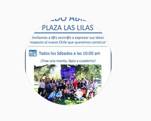
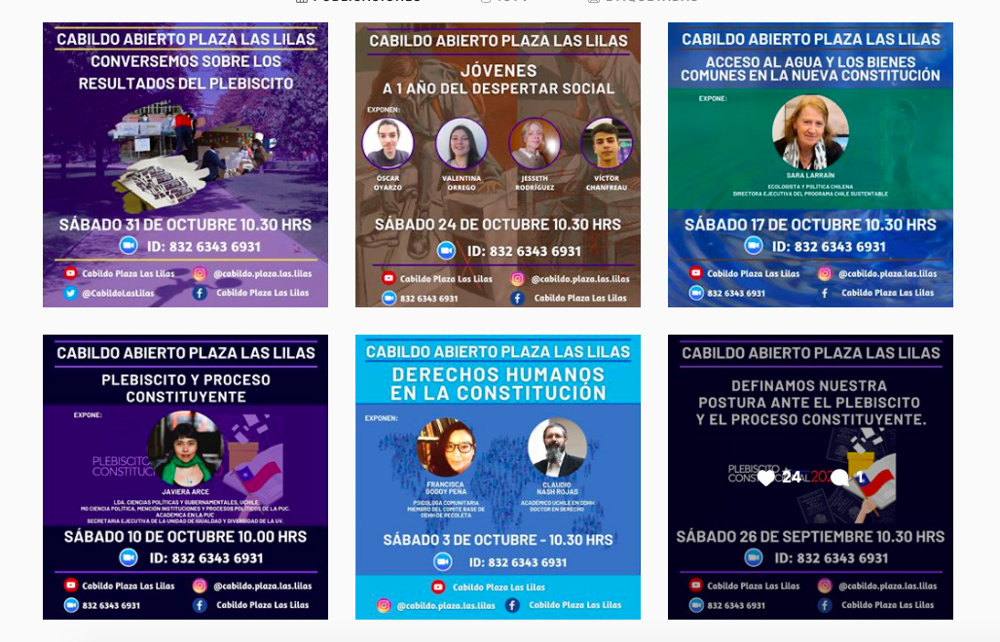
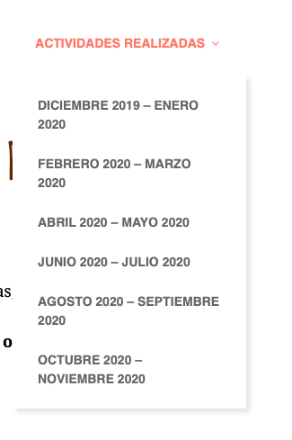

#### FOLIO: PRO2
# Cabildo Plaza las Lilas

[instagram](https://www.instagram.com/cabildo.plaza.las.lilas/)
[facebook](https://www.facebook.com/Cabildo-Plaza-las-Lilas-111698070368376/)
[twitter](https://twitter.com/CabildoLasLilas)
[pagina web](https://cabildolaslilas.cl)
[youtube](https://www.youtube.com/channel/UC4TJ7hydBHSytANeKsIm0cg)
<contacto@cabildolaslilas.cl>
---

### Representantes
#### 
No señalan tener representantes.

---
### Interacciones frecuentes
#### 
* No señalan tener interacciones con otras organizaciones

### Redes sociales
#### ¿Para qué se utiliza la red social?
| Instagram | Facebook | Twitter | Pag web
|---|---|---|---|
|Difusión de actividades e informaciones del cabildo | Difusión de actividades e informaciones del cabildo. Comparten videos | Comparten los post de instagram| Concentración de la información de |

### **Instagram**
| seguidores | seguidos | publicaciones | hashtag 
|---|---|---|---|
|866|1.024|82| 0

* Primera Publicación IG: 03/11/2019

---
### Frecuencia de publicación.

Publicaciones:
* Feed: Semanalmente
* Historias: Semanalmente

Actividades: Semanalmente

---
### Ubicación
* Plaza las lilas al costado de juegos infantiles

---
### Describir temas de interés y/o trabajo
* Autoeducación
* Debate y dialogo respetuoso

---
### Describir la imagen ideal por la cual se trabaja.
#### (El horizonte hacia el cual se quiere avanzar.)
* Construir comunidad 
* Dialogar sobre el Chile que queremos construir

---
### ¿Que se hace?
#### (Manifestaciones, marchas, intervenciones, actividades culturales, conversatorios, intercambio de saberes, actividades solidarias o de apoyo mutuo, abastecimiento, contra información, emplazamiento a autoridades etc.)
* Ciclos de conversatorios por zoom
* Asambleas territoriales
* Jornadas de definición de posturas de la asamblea
* Consejos y recomendaciones para las familias en cuarentena con niños
* Desayunos online de conversacion
* Picnic de valentin
* Jornadas de contención y reflexión

---
### Describir y distinguir demandas más reivindicativas de espacios sin relación con lo contencioso o con lo político mas prefigurativo
#### (lo contencioso; demanda al Estado, a alguna autoridad, privados, etc), (prefigurativo, transformación desde lo cotidiano, etc.).
* Conversacion comunitaria para la construcción de un mejor país

---
### Tipo de organización interna.
#### 
Asambleismo.

---
### Describir los temas / imágenes- iconos / conceptos mas habitualmente presentes en sus publicaciones. Describir cambios/ transformaciones en los contenidos desde Octubre.

**Iconos:**
No tienen icono especifico ni logo. Utilizan una imagen de un afiche. 

**Diseño estético:**
Tienen un diseño estetico fijo y muy similar entre si. Varia entre el tipo de actividad que están realizando como organización.

---
### Percepciones que se tiene del Estado
#### (Aparato burocrático)
> No señalan percepciones sobre el Estado.

| Declaraciones | Link | 
|---|---|
|Anotar los comunicados | [Link]() |

---
### Percepciones que se tiene de las Fuerzas de Orden
#### (Aparato represivo)
> No señalan percepciones sobre las fuerzas de orden.

| Declaraciones | Link | 
|---|---|
|Anotar los comunicados | [Link]() |

---
### Incorporar aca notas, citas textuales, links, etc. extra a los ya incorporados, que sean de interés para comprender tanto la forma como los contenidos asociados a la organización.
* Su página web es muy transparente y da cuenta de todas las discusiones que han realizado, de hecho, tienen una seccion donde dan a concoer todas las actividades y acuerdos que han llegado como cabildo. [link](https://cabildolaslilas.cl)

