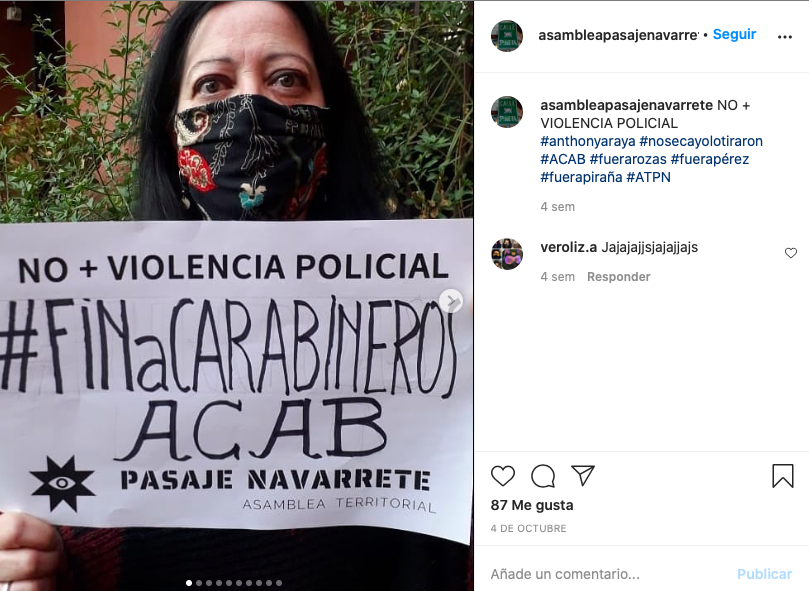
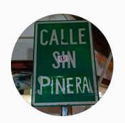

#### FOLIO: PRO3
# Asamblea Pasaje Navarrete

[instagram](https://www.instagram.com/asambleapasajenavarrete/)
[facebook]()
[twitter]()
<correo@correo.cl>
---

### Representantes
#### (Nombres o emails de voceros o representantes).
No señalan tener representantes.

---
### Interacciones frecuentes
#### 
No señalan tener interacciones con otras organizaciones.

### Redes sociales
#### ¿Para qué se utiliza la red social?
| Instagram |  
|---|
|Difusión de información y actividades de la asamblea|

### **Instagram**
| seguidores | seguidos | publicaciones | hashtag 
|---|---|---|---|
|778|650|97| 0

* Primera Publicación IG: 17/11/2019

---
### Frecuencia de publicación.

Publicaciones:
* Feed: Dos veces al mes
* Historias: Semanalmente

Actividades: Mensualmente

---
### Ubicación
* Pasaje navarrete con manuel montt

---
### Describir temas de interés y/o trabajo
* Educación cívica autogestionada

---
### Describir la imagen ideal por la cual se trabaja.
#### (El horizonte hacia el cual se quiere avanzar.)
* Un país más justo
* Dignidad para la vida
* Organización territorial

---
### ¿Que se hace?
#### (Manifestaciones, marchas, intervenciones, actividades culturales, conversatorios, intercambio de saberes, actividades solidarias o de apoyo mutuo, abastecimiento, contra información, emplazamiento a autoridades etc.)
* Manifestaciones
    * Cacerolazos
    * Cortes de calle
    * Velatones
* Jornadas educativas autoreflexivas 
* Intervenciones virtuales sobre hechos actuales

* Microfonos abiertos
* Asambleas territoriales
* Actividades conmemorativas
* Compra colaborativa de frutas y verduras
* Jornadas de donacion de ropa a las personas en situación de calle del parque forestal
* Creacion de pancartas y murales

---
### Describir y distinguir demandas más reivindicativas de espacios sin relación con lo contencioso o con lo político mas prefigurativo
#### (lo contencioso; demanda al Estado, a alguna autoridad, privados, etc), (prefigurativo, transformación desde lo cotidiano, etc.).
* "Nos cuidamos, conversamos y nos mantenemos unidos"
* "Queremos una vida digna, respeto por cada uno de nosotrxs y, en conjunto, apañarnos en este hermoso estallido social."

---
### Tipo de organización interna.
#### (Vocerías, asambleísmo, horizontalidad, etc.; *se entiende que esta dimensión es más difícil de captar vía análisis de redes sociales, pero quizás se puede vislumbrar a través de roles/cargos*)

---
### Describir los temas / imágenes- iconos / conceptos mas habitualmente presentes en sus publicaciones. Describir cambios/ transformaciones en los contenidos desde Octubre.
Su contenido bajó al momento de pasar a tener actividades no presenciales, sin embargo, comenzaron a realizar otro tipo de actividades. Su contenido se ajusta a los acontecimientos politicos y sociales de Chile.

**Iconos:**
No tienen icono ni logo. Su foto de instagram es un cartel que se encuentra en el sector donde cacerolean

**Diseño estético:**
Tienen un diseño estetico fijo y similar dependiendo del tipo de actividad. También suben mucho contenido audiovisual sin edición lo cual permea en el diseño estetico.

---
### Percepciones que se tiene del Estado
#### (Aparato burocrático)
> Son quienes ordenan la violacion de los ddhh. Criminalización de la protesta social. 

| Declaraciones | Link | 
|---|---|
|Anotar los comunicados | [Link]() |

---
### Percepciones que se tiene de las Fuerzas de Orden
#### (Aparato represivo)
> Violadores de ddhh. Represion violenta y abusiva. No más violencia policial.

| Declaraciones | Link | 
|---|---|
|Por Gustavo y Fabiola | [Link](https://www.instagram.com/p/B5atYu1l1gE/) |
|No + violencia policial | [Link](https://www.instagram.com/p/CF7axjHJu-l/) |

---
### Incorporar aca notas, citas textuales, links, etc. extra a los ya incorporados, que sean de interés para comprender tanto la forma como los contenidos asociados a la organización.
