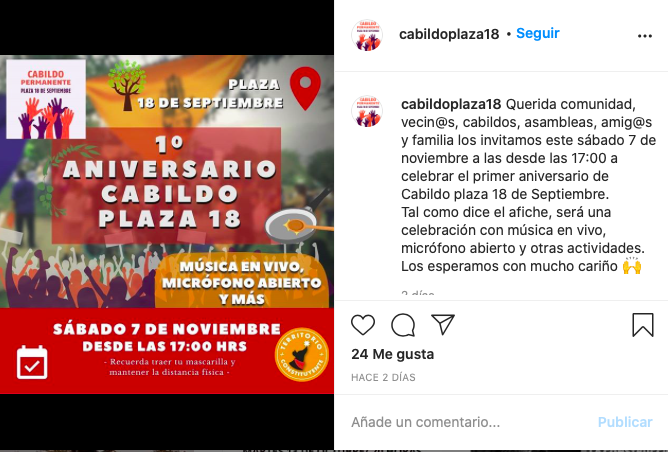

#### FOLIO: PRO4
# Cabildo Plaza 18 de Septiembre

[instagram](https://www.instagram.com/cabildoplaza18/)
[facebook]()
[youtube](https://www.youtube.com/channel/UCufnuYzhqTLFTjUJKAuMH8A)
<correo@correo.cl>
---

### Representantes
#### (Nombres o emails de voceros o representantes).
No señalan tener representantes.

---
### Interacciones frecuentes
#### 
* Voces por la dignidad
* Territorio Constituyente
* Asambleas y Cabildos de Providencia
* Cabildo Plaza Lillo

### Redes sociales
#### ¿Para qué se utiliza la red social?
| Instagram | Youtube | Twitter | Otra 
|---|---|---|---|
|Difusión de actividades e informaciones|Difusión y transmisión de conversatorios en vivo|

### **Instagram**
| seguidores | seguidos | publicaciones | hashtag 
|---|---|---|---|
|1.029|776|137| 0

* Primera Publicación IG: 09/11/2019

---
### Frecuencia de publicación.

Publicaciones: 
* feed: semanalmente
* historias: semanalmente

Actividades: Dos veces al mes.

---
### Ubicación
* Plaza 18 septiembre // Av Los Leones con PL Ferrer

---
### Describir temas de interés y/o trabajo
* Autoeducación
* Organización barrial
* Apoyo mutuo interbarrial

---
### Describir la imagen ideal por la cual se trabaja.
#### (El horizonte hacia el cual se quiere avanzar.)
* Construccion de una sociedad que debata y converse sobre sus punto de encuentro y desencuentro

---
### ¿Que se hace?
#### (Manifestaciones, marchas, intervenciones, actividades culturales, conversatorios, intercambio de saberes, actividades solidarias o de apoyo mutuo, abastecimiento, contra información, emplazamiento a autoridades etc.)
* Actividades culturales comunitarias
* Actividades de apoyo mutuo hacia otras organizaciones
* Cabildos abiertos
* Jornadas de discusión y conversación
* Cabildos para NNA
* Conversatorios sobre un proceso constituyente
* Charlas y encuentros feministas
* Difusión de campaña por el apruebo y convención constitucional
* Iniciativas de poesia o microcuentos conmemoracion 18/10
* Encuentros y cabildos virtuales
* Participacion en manifestaciones tipo marchas
* Aniversario cabildo

---
### Describir y distinguir demandas más reivindicativas de espacios sin relación con lo contencioso o con lo político mas prefigurativo
#### (lo contencioso; demanda al Estado, a alguna autoridad, privados, etc), (prefigurativo, transformación desde lo cotidiano, etc.).
* Dialogo y debate
* Apertura y democratizacion del conocimiento

---
### Tipo de organización interna.
#### 
Horizontalidad. Se percibe organizacion interna para organizar los conversatorios.

---
### Describir los temas / imágenes- iconos / conceptos mas habitualmente presentes en sus publicaciones. Describir cambios/ transformaciones en los contenidos desde Octubre.
Sus cambios de contenido se han ajustado al contenido de debate publico. Añadieron contenido sobre la posicion ante el proceos constituyente y campañas de apoyo mutuo a otras organizaciones.

**Iconos:**
Su icono y logo son manos levantadas con el nombre de la organización.

**Diseño estético:**
Tienen un diseño estetico claro, utilizan colores rojos la mayoria de las veces. También suben contenido audiovisual y contenido propio de otras organizaciones con las que trabajan. 

---
### Percepciones que se tiene del Estado
#### (Aparato burocrático)
> Mala implementacion de politicas de prevencion covid que llevo a privilegiar la economia en vez de la población.

| Declaraciones | Link | 
|---|---|
|Declaracion publica censura | [Link](https://www.instagram.com/p/CAgawggJAet/) |

---
### Percepciones que se tiene de las Fuerzas de Orden
#### (Aparato represivo)
> Accionar violento de cabarineros.

| Declaraciones | Link | 
|Declaracion publica censura | [Link](https://www.instagram.com/p/CAgawggJAet/) |

---
### Incorporar aca notas, citas textuales, links, etc. extra a los ya incorporados, que sean de interés para comprender tanto la forma como los contenidos asociados a la organización.
