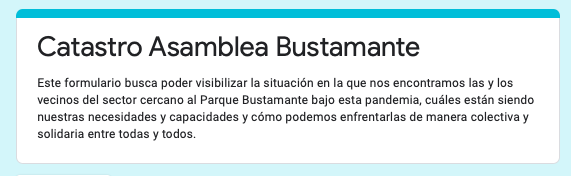
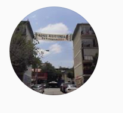

#### FOLIO: PRO6
# Vecin@s Semijuana

[instagram](https://www.instagram.com/vecinxs.semijuana/)

---

### Representantes
#### 
No señalan tener representantes.

---
### Interacciones frecuentes
#### 
* Asambleas eje dignidad

### Redes sociales
#### ¿Para qué se utiliza la red social?
| Instagram |
|---|
|Difusión de información y actividades

### **Instagram**
| seguidores | seguidos | publicaciones | hashtag 
|---|---|---|---|
|940|786|70| 0

* Primera Publicación IG: 28/11/2019

---
### Frecuencia de publicación.

Publicaciones:
* Feed: semanalmente
* Historias: semanalmente

Actividades: dos veces al mes.

---
### Ubicación
* Seminario / Juana Lestonnac

---
### Describir temas de interés y/o trabajo
* Organizacion territorial
* Apoyo mutuo
* Defensa barrial

---
### Describir la imagen ideal por la cual se trabaja.
#### (El horizonte hacia el cual se quiere avanzar.)
* Justicia y memoria
* Colaboración y apoyo mutuo barrial

---
### ¿Que se hace?
#### (Manifestaciones, marchas, intervenciones, actividades culturales, conversatorios, intercambio de saberes, actividades solidarias o de apoyo mutuo, abastecimiento, contra información, emplazamiento a autoridades etc.)
* Campañas solidaria de recolección de alimentos
* Jornadas de lienzo y propaganda
* Manifestaciones
    * Cacerolazos
    * Velatones
    * Marchas
* Intervenciones artisticas politicas
* Difusión actividades de otras organizaciones
* Recoleccion de enseres para otras organizaciones o comunidades
* Autoformación y conversatorios
* Asambleas virtuales y presenciales
* Cine al aire libre
* Actividades conmemorativas
* Campaña por el apruebo y la convencion constitucional
* Intervenciones luminicas
* Denuncias publicas por desalojos a personas en situacion de calle [link](https://www.instagram.com/p/CFh1URTJOfE/)
* Mercaditos y difusión de emprendimientos
* Catastro de vecinxs afctados por pandemia

---
### Describir y distinguir demandas más reivindicativas de espacios sin relación con lo contencioso o con lo político mas prefigurativo
#### (lo contencioso; demanda al Estado, a alguna autoridad, privados, etc), (prefigurativo, transformación desde lo cotidiano, etc.).
* Comunidades organizadas, cercanas y que se apoyan

---
### Tipo de organización interna.
#### 
Asambleismo y horizontalidad.

---
### Describir los temas / imágenes- iconos / conceptos mas habitualmente presentes en sus publicaciones. Describir cambios/ transformaciones en los contenidos desde Octubre.
Su contenido ha variado según el contexto nacional politico y sociosanitario. Pasaron de hacer variadas actividades presenciales a las actividades virtuales, cacerolazos y campañas de apoyo a otros vecinos.

**Iconos:**
No tienen icono ni logo. Tienen una foto de un lienzo en su instagram.

**Diseño estético:**
Tienen un diseño estetico similar, se utilizan colores vivos. Su contenido es principalmente información de actividades, material audiovisual y fotografias.

---
### Percepciones que se tiene del Estado
#### (Aparato burocrático)
> Dictadura y tirania. 

| Declaraciones | Link | 
|---|---|
|Cuenta publica Piñera | [Link](https://www.instagram.com/p/CGfI4-Np3lX/) |

---
### Percepciones que se tiene de las Fuerzas de Orden
#### (Aparato represivo)
> Carabineros nos tiene ahogadxs en lacrimógenas a todxs lxs niñxs, adultos mayores y enfermxs de nuestro barrio. Rechazamos categóricamente los niveles desmedidos de represión. ¡NO + LACRIMÓGENAS!

| Declaraciones | Link | 
|---|---|
|Video del sector lleno de gas lacrimogeno | [Link](https://www.instagram.com/p/B5brDWdHr-s/) |
|Acontecimientos 05/10/2020| [Link](https://www.instagram.com/p/CF97x07J7YV/) |

---
### Incorporar aca notas, citas textuales, links, etc. extra a los ya incorporados, que sean de interés para comprender tanto la forma como los contenidos asociados a la organización.
* Lienzo en su barrio sale sin autorizacion y fuera de contexto en la camapaña por el rechazo [link](https://www.instagram.com/p/CFlydJrJEaU/)