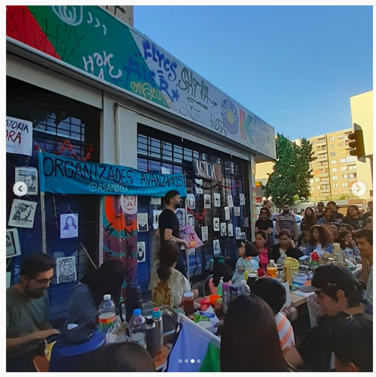
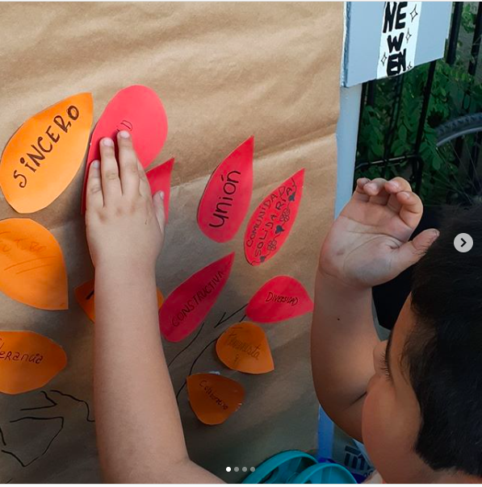
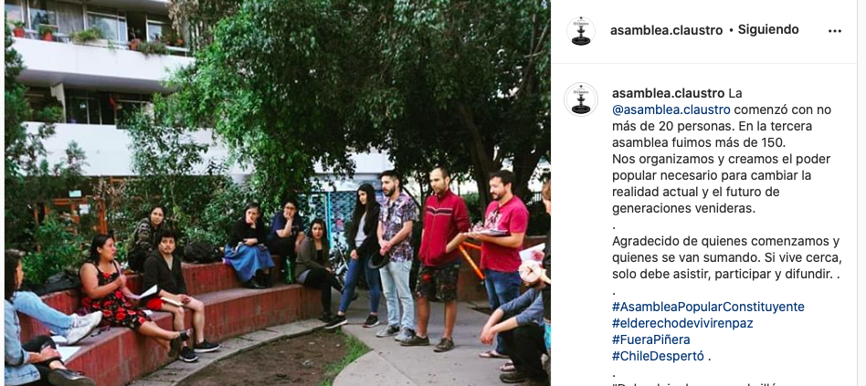
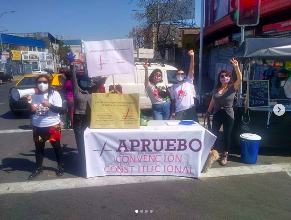
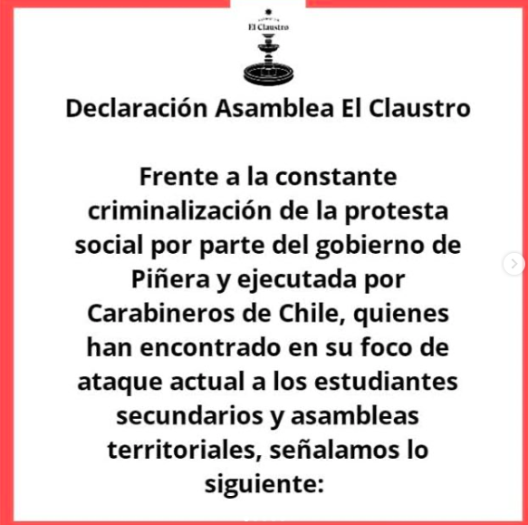
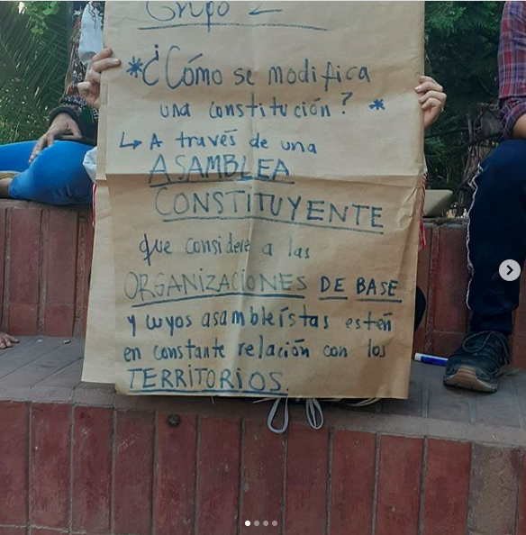
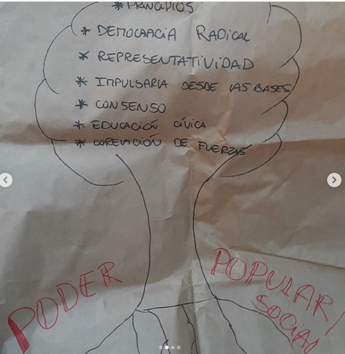
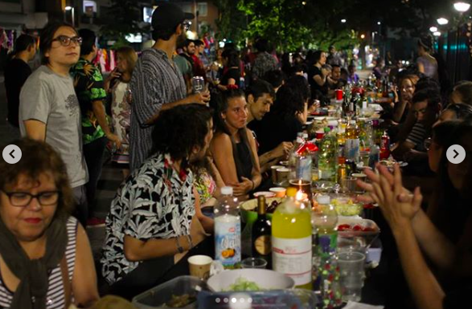

#### FOLIO: SAT1
# Asamblea El Claustro

[Instagram](https://www.instagram.com/asamblea.claustro/)
[Spotify](https://open.spotify.com/show/4a5B5UC0gjMC95INaLicdU?si=eJjnQttVQ9GbDVFjIig19A)
<el.claustro.asambleas@gmail.com>
---

### Representantes
#### No tienen representantes.

---
### Seguidores
#### Seguidos por más de 100 organizaciones socio comunitarias siguen a la asamblea. Organizaciones de todo Santiago y Chile.

---
### Seguidos
#### Siguen principalmente a los participantes de la asamblea y a más de 100 organizaciones sociocomunitarias de Chile.

---
### Interacciones frecuentes
#### 

* Colectiva feminista de la asamblea: **Colectiva La Bailarina**
* Asambleas eje dignidad
    * Asamblea SBSI
    * Comunidad santa isabel
    * Asamblea Marín y alrededores
* Cordon Vicuña
* CAT - Coordinadora de Asambleas Territoriales

**Instagram**

| seguidores | seguidos | hashtag |
|---|---|---|
|2.149|669|0|

---
### Describir:
Se ubican en el sector Santa Isabel / Portugal / Curicó, Santiago Centro. Se reúnen en Portugal 333, en una plaza llamada El Claustro.

#### No han parado las publicaciones hasta la actualidad. Variación de contenido gráfico según contexto sociopolítico.
 
 #

**Actividad:**   
* Primera Publicación IG
    * 05/11/2019

#### Cantidad de publicaciones
| Instagram | Spotify | otro |
|---|---|---|
|212|9|0|

---
### Frecuencia de publicación.

Publicaciones: 
* Tres veces por semana publicación de contenido en el feed de instagram.
* Contenido una vez por día en historias de instagram.
* Envio de correos electrónicos semanales a los participantes de la asamblea.

Actividades:
---
### Describir temas de interés y/o trabajo
* Manifestaciones: Cacerolazos, marchas, cicletadas y velatones. 
* Economía colaborativa. 
* Actividades culturales familiares. 
* Salud mental. 
* Vinculación social con el territorio. 
* Propaganda a favor del apruebo + cc. 

---
### Describir la imagen ideal por la cual se trabaja.
#### **CONSIGNAS**:
* Organizadxs, avanzamos juntxs.
* Trabajando unidxs, organizadxs e informadxs.

Ya no tenemos miedo de compartir, ya no creemos en el individualismo neoliberal, lo combatimos con acciones comunitarias.

Nos organizamos y creamos el poder popular necesario para cambiar la realidad actual y el futuro de generaciones venideras.

---
### ¿Qué hace?
#### 
* Manifestaciones tipo cacerolazos, marchas, bicicletadas, velatones.
* Actividades culturales familiares focalizadas a NNA, pasacalles y festivales barriales. 
    * Ferias del libro. 
    * Cine al aire libre.
* Reuniones semanales presenciales (ahora virtuales), onces comunitarias y charlas informativas.
* Compras en cooperativas vecinales. 
*  Mercadito.
* Declaraciones increpando a autoridades como el Alcalde de Santiago y al Gobierno.
* Nueva constitución. 
* Violencia institucional y ddhh.

---
### Describir y distinguir demandas más reivindicativas de espacios sin relación con lo contencioso o con lo político mas prefigurativo
#### 
* Dignidad para la vida. 
* Transformación de los vinculos vecinales comunitarios.
    * Se dirige a los vecinos y vecinas del sector para sumarse a participar en las actividades, hablan sobre el bien común y la dignidad para todxs desde NNA, el medioambiente, los animales y las personas mayores.
* Nuevas formas de compra a través de cooperativas comunitarias.
* Claro apoyo a la opción apruebo y convención constitucional del plebiscito 25/10. 
    * Jornadas de información territorial sobre el plebiscito. Información virtual y física en la feria 10 de julio de los domingos.

---
### Tipo de organización interna.
#### 
* Horinzontalidad.
* Asambleísmo sumado a trabajo por comisiones. 
    * En su trabajo con el CAT, Cordón Vicuña y Eje Dignidad presentan vocerías los miembros de la comisión vinculación territorial.

---
### Describir los temas / imágenes- iconos / conceptos mas habitualmente presentes en sus publicaciones. Describir cambios/ transformaciones en los contenidos desde Octubre.

**Transformaciones**
Temáticas según el contexto sociopolítico nacional e internacional. Mirada contrahegemonica.
* Economía comunitaria y redes de abastecimiento. Red de compra comunitaria entre vecinos pertenecientes a la asamblea.
Resistir y vincularse como vecinxs. Dar a conocer la información para la comunidad. Resistencia territorial.

**Iconos:**
Mismo logo desde nov 2019. Linea gráfica consolidada. El logo se vincula al lugar donde se reunen puesto que el claustro tiene una fuente.

**Diseño estético:**
Colores: gris oscuro, amarillo claro, morado, colores diversos. Las asambleas virtuales tienen toda la misma gráfica, los capitulos de los podcast también. **Historias destacadas:** colores amarillo y rojo.

---
### Percepciones que se tiene del Estado
#### (Aparato burocrático)

| Temática de declaración o imagen | link | 
|---|---|
| Criminalización de la protesta| [Link](https://www.instagram.com/p/B7MTjfjJtQW/) |

---
### Percepciones que se tiene de las Fuerzas de Orden
#### (Aparato represivo)

| Temática de declaración o imagen | link | 
|---|---|
| Disolver fuerzas especiales| [Link](https://www.instagram.com/p/CF4lhWipcro/) |
| Asesinados por agentes del Estado |[Link](https://www.instagram.com/p/B40Z4fVlgjQ/)

---
### Incorporar aca notas, citas textuales, links, etc. extra a los ya incorporados, que sean de interés para comprender tanto la forma como los contenidos asociados a la organización.

**OTROS**
* Jornadas de educación popular

* Fanzine #1 de la asamblea: [Link](https://www.instagram.com/p/B5ieZwEFWPp/)
* Cena comunitario año nuevo 2020: [Link](https://www.instagram.com/p/B6yTz-1pebh/)
    * Medios de comunicación: [Link](https://www.instagram.com/p/B6yiGyvJtGA/)

   
* Registro audiovisual
    * Velatón por los asesinados por el Estado: [Link](https://www.instagram.com/p/B5IlpoAlX-m/)
    * Paro nacional 12/11: [Link](https://www.instagram.com/p/B41FbetlN5N/)