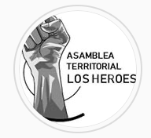

#### FOLIO: SAT10
# Asamblea Metro Los Heroes

[instagram](https://www.instagram.com/asamblealosheroes/)
<asamblealosheroes@gmail.com>
---

### Representantes
#### No tiene representantes, pero para la **olla común** se le transfiere a Johanna Bustamante.

---
### Interacciones frecuentes
#### 
* Comedor Popular Margarita Ancacoy
* Asamblea Barrio Republica
* Asamblea Barrio Yungay
* Asamblea Barrio Brasil

### Redes sociales
#### ¿Para qué se utiliza la red social?
| Instagram | Correo|
|---|---|
|Difusión de actividades e informaciones varias| Contacto y donaciones monetarias para la olla común|

### **Instagram**
| seguidores | seguidos | publicaciones | hashtag 
|---|---|---|---|
|514|453|27|0

Primera Publicación IG: 08/07/2020

---
### Frecuencia de publicación.

Publicaciones:
* Feed: semanalmente
* Historias: diariamente

Actividades: Una vez por semana. 

---
### Ubicación
* Sector Los Heróes

---
### Describir temas de interés y/o trabajo
* Libertad a los presos politicos del estallido
* Colaboración y cooperación con ollas comunes
* Protesta social

---
### Describir la imagen ideal por la cual se trabaja.
####
* Unidad vecinal y territorial
* Colaboración y cooperación entre vecinxs

---
### ¿Que se hace?
* Manifestaciones
    * Cacerolazos
    * Marchas
    * Velatón
* Apoyo a la olla común Margarita Andacoy
    * "Lucatón" solidaria
 * Jornadas de protesta social
    * "Por el hambre y el trabajo"
    * "Contra el racismo"
    * "Por los presos politicos de la revuelta"
* Huerto comunitario
* Conversatorios sobre "resistencia popular en los territorios"

---
### Describir y distinguir demandas más reivindicativas de espacios sin relación con lo contencioso o con lo político mas prefigurativo
#### (lo contencioso; demanda al Estado, a alguna autoridad, privados, etc), (prefigurativo, transformación desde lo cotidiano, etc.).
* Cambios y transformciones en la vida del barrio
* Unión vecinal y territorial

---
### Tipo de organización interna.
#### Asambleísmo y horizontalidad.

---
### Describir los temas / imágenes- iconos / conceptos mas habitualmente presentes en sus publicaciones. Describir cambios/ transformaciones en los contenidos desde Octubre.
La organización es "relativamente" nueva, nace como un brazo del **comedor popular margarita andacoy**.  

**Iconos:**
Su icono se representa por un puño de color negro y gris con el nombre de la asamblea a un costado.

**Diseño estético:**
No tienen una linea estetitca clara. Utilizan colores azules, negro, blanco y rojo. El diseño de la información subida a la página depende directamente del "tipo" de contenido.

---
### Percepciones que se tiene del Estado
#### (Aparato burocrático)
Piden la renuncia del Presidente Piñera. Encarcelan la protesta social. 

> Ante las políticas represivas de un gobierno en contra de la vida, los territorios en resistencia nos organizamos para rechazar la violencia política, económica y social (...)

| Declaraciones | Link | 
|---|---|
|Protesta social contra la cuenta pública | [Link](https://www.instagram.com/p/CDRnL-PhRZs/) |

---
### Percepciones que se tiene de las Fuerzas de Orden
#### (Aparato represivo)
> Represión contra la protesta social. 

| Declaraciones | Link | 
|---|---|
|Anotar los comunicados | [Link](https://www.instagram.com/p/CDZcXVPhCyV/) |

---
### Incorporar aca notas, citas textuales, links, etc. extra a los ya incorporados, que sean de interés para comprender tanto la forma como los contenidos asociados a la organización.

* Primera públicación [Link](https://www.instagram.com/p/CCaAFChhHLu/)
