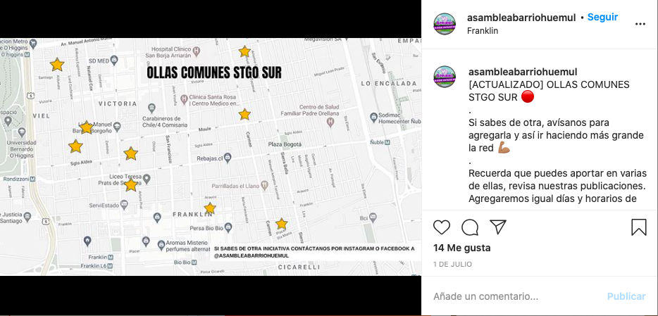
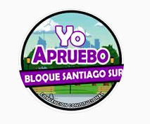
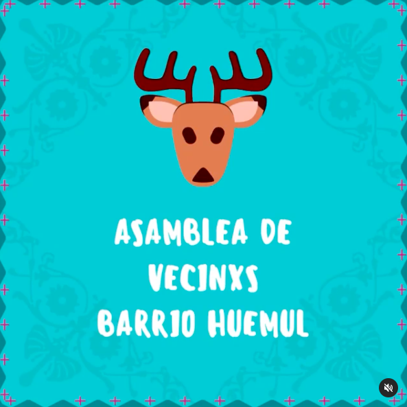

#### FOLIO: SAT11
# Asamblea Barrio Huemul

[Instagram](https://www.instagram.com/asambleabarriohuemul/)

---

### Representantes
#### No tienen representantes.

---
### Interacciones frecuentes
#### 
* "Los organizados" sector Matta Sur
* Comité Matta Sur
* Barrio Rondizzoni

### Redes sociales
#### ¿Para qué se utiliza la red social?
| Instagram | 
|---|---|---|---|
|Difusión de actividades e informaciones varias|

### **Instagram**
| seguidores | seguidos | publicaciones | hashtag 
|---|---|---|---|
|967|470|57| #barriohuemul

* Primera Publicación IG: 16/12/2019

---
### Frecuencia de publicación.
Publicaciones:
* Feed: Semanalmente. Dos veces por mes.
* Historias: Semanalmente

Actividades: Mensualmente.

---
### Ubicación
* Barrio huemul, sector franklin/nataniel cox/placer/viel. Son parte del bloque Santiago Sur.

---
### Describir temas de interés y/o trabajo
* Nueva constitución y proceso constituyente participativo
* Organización territorial
* Vinculación, colaboración y cooperación entre vecinxs

---
### Describir la imagen ideal por la cual se trabaja.
#### (El horizonte hacia el cual se quiere avanzar)
* Dignidad
* Territorios organizados

---
### ¿Que se hace?
#### (Manifestaciones, marchas, intervenciones, actividades culturales, conversatorios, intercambio de saberes, actividades solidarias o de apoyo mutuo, abastecimiento, contra información, emplazamiento a autoridades etc.)
* Cabildos
* Actividades culturales familiares
    * Carnaval por la dignidad
    * Celebración 106 años del barrio huemul
* Apoyo ollas comunes y familias del barrio
    * Rifa Solidaria
    * Aportes monetarios y de viveres a olla comunes y a vecinos del sector
    * Armado de cajas de alimentos
    * Difusión ubicación de ollas comunes del sector [Link](https://www.instagram.com/p/CCG2VZpJ9o4/)
    
    
* Red de apoyo a personas mayores del sector por crisis COVID 19
* Campañas de donación de carpas y sillas de rueda. 
* Manifestaciones
    * Cacerolazos
    * Velatones
    * Marchas territoriales
* Asambleas y reuniones (virtuales/presenciales)
* Difusión de información del municipio
* Jornadas de propaganda por el apruebo y la convernción constitucional

---
### Describir y distinguir demandas más reivindicativas de espacios sin relación con lo contencioso o con lo político mas prefigurativo
#### (lo contencioso; demanda al Estado, a alguna autoridad, privados, etc), (prefigurativo, transformación desde lo cotidiano, etc.).
* Unión y colaboración entre vecinxs
* Apoyo mutuo

---
### Tipo de organización interna.
#### Asambleísmo y horizontalidad.

---
### Describir los temas / imágenes- iconos / conceptos mas habitualmente presentes en sus publicaciones. Describir cambios/ transformaciones en los contenidos desde Octubre.

**Iconos:**
Tiene dos iconos importantes:
* Su imagen de perfil de instagram que es un fondo de ciudad dibujado con letras moradas y blancas que dicen YO APRUEBO / BLOQUE SANTIAGO SUR / CONVENCIÓN CONSTITUCIONAL

* Un dibujo de un huemul con un pañuelo rosado en el cuello que dice: huemul APRUEBA

* Otro dibujo de huemul sumado al texto: Asamblea de vecinxs del barrio huemul

**Diseño estético:**
No tienen un diseño estetico fisico, utilizan colores vivos para sus informativos. 

---
### Percepciones que se tiene del Estado
#### (Aparato burocrático)
> Gobierno no ha sido capaz de proteger a la ciudadanía durante la pandemia. 

| Declaraciones | Link | 
|---|---|
|Anotar los comunicados | [Link]() |

---
### Percepciones que se tiene de las Fuerzas de Orden
#### (Aparato represivo)
> No hay manifestaciones sobre percepciones de las fuerzas del orden.

| Declaraciones | Link | 
|---|---|
|Anotar los comunicados | [Link]() |

---
### Incorporar aca notas, citas textuales, links, etc. extra a los ya incorporados, que sean de interés para comprender tanto la forma como los contenidos asociados a la organización.
* Capsulas de vecinxs argumentando por qué aprueban la nueva constitución [Link](https://www.instagram.com/p/CFCayr8pekd/)