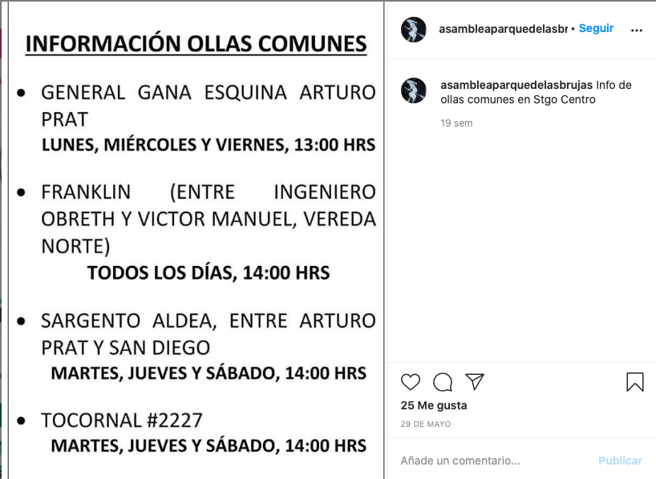
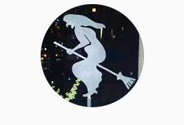
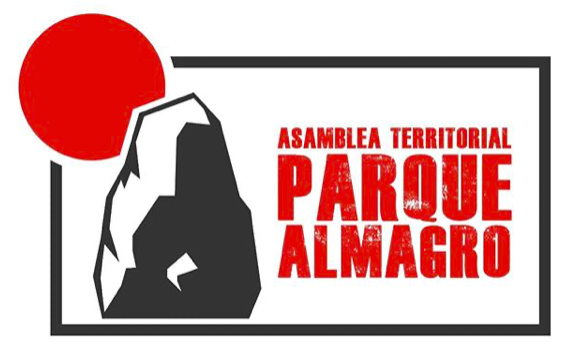

#### FOLIO: SAT12
# Asamblea Parque de las Brujas 

[instagram](https://www.instagram.com/asambleaparquedelasbrujas/)
[facebook]()
[twitter]()
<asambleaparquealmagro@gmail.com>
---

### Representantes
#### No tiene representantes.

---
### Interacciones frecuentes
#### 
* Ollas comunes parque almagro
* Coordinadora 18 de octubre
* Estudiantes UCEN en toma

### Redes sociales
#### ¿Para qué se utiliza la red social?
| Instagram | Correo 
|---|---|---|---|
|Difusión|Contacto|

### **Instagram**
| seguidores | seguidos | publicaciones | hashtag 
|---|---|---|---|
|1.269|377|98| 3

* Primera Publicación IG: 07/11/2019

---
### Frecuencia de publicación.

Publicaciones: 
* Feed: dos veces por mes.
* Historias: dos veces a la semana.

Actividades: Una vez al mes.

---
### Ubicación
* Sector Parque Almagro / Sta isabel con San diego.

---
### Describir temas de interés y/o trabajo
* Feminismo
* Derechos humanos
* Organización territorial

---
### Describir la imagen ideal por la cual se trabaja.
#### (El horizonte hacia el cual se quiere avanzar.)
* Mejorar la calidad de vida en el barrio de todos los vecinos
* Fortalecimiento de la organización popular

---
### ¿Que se hace?
#### (Manifestaciones, marchas, intervenciones, actividades culturales, conversatorios, intercambio de saberes, actividades solidarias o de apoyo mutuo, abastecimiento, contra información, emplazamiento a autoridades etc.)
* Manifestaciones
    * Cacerolazos
    * Velatones
* Pintatones de murales
* Actividades deportivas como yoga y calistenia
* Cabildos y debates sobre la constitución y la actualidad nacional
* Actividades culturales
    * Cine al aire libre
    * Festival de arte y musica
* Conversatorios y charlas
* Ferias comunitarias de comercio
    * Red de economía popular
* Ferias del libro
* Intervención del espacio publico con ceniceros
* Apoyo y propaganda al apruebo y convención constitucional
* Información relevante por covid19
* Difusión de información para asistir o cooperar con ollas comunes del sector

---
### Describir y distinguir demandas más reivindicativas de espacios sin relación con lo contencioso o con lo político mas prefigurativo
#### (lo contencioso; demanda al Estado, a alguna autoridad, privados, etc), (prefigurativo, transformación desde lo cotidiano, etc.).
**CONSIGNAS**
* Compartirmos, dialogamos, discutimos en comunidad.
* Mejorar la calidad de vida de los vecinos y vecinas del sector
* Resignificar los espacios y recuperar el territorio

---
### Tipo de organización interna.
#### Asambleismo y horizontalidad. Trabajo por comisiones.

---
### Describir los temas / imágenes- iconos / conceptos mas habitualmente presentes en sus publicaciones. Describir cambios/ transformaciones en los contenidos desde Octubre.
El contenido siempre se ha vinculado a información sobre represión policial, manifestaciones y actividades, ultimamente sus publicaciones se enfocan en actualidad nacional y apoyo a ollas comunes.

**Iconos:**
* La imagen de su instagram es una bruja, con un fondo de edificios al fondo:

* El logro que utilizaban previo a la pandemia es:

**Diseño estético:**
Tenian una línea gráfica definida hasta que comenzó la pandemia (12/03) donde comenzaron a subir contenido de manera desordenada. 

---
### Percepciones que se tiene del Estado
#### (Aparato burocrático)
> Gobierno violador de derechos humanos. 

| Declaraciones | Link | 
|---|---|
|Libertad presos politicos | [Link](https://www.instagram.com/p/B9_2bT0JX3R/) |

---
### Percepciones que se tiene de las Fuerzas de Orden
#### (Aparato represivo)
> Realizan montajes, llaman terroristas a los manifestantes y violan los derechos humanos.

| Declaraciones | Link | 
|---|---|
|Conmenoración asesinato Camilo Catrillanca | [Link](https://www.instagram.com/p/B42GQ3oppFw/) |

---
### Incorporar aca notas, citas textuales, links, etc. extra a los ya incorporados, que sean de interés para comprender tanto la forma como los contenidos asociados a la organización.

* Re "bautizaron" el parque almagro como plaza de las brujas el 8M [Link](https://www.instagram.com/p/CB4civhpm4_/)
    > NO EXISTE MÁS EL PARQUE ALMAGRO!!! BIENVENIDXS AL PARQUE DE LAS BRUJAS, LOCALIZADO EN OPOSICIÓN GEOMÉTRICA, ÉTICA Y MORAL AL PALACIO DE LA MONEDA Desterrando los nombres asignados desde Estado Genocida Chileno
    