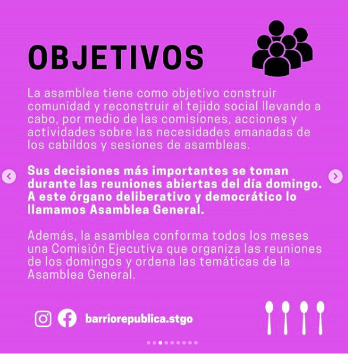
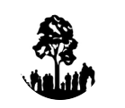
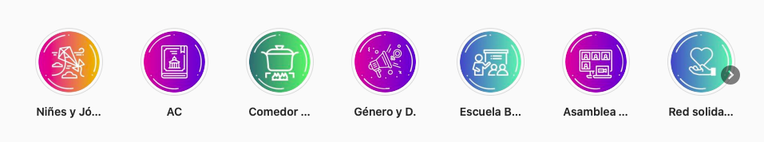

#### FOLIO: SAT13
# Asamblea Barrio República

[instagram](https://www.instagram.com/barriorepublica.stgo/)
[facebook](https://www.facebook.com/barriorepublica.stgo)
[página web](https://linktr.ee/asambleabarriorepublica)

---

### Representantes
#### Coordinación ejecutiva cargos rotativos que duran aprox un mes.

---
### Interacciones frecuentes
* Comedor margarita andacoyo
* asamblea barrio yungay
* asamblea barrio brasil

### Redes sociales
#### ¿Para qué se utiliza la red social?
| Instagram | Facebook | Página web | Diario Mural 
|---|---|---|---|
|Difusión de información y actividades | Difusión de información y comparten noticias para colaborar con organizaciones animalistas del barrio | Difusión de declaraciones, comisiones y actas| Difusión de actividades y noticias barriales|

### **Instagram**
| seguidores | seguidos | publicaciones | hashtag 
|---|---|---|---|
|4.914|468|617| 2

* Primera Publicación IG: 07/11/2019

---
### Frecuencia de publicación.

Publicaciones: 
* Feed: tres veces por semana
* Historia: diariamente

Actividades: Semanalmente

---
### Ubicación
* Barrio republica

---
### Describir temas de interés y/o trabajo
* Proceso constituyente
* Feminismo y organizacion contra violencia patriarcal
* Niñes
* Colaboración y apoyo mutuo vecinal
* Autoeducación y educación popular
* Espacio e instancia de organización barrial

---
### Describir la imagen ideal por la cual se trabaja.
* **CONSIGNA**: Hasta que la dignidad se haga constumbre.
* Promueve la lucha activa por un país que garantice los derechos sociales y el buen
vivir para todes. 
* Principios y objetivos basados en la colaboración, organización y autoeducacion de los vecinos para los vecinos. [Link](https://drive.google.com/file/d/1Gpob2uynyHwhdc39nT4dZpg3fQrKWG8j/view)

---
### ¿Que se hace?
#### (Manifestaciones, marchas, intervenciones, actividades culturales, conversatorios, intercambio de saberes, actividades solidarias o de apoyo mutuo, abastecimiento, contra información, emplazamiento a autoridades etc.)
* Manifestaciones
    * Marchas
    * Cacerolazos
    * Velatones
* Propaganda a favor del apruebo y convención constistucional 
* Olla común
    * Colaboración con viveres
    * Apoyo mutuo entre vecinos
    * Entrega de alimentos
    * Rifas solidarias
* Asambleas semanales (virtuales/presenciales)
* Conversatorios y charlas de tematicas como ddhh, constitución, etc.
* Escuela barial
* Apoyo a vecinos emprendedores
* Informaciones diarias
    * Diario mural
* Intervenciones con murales y lienzos
* Actividades para niños
    * Asamblea de niñxs
* Onces barriales
* Malones barriales
* Talleres con aporte voluntario para el comedor popular

---
### Describir y distinguir demandas más reivindicativas de espacios sin relación con lo contencioso o con lo político mas prefigurativo
#### (lo contencioso; demanda al Estado, a alguna autoridad, privados, etc), (prefigurativo, transformación desde lo cotidiano, etc.).
* Colaboración entre vecinxs
* Construir comunidad y reconstruir el tejido social llevando a cabo actividades emanadas de la asamblea 

---
### Tipo de organización interna.
#### Asambleismo y horizontalidad. Comisiones de trabajo por tematica, tienen instagrams de cada algunas comisiones como niñes, olla común, feministas, etc. Coordinación ejecutiva que varia cada un mes.

---
### Describir los temas / imágenes- iconos / conceptos mas habitualmente presentes en sus publicaciones. Describir cambios/ transformaciones en los contenidos desde Octubre.
Al ser su objetivo la cohesión social, parten como asamblea realizando actividades comunitarias focalizadas para quienes habitan el territorio, convocatorias a marchas y conmemoraciones; actualmente han variado su contenido hacia la crisis sociosanitaria, la violacion de ddhh y el comedor solidario donde colaboran.

**Iconos:**
Logo de la organizacion es un arbol y gente, utilizan el color verde destacador como color principal en sus logos y paginas.

**Diseño estético:**
No tienen colores ni un diseño estetico predefinido, sin embargo, para sus historias destacadas utilizan colores con colores fuertes y variados. 

---
### Percepciones que se tiene del Estado
#### (Aparato burocrático)
> Estado que viola los ddhh sistematicamente. Racista y a favor del empresariado.

| Declaraciones | Link | 
|---|---|
| Chile Estado terrorista | [Link](https://www.instagram.com/p/CD4AOqcJXTD/) |
| Hechos en el Wallmapu | [Link](https://www.instagram.com/p/CDcR2UTphak/) |

---
### Percepciones que se tiene de las Fuerzas de Orden
#### (Aparato represivo)
> Complices del Estado, represión violenta y criminalización de la protesta.

| Declaraciones | Link | 
|---|---|
| Chile Estado terrorista | [Link](https://www.instagram.com/p/CD4AOqcJXTD/) |
| Hechos en el Wallmapu | [Link](https://www.instagram.com/p/CDcR2UTphak/) |

---
### Incorporar aca notas, citas textuales, links, etc. extra a los ya incorporados, que sean de interés para comprender tanto la forma como los contenidos asociados a la organización.
* La *pagina web* de la organizacion es muy particular, es muy detallada y muestra todas las iniciativas. [link](https://linktr.ee/asambleabarriorepublica)
* Salida de la Coordindora de Asambleas Territoriales por no estar acorde a los principios y objetivos de la asamblea [link](https://drive.google.com/file/d/1XXmsrzzlKavZNg9oV8ABiPSs2BKa8QfV/view)
* Tienen un diario mural virtual [link](https://padlet.com/cnquinteros90/jzvl1e0r5ri5hcux)
* Poseen un protocolo contra la violencia patriarcal [link](https://drive.google.com/file/d/1jkKpSIwAc8CMNiDFFibtqQGUIbsFVTIt/view)

* Postura frente al plebiscito 25/10/2020 [link](https://www.flipsnack.com/aprendizajeip/declaraci-n-asamblea-autoconvocada-barrio-rep-blica.html)
