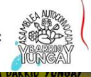
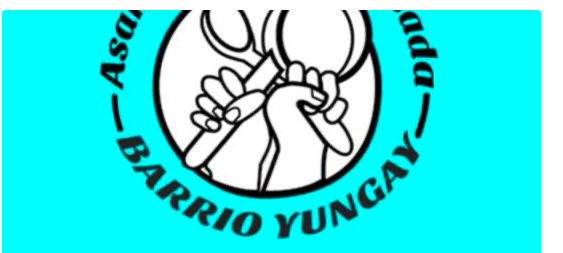
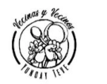
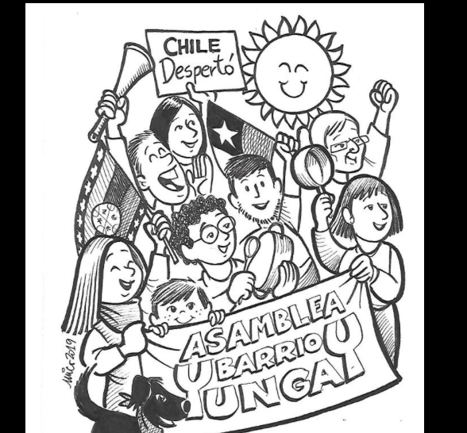

#### FOLIO: SAT14
# Asamblea Autoconvocada Vecinxs Barrio Yungay

[instagram](https://www.instagram.com/yungay_te_ve/)
[facebook](https://www.facebook.com/yungayteve/)
[twitter](www.twitter.com/TeVeYungay)
<correo@correo.cl>
---

### Representantes
#### No tiene representantes.

---
### Interacciones frecuentes
#### 
* Asamblea autoconvocada barrio republica
* asamblea barrio los heroes
* asamblea barrio santa ana

### Redes sociales
#### ¿Para qué se utiliza la red social?
| Instagram | Facebook | Twitter | Otra 
|---|---|---|---|
|0|0|0| 0|

### **Instagram**
| seguidores | seguidos | publicaciones | hashtag 
|---|---|---|---|
|4.484|198|349| #vecinosyungay

* Primera Publicación IG: 22/10/2019

---
### Frecuencia de publicación.

Publicaciones:

Actividades:

---
### Ubicación
* Barrio yungay

---
### Describir temas de interés y/o trabajo

---
### Describir la imagen ideal por la cual se trabaja.
#### (El horizonte hacia el cual se quiere avanzar.)
* Un nuevo pacto social
* Colaboración y organización barrial

---
### ¿Que se hace?
* Manifestaciones
    * Cacerolazos
    * Marchas
* Actividades para la familia / niñxs
    * Juegos virutales [link](https://boletinyungay.org/2020/04/04/trawupayin-komikan-aukantuayin-juguemos-komikan/)
    * Jornadas familiares
* Difusión de información y contrainformación
* Emplazamiento a las autoridades de gobierno
* Festivales culturales
* Pasacalles
* Microfono abierto
* Jornadas de propaganda
    * Muralismo
    * Pancartas
* Conversatorios constituyentes
* Talleres 
* Olla común
    * Colaboracion con viveres
    * Rifa de apoyo
    * Canastas solidarias
* Rifas para otras organizaciones del barrio

---
### Describir y distinguir demandas más reivindicativas de espacios sin relación con lo contencioso o con lo político mas prefigurativo
#### (lo contencioso; demanda al Estado, a alguna autoridad, privados, etc), (prefigurativo, transformación desde lo cotidiano, etc.).
* Uso y apropiación del espacio publico barrial *no nos cansaremos de usar las calles*
CONSIGNAS: *¡No nos soltemos, no dejemos las calles!*
* Solidaridad y colaboración comunitaria
* Apoyo vecinal

>  Nuestras demandas sociales y el anhelo de una nueva Constitución para una sociedad más justa y equitativa para todxs, solo se van a conseguir con una comunidad unida, organizada, deliberante y movilizada.

---
### Tipo de organización interna.
#### Asambleismo y horizontalidad.

---
### Describir los temas / imágenes- iconos / conceptos mas habitualmente presentes en sus publicaciones. Describir cambios/ transformaciones en los contenidos desde Octubre.
Comenzaron realizando cabildos y actividades familiares. Actualmente informan, difunden manifestaciones, 

**Iconos:**
* Hicieron un concurso para elegir el logo de la asamblea [link](https://boletinyungay.org/2020/01/13/bases-concurso-logo-para-mi-asamblea/)
* El logo tiene el nombre de la asamblea, un puño en alto, lapices y flores.

* El logo de las declaraciones es otro, uno que tiene una cuchara y una olla

**Diseño estético:**
No tienen un diseño estetico definido ni colores ha utilizar. Intentan usar colores vivos para actividades no ligadas a la manifestación.

---
### Percepciones que se tiene del Estado
#### (Aparato burocrático)
> Estado represor, no entienden las demandas y no escuchan al pueblo. Persecución politica a dirigentes vecinales y manifestantes.  Terrorismo y criminalización de la protesta.

| Declaraciones | Link | 
|---|---|
|Cocina constituyente | [Link](https://www.instagram.com/stories/highlights/17860080178599522/) |
|Rechazo persecución politica | [Link](https://www.instagram.com/p/B5IzZ_9JoaI/) |

---
### Percepciones que se tiene de las Fuerzas de Orden
#### (Aparato represivo)
> Militarización del territorio. Represión y violencia sistematica hacia el pueblo, los mapuche y los marginados. Complices de la invisibilización de la pobreza en Stgo Centro.

| Declaraciones | Link | 
|---|---|
|Declaracion 30/05/2020 | [Link](https://www.instagram.com/p/CA0HQpnJTdA/) |

---
### Incorporar aca notas, citas textuales, links, etc. extra a los ya incorporados, que sean de interés para comprender tanto la forma como los contenidos asociados a la organización.

* Página informativa sobre la organización [Link](https://boletinyungay.org)

* En su página tienen ilustraciones de la revuelta, la organizacion y el barrio por parte de un vecino.

* Dan por *quemada* la constitución del 80' [Link](https://www.instagram.com/p/B7RzE8zJ4dO/)