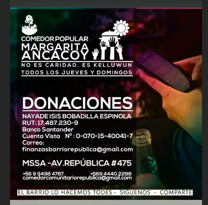
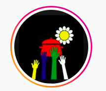

#### FOLIO: SAT15
# Comedor Popular Margarita Ancacoy

[instagram](https://www.instagram.com/comedormargaritancacoy/)
<comedorcomunitariorepublica@gmail.com>
> Whatsapp: +56994984767
---

### Representantes
#### Donaciones monetarias a Nayade. No hay otros tipos de representación.

---
### Interacciones frecuentes
#### 
* Asamblea autoconvocada barrio republica
* Asamblea autoconvocada barrio los heroes

### Redes sociales
#### ¿Para qué se utiliza la red social?
| Instagram | Facebook | Whatsapp 
|---|---|---|---|
|Información de menús, canales de donación y trabajo del comedor |No tienen| Contacto|

### **Instagram**
| seguidores | seguidos | publicaciones | hashtag 
|---|---|---|---|
|400|104|105| 0

* Primera Publicación IG: 24/06/2020

---
### Frecuencia de publicación.

Publicaciones:
* Historias: Diariamente
* Feed: Semanalmente

Actividades: Domingos y jueves almuerzos.

---
### Ubicación
* Barrio republica / plaza manuel rodriguez

---
### Describir temas de interés y/o trabajo
* Alimentación para vecinos y vecinas 
* Colaboración y apoyo mutuo

---
### Describir la imagen ideal por la cual se trabaja.
#### 
* Alimentación como derecho
* País digno y más justo

---
### ¿Que se hace?
####
* Propaganda por el apruebo convención constitucional
* Centro de acopio en negocios del barrio [Link](https://www.instagram.com/p/CB59nKXjr8H/)
* Comedor popular
* Rifas solidarias
* Jornadas de propaganda y agitación en torno a temáticas de la alimentación 

* Campañas de abastecimiento y donaciones

---
### Describir y distinguir demandas más reivindicativas de espacios sin relación con lo contencioso o con lo político mas prefigurativo
#### (lo contencioso; demanda al Estado, a alguna autoridad, privados, etc), (prefigurativo, transformación desde lo cotidiano, etc.).
* CONSIGNA: El barrio lo hacemos todes
* Alimentación como derecho desde el nacimiento
* Vida digna desde cada organización y territorio

---
### Tipo de organización interna.
#### Horizontalidad y trabajo en equipo. Comisiones. 

---
### Describir los temas / imágenes- iconos / conceptos mas habitualmente presentes en sus publicaciones. Describir cambios/ transformaciones en los contenidos desde Octubre.
Nacen con un fin especifico que es dar a conocer las necesidades alimentarias de la población que reside en el sector. Se han pronunciado en torno a hechos sociales interpelando al gobierno.

**Iconos:** Fondo negro, una olla roja, una margarita y manos de colores amarillo, blanco, azul y verde.

**Diseño estético:**
Estilo estetico definido, utilizan los colores negro y blanco para las fotografias y letras blancas.

---
### Percepciones que se tiene del Estado
#### (Aparato burocrático)
> Estado racista y fascista. Criminalización de la lucha y la protesta social.

| Declaraciones | Link | 
|---|---|
|Huelga de hambre presos politicos mapuche | [Link](https://www.instagram.com/p/CDcVFp2JXqX/) |

---
### Percepciones que se tiene de las Fuerzas de Orden
#### (Aparato represivo)
> Militarización de los territorios. 

| Declaraciones | Link | 
|---|---|
|Huelga de hambre presos politicos mapuche | [Link](https://www.instagram.com/p/CDcVFp2JXqX/) |

---
### Incorporar aca notas, citas textuales, links, etc. extra a los ya incorporados, que sean de interés para comprender tanto la forma como los contenidos asociados a la organización.

* Comienzan recibiendo donaciones [link](https://www.instagram.com/p/CFIg6MIpVnm/) 

* Historicidad clara en la acción del comedor solidario, se vuelven a realizar luego de muchos años. [link](https://www.instagram.com/p/CB6ijEpgHBk/)
> La reciprocidad, el kelluwün, hoy emerge nuevamente convertido en charquicán con huevo, en comida para quien la necesite, porque desde las ollas y comedores se resiste el hambre con autoorganización y autonomía desde los vecines y para los vecines.

