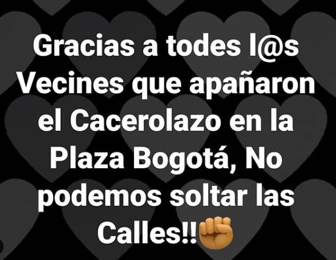

#### FOLIO: SAT16
# Los Organizados

[instagram](https://www.instagram.com/los.organizados/)
[facebook](https://www.facebook.com/LosOrganizados-113343760226374/?modal=admin_todo_tou)
[twitter]()
<organizadoslos@gmail.com>
---

### Representantes
#### No tienen representantes.

---
### Interacciones frecuentes
#### 
* Junta de Vecinos Plaza Bogotá
* Asamblea Territorial Plaza Bogotá
* Asamblea Barrio Huemul
* Olla común san antonio de padua
* Radio Franklin

### Redes sociales
#### ¿Para qué se utiliza la red social?
| Instagram | Facebook | 
|---|---|
|Difusión de todo tipo de contenido |Difusión de videos de las actividades|

### **Instagram**
| seguidores | seguidos | publicaciones | hashtag 
|---|---|---|---|
|597|225|454| #feriacontrabando

* Primera Publicación IG: 03/02/2020

---
### Frecuencia de publicación.

Publicaciones:
* Feed: Tres veces por semana
* Historias: Diariamente

Actividades: Semanalmente

---
### Ubicación
* Bloque Matta Sur

---
### Describir temas de interés y/o trabajo
* Difusión de información
* Colaboración vecinal
* 

---
### Describir la imagen ideal por la cual se trabaja.
#### (El horizonte hacia el cual se quiere avanzar.)
* Vecinxs organizados por el territorio y el empoderamiento.

---
### ¿Que se hace?
#### (Manifestaciones, marchas, intervenciones, actividades culturales, conversatorios, intercambio de saberes, actividades solidarias o de apoyo mutuo, abastecimiento, contra información, emplazamiento a autoridades etc.)
* Red de acopio solidario
* Olla común
    * Aportes en viveres
    * Aporte monetario
    * Difusión actividades
    * Difusión de diversas ollas comunes
* Difusión donaciones para olla común
* Difusión murales del barrio
* Difusión actividades de otras organiaciones sociocomunitarias
* Difusión emprendimientos y comercio local
* Actividades educativas e informativas sobre el proceso constituyente
* Conmemoración de días como el 11/09, 29/03, 18/10.
* Contrainformación sobre el plebiscito y la prensa hegemonica.
* Charlas sobre el patrimonio de barrio matta sur
* Manifestaciones
    * Cacerolazos
    * Banderazos
* Intervenciones a favor del apruebo y convencion constitucional
    * Propaganda plebiscito

---
### Describir y distinguir demandas más reivindicativas de espacios sin relación con lo contencioso o con lo político mas prefigurativo
#### (lo contencioso; demanda al Estado, a alguna autoridad, privados, etc), (prefigurativo, transformación desde lo cotidiano, etc.).
* Organización territorial
* Empoderamiento vecinal
* Unidad vecinal
* Dignidad para la vida

---
### Tipo de organización interna.
#### Horizontabilidad.

---
### Describir los temas / imágenes- iconos / conceptos mas habitualmente presentes en sus publicaciones. Describir cambios/ transformaciones en los contenidos desde Octubre.
Ha variado el contenido según el contexto sociopolitico. Los conceptos mas habituales en sus publicaciones se vinculan al apruebo, dignidad, bloque matta sur.

**Iconos:**
El icono principal que utilizan es una imagen con fondo blanco con contornos de casas dibujadas que dicen Los Organizadxs.

Por otra parte, haciendo campaña por el proceso constituyente, tienen otro logo que dice Yo Apruebo.

**Diseño estético:**
No presentan diseño estético fijo, suben contenido sin linea editorial intentando abarcar todas las tematicas de actualidad social.

Tampoco hacen afiches, son imagenes con textos fabricados desde facebook.

---
### Percepciones que se tiene del Estado
#### (Aparato burocrático)
> Estado empresario que no ayuda a las personas a vivir la crisis. Se vela por el empresariado y no por los trabajadores.

| Declaraciones | Link | 
|---|---|
|Anotar los comunicados | [Link]() |

---
### Percepciones que se tiene de las Fuerzas de Orden
#### (Aparato represivo)
> No se sienten seguros de la policia. *me protegen mis amigas, no la policia* 

| Declaraciones | Link | 
|---|---|
|Anotar los comunicados | [Link]() |

---
### Incorporar aca notas, citas textuales, links, etc. extra a los ya incorporados, que sean de interés para comprender tanto la forma como los contenidos asociados a la organización.
