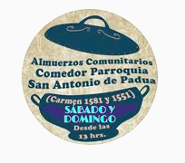

#### FOLIO: SAT17
# Olla común San Antonio de Padua

[instagram](https://www.instagram.com/olla.comun.san.antonio.depadua/)
[facebook](https://www.facebook.com/ollacomun.padua)
[youtube]()
<correo@correo.cl>
---

### Representantes
#### No tienen representantes.

---
### Interacciones frecuentes
#### 
* Los Organizadxs
* Asamblea autoconvocada barrio huemul
* Asamblea autoconvocada plaza bogotá

### Redes sociales
#### ¿Para qué se utiliza la red social?
| Instagram | Facebook | Twitter | Otra 
|---|---|---|---|
|Difusión de las actividades y menús de fin de semana | No tienen actividades publicas |0| 0|

### **Instagram**
| seguidores | seguidos | publicaciones | hashtag 
|---|---|---|---|
|146|104|47| #Entrevecinosnosayudamos🏘️

* Primera Publicación IG: 26/07/2020

---
### Frecuencia de publicación.

Publicaciones:
* Feed: semanalmente
* Historias: diariamente

Actividades: Todos los fines de semana realizan la olla común en el sector matta sur.

---
### Ubicación
* Sector Matta Sur cercano a la calle Carmen.

---
### Describir temas de interés y/o trabajo
* Alimentación
* Difusión de actividades
* Colaboración y apoyo mutuo

---
### Describir la imagen ideal por la cual se trabaja.
#### (El horizonte hacia el cual se quiere avanzar.)
* Colaboración y apoyo mutuo vecinal

---
### ¿Que se hace?
#### 
* Difusión de actividades
* Entrega de alimentos
* Recepcion de donaciones
* Campaña de donaciones para olla común y dulces para niños
* Difusión de emprendimientos en sus historias de instagram

---
### Describir y distinguir demandas más reivindicativas de espacios sin relación con lo contencioso o con lo político mas prefigurativo
#### (lo contencioso; demanda al Estado, a alguna autoridad, privados, etc), (prefigurativo, transformación desde lo cotidiano, etc.).
* CONSIGNAS: 
    * Solo el pueblo ayuda al pueblo
    * Entre vecinos nos ayudamos
    * Amor, solidariad y cariño vecinal

---
### Tipo de organización interna.
#### Vocerias y trabajo en equipo.
Johanna recibe donaciones en su cuenta bancaria para comprar viveres para el funcionamiento de la olla.

---
### Describir los temas / imágenes- iconos / conceptos mas habitualmente presentes en sus publicaciones. Describir cambios/ transformaciones en los contenidos desde Octubre.
Su contenido se focaliza en las actividades que realizan como olla común para la comunidades cercanas al sector Matta Sur.

**Iconos:**
Su icono es una olla abierta con información entre la tapa y la olla. 

**Diseño estético:**
No tienen diseño estetico fijo, la mayoria de sus publicaciones son fotos sobre las actividades de la olla común que realizan todos los fines de semana. 

---
### Percepciones que se tiene del Estado
#### (Aparato burocrático)
> No se posicionan frente al rol del Estado.

| Declaraciones | Link | 
|---|---|
|Anotar los comunicados | [Link]() |

---
### Percepciones que se tiene de las Fuerzas de Orden
#### (Aparato represivo)
> No se posicionan frente al rol de las fuerzas de orden.

| Declaraciones | Link | 
|---|---|
|Anotar los comunicados | [Link]() |

---
### Incorporar aca notas, citas textuales, links, etc. extra a los ya incorporados, que sean de interés para comprender tanto la forma como los contenidos asociados a la organización.
* Registro audiovisual de la olla común [Link](https://www.youtube.com/watch?v=iq8pTkGvJAA)
