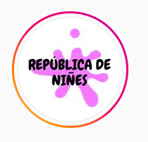
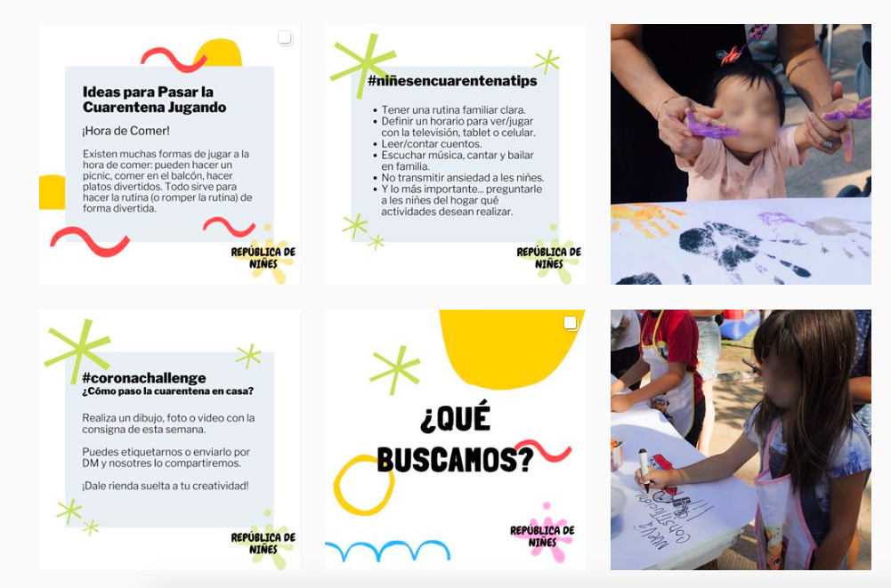

#### FOLIO: SAT18
# Asamblea República "de Niñes"

[instagram](https://www.instagram.com/republicadenines/)
[facebook]()
[twitter]()
<correo@correo.cl>
---

### Representantes
#### Comisión de la asamblea autoconvocada  barrio republica.

---
### Interacciones frecuentes
#### 
* Asamblea autoconvocada barrio republica
* Republica constituyente
* Banco de tiempo república

### Redes sociales
#### ¿Para qué se utiliza la red social?
| Instagram |
|---|
|Difusión de actividades para NNA del sector república|

### **Instagram**
| seguidores | seguidos | publicaciones | hashtag 
|---|---|---|---|
|218|153|25| 0

* Primera Publicación IG: 31/03/2020

---
### Frecuencia de publicación.

Publicaciones:
* Feed: Semanalmente
* Historias: Diariamente

Actividades: No hacen actividades. 

---
### Ubicación
* Barrio republica

---
### Describir temas de interés y/o trabajo
* Participación de NNA
* Infancias y niñez
* Ideas para pasar la cuarentena

---
### Describir la imagen ideal por la cual se trabaja.
#### (El horizonte hacia el cual se quiere avanzar.)
* "Que el nuevo chile se construya con la participación de todas las infancias"

---
### ¿Que se hace?
####
* Recomendaciones de actividades para NNA en cuarentena
* Informativos sobre el rol de la niñez e infancia
* Recolección de alimentos exclusivos para los niños del sector
* Actividades de dibujo en cuarentena

---
### Describir y distinguir demandas más reivindicativas de espacios sin relación con lo contencioso o con lo político mas prefigurativo
#### (lo contencioso; demanda al Estado, a alguna autoridad, privados, etc), (prefigurativo, transformación desde lo cotidiano, etc.).
* Generar espacios para que les niñes puedan desarrollarse y participar activamente y politicamente en sus comunidades
* Generar espacios también en RRSS a través de padres, madres y cuidadores.

---
### Tipo de organización interna.
#### 
Comisión de trabajo, horizontalidad y asambleismo. 

---
### Describir los temas / imágenes- iconos / conceptos mas habitualmente presentes en sus publicaciones. Describir cambios/ transformaciones en los contenidos desde Octubre.
Su contenido ha variado por la pandemia y el proceso constituyente. Sin embargo, todo su contenido se enmarca en los niños y padres y madres. 

**Iconos:**
Su icono tiene una mancha morada con letras negras que dice republica de niñes.

**Diseño estético:**
Tienen un diseño estetico fijo para las publicaciones con información, también suben fotografías de actividades con los niñes tapandole sus caras por temas de privacidad. 

---
### Percepciones que se tiene del Estado
#### (Aparato burocrático)
> Asumir responsabilidades politicas de las violaciones de ddhh que han realizado a NNA de todas las edades a lo largo de todo chile.

| Declaraciones | Link | 
|---|---|
|Declaración 03/10/2020 | [Link](https://www.instagram.com/p/CF5KbUmJ8fU/) |

---
### Percepciones que se tiene de las Fuerzas de Orden
#### (Aparato represivo)
> Reprimen y son complices del Estado. Exigen la salida de Rozas.

| Declaraciones | Link | 
|---|---|
|Declaración 03/10/2020 | [Link](https://www.instagram.com/p/CF5KbUmJ8fU/) |

---
### Incorporar aca notas, citas textuales, links, etc. extra a los ya incorporados, que sean de interés para comprender tanto la forma como los contenidos asociados a la organización.
