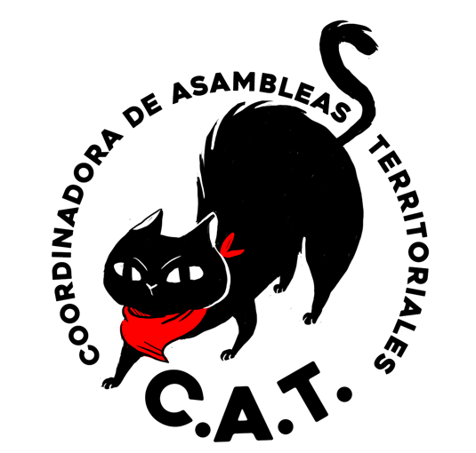

#### FOLIO: SAT19
# Coordinadora de Asambleas Territoriales (CAT)

[instagram](https://www.instagram.com/asambleasterritoriales/)
[facebook](https://www.facebook.com/asambleasterritorialesCAT)
[twitter](https://twitter.com/catcoordinadora)
[youtube](https://www.youtube.com/channel/UC32AZECUSSn8XO77i3aKbaQ)
[Página web](http://www.asambleasterritoriales.org)
<asambleasrm@gmail.com>
---

### Representantes
#### Representantes por asambleas. Vocería CAT electa por los asistentes.

---
### Interacciones frecuentes
#### Se compone por:
> Asambleas (118), Coordinadoras, Cordones y territoriales (20), Cabildos (11), Juntas de Vecinos (5) y decenas de otras organizaciones reconocimos nuestra fuerza colectiva e iniciamos juntes un proceso de lucha a la altura de los desafíos que ha puesto la historia a nuestra generación.

### Redes sociales
#### ¿Para qué se utiliza la red social?
| Instagram | Facebook | Twitter | Youtube 
|---|---|---|---|
|Difusión de actividades e información| Difusión de actividades e información| Difusión de actividades de alta convocatoria| Videos en vivo de conversatorios o manifestaciones|

### **Instagram**
| seguidores | seguidos | publicaciones | hashtag 
|---|---|---|---|
|6.041|630|210| 3

* Primera Publicación IG: 23/11/2019

---
### Frecuencia de publicación.

Publicaciones:
* Historias: diariamente
* Feed: Semanalmente

Actividades: Cada dos semanas. 

---
### Ubicación
* Región Metropolitana General

---
### Describir temas de interés y/o trabajo
* Unificación de asambleas
* Dignidad de las personas
* Autonomia y poder de las asambleas territoriales
* Derechos humanos

---
### Describir la imagen ideal por la cual se trabaja.
#### (El horizonte hacia el cual se quiere avanzar.)
Declaran objetivos e intenciones de trabajo [LINK](http://www.asambleasterritoriales.org/que-es-la-cat/declaracion-cat/)
> Las Asambleas territoriales autoconvocadas continuaremos levantando la lucha organizada desde los territorios, ¡hasta que la dignidad se haga costumbre, y hasta que caiga el neoliberalismo!

---
### ¿Que se hace?
#### (Manifestaciones, marchas, intervenciones, actividades culturales, conversatorios, intercambio de saberes, actividades solidarias o de apoyo mutuo, abastecimiento, contra información, emplazamiento a autoridades etc.)
* Encuentros de asambleas metropolitanas
* Difusión de actividades de las asambleas
* Campaña de apoyo mutuo para las ollas comunes 
* Campaña de donaciones nacionales e internacionales para ollas comunes
* Declaraciones y emplazamiento a autoridades de gobierno
* Difusión de informaciones varias ligadas a las manifestaciones sociales o hechos de represión de las fuerzas de orden

---
### Describir y distinguir demandas más reivindicativas de espacios sin relación con lo contencioso o con lo político mas prefigurativo
#### 
* Conocernos, compartir experiencias y unir nuestras luchas
* Quiere ser un espacio de encuentro y articulación impulsada por un grupo de asambleas barriales y territoriales
* Unificar demandas entre todas las asambleas territoriales de la RM
* Espacio orientado a encontrar las demandas comunes que van surgiendo de los territorios, la lucha contra la impunidad y por una vida digna.
[LINK](http://www.asambleasterritoriales.org/que-es-la-cat/)

---
### Tipo de organización interna.
#### Horizontalidad y asambleismo. Vocerias electas por los representantes de las asambleas.

---
### Describir los temas / imágenes- iconos / conceptos mas habitualmente presentes en sus publicaciones. Describir cambios/ transformaciones en los contenidos desde Octubre.
El contenido difundido ha variado segun el contexto social y politico, también permeado por la crisis sociosanitaria. 

**Iconos:**
Su icono es un gato negro con un pañuelo rojo. CAT=Gato en inglés. 

**Diseño estético:**
Utilizan colores como negro y rojo en su página web. No tienen diseño estetico claro ni común en su instagram, más aún porque comparten imagenes y noticias de todas las asamblea sque son parte de la CAT.

---
### Percepciones que se tiene del Estado
#### (Aparato burocrático)
> Violadores de ddhh. Criminalizan la protesta social. "Declaramos que las asambleas autoconvocadas que adhieren a la CAT, son hijas de la rebelión popular y luchamos contra todas las formas de opresión del Estado capitalista neoliberal." Estado negacionista.

| Declaraciones| Link | 
|---|---|
|Declaración CAT 18/01/2020 | [Link](http://www.asambleasterritoriales.org/que-es-la-cat/declaracion-cat/) |

---
### Percepciones que se tiene de las Fuerzas de Orden
#### (Aparato represivo)
> Represores de la protesta social, complices del Estado. 

| Declaraciones | Link | 
|---|---|
|Declaración CAT 18/01/2020 | [Link](http://www.asambleasterritoriales.org/que-es-la-cat/declaracion-cat/) |

---
### Incorporar aca notas, citas textuales, links, etc. extra a los ya incorporados, que sean de interés para comprender tanto la forma como los contenidos asociados a la organización.
* Se declaran como una coordinadora:
> FEMINISTA HORIZONTAL DIVERSA TERRITORIAL 

