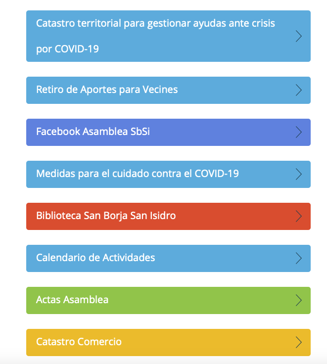
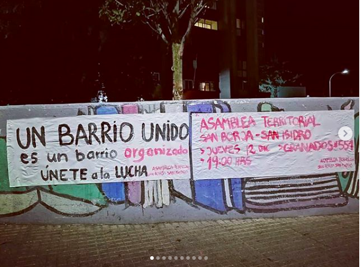
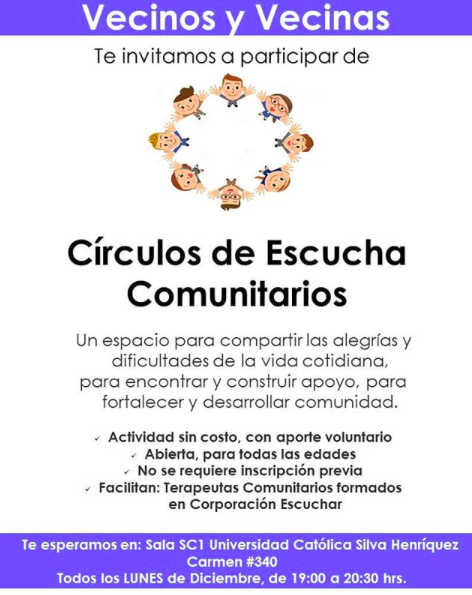
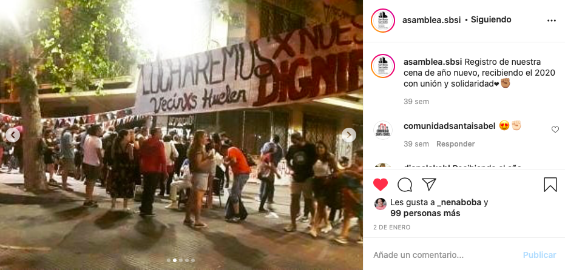

#### FOLIO: SAT2
# Asamblea San Borja San Isidro

[Instagram](https://www.instagram.com/asamblea.sbsi/)
[Twitter](https://twitter.com/AsambleaSbsi)
[Página web](https://il.ink/asambleasbsi)
<asamblea.sbsi@gmail.com>
---

### Representantes
#### No tienen representantes.

---
### Seguidores
#### 
La mayoría de sus seguidores son organizaciones sociocomunitarias y personas individuales.

---
### Seguidos
#### 
Siguen a más de 50 organizaciones sociocomunitarias son seguidas por la asamblea. Organizaciones principalmente de Stgo Centro pero también de todo RM y Chile. También siguen a fundaciones, organizaciones y medios de comunicación, como también a algunos participantes de la asamblea.

---
### Interacciones frecuentes
#### 
* Colectiva feminista de la asamblea: **Feminismo SBSI**
* Cordón Vicuña
* Asambleas del eje dignidad
    * Asamblea El Claustro
    * Comunidad santa isabel
    * Asamblea Marín y alrededores
    * Rosal Organizado

**Instagram**

| seguidores | seguidos | hashtag |
|---|---|---|
|1.652|670|0|

---
### Describir:
Se ubican en el sector San Borja / Blas Cañas / San Isidro. Se reúnen en la plaza de los libros, cercanos al hospital clinico UC.

#### 
No han parado las publicaciones hasta la actualidad. Variación de contenido gráfico según contexto sociopolítico.

**Actividad:**   
* Primera Publicación IG
    * 06/11/2019

#### Cantidad de publicaciones
| Instagram | Facebook | otro |
|---|---|---|
|172|171|0|

* Las publicaciones de facebook son las mismas que las de instagram.

---
### Frecuencia de publicación.

Publicaciones: Dependiendo de la semana, aproximadamente se realizan 15 publicaciones por mes en el feed de instagram. Suben historias de instagram todos los días.

Actividades: Cada dos semanas hay una actividad. La asamblea tiene reuniones todas las semanas (virtuales).
 
---
### Describir temas de interés y/o trabajo
Se dividen en comisiones para trabajar:
* Feminismo
* Grupo de apoyo mutuo
* Comunicaciones
* Niñez

Su foco es integrar a la mayor cantidad de personas en diversas actividades por comisión. La comisión **grupo de apoyo mutuo** surge de la situación sociosanitaria del covid19. Todo lo que realiza la asamblea está transparentado en su página web: 

---
### Describir la imagen ideal por la cual se trabaja.
#### (El horizonte hacia el cual se quiere avanzar.)
**CONSIGNAS**
* RESISTENCIA TERRITORIAL.
* ¡A organizarnos entre todes por un mejor vivir!
* Organización barrial para el bien común del territorio.

* Mejor calidad de vida de las ciudadanas y ciudadanos del país. **DIGNIDAD**.

---
### ¿Que se hace?
#### 
* Cooperativa de abastecimiento: Núcleo SBSI
* Manifestaciones como:
    * Cacerolazos
    * Jornadas de contrainformación
    * Pintatones
    * Velatones

* Trabajo colaborativo con otras asambleas del *sector eje dignidad*.
* Reuniones semanales virtuales y físicas
    * Onces comunitarias
    * Almuerzos comunitarios

* Conversatorios sobre tematicas como: feminismo, constitución, salud, derechos humanos.
* Talleres de autodefensa, para niñes, primeros auxilios, entre otros: **TALLERES DE VERANO**
* Contrainformación [Link](https://www.instagram.com/p/B81jurfp6n7/)
---
### Describir y distinguir demandas más reivindicativas de espacios sin relación con lo contencioso o con lo político mas prefigurativo
#### (lo contencioso; demanda al Estado, a alguna autoridad, privados, etc), (prefigurativo, transformación desde lo cotidiano, etc.).
* Constuir redes de colaboración y apoyo mutuo entre vecinos. 

> [Link](https://docs.google.com/forms/d/e/1FAIpQLScDXBChvBCfeTNdSsa9pHULb2Lbuk_JIHkhw-UPyyve5xw_6A/viewform?fbclid=IwAR2KZLRGfxhZjWk6oU0VTNcVXrvym7rAm5WPBPpjEdAAnD-Ys91ycKbttV4) Catastro de vecinos y vecinas con el " objetivo es catastrar para saber quiénes están dispuestos a colaborar y brindar apoyo, a la vez que identificar quiénes podrían necesitarlo."

* Nuevas formas de compra a través de cooperativas comunitarias.
* Autocuidado vecinal desde la salud mental.

---
### Tipo de organización interna.
#### Asambleísmo y horizontalidad. Trabajo en comisiones.

---
### Describir los temas / imágenes- iconos / conceptos mas habitualmente presentes en sus publicaciones. Describir cambios/ transformaciones en los contenidos desde Octubre.
* Actualmente exponen información que alude al plebiscito, la pandemia, reuniones virtuales y acontecimientos nacionales relevantes.

**Iconos:**
El icono de la asamblea ha variado, pero se compone una imagen con dos edificios que representan las torres de san borja. 

**Diseño estético:**
La gráfica cambia a partir del 26 de enero, desde ahí utilizan la misma fuente de letra en todas las imagenes publicadas y los colores más utilizados son blanco, negro, rojo, gris. Siempre ponen el logo de la asamblea en la esquina superior izquierda.

---
### Percepciones que se tiene del Estado
#### (Aparato burocrático)

| Declaraciones | Link | 
|---|---|
|Acuerdo por la Paz Nov 2019 | [Link](https://www.instagram.com/p/B5TGgfHl1pV/) |
|Posición del gobierno y ffee | [Link](https://www.instagram.com/p/B8LyRLnJI01/) |

---
### Percepciones que se tiene de las Fuerzas de Orden
#### (Aparato represivo)

| Declaraciones | Link | 
|---|---|
|Violencia represiva de carabineros en las manifestaciones  | [Link](https://www.instagram.com/p/B6t58wFJP7Y/) |
|Mural barrial | [Link](https://www.instagram.com/p/CF5UduGJcKy/) |

---
### Incorporar aca notas, citas textuales, links, etc. extra a los ya incorporados, que sean de interés para comprender tanto la forma como los contenidos asociados a la organización.

* **AUTOFORMACIÓN**: Drive con diversos textos, publicaciones e informes en temas como Feminismo, Proceso constituyente y una biblioteca. [Link](https://drive.google.com/drive/folders/1rQ4Z-3RSdiKKHTDHHiem45o3-OfHvgTo)

* Celebración de año nuevo 2020 en comunidad.

