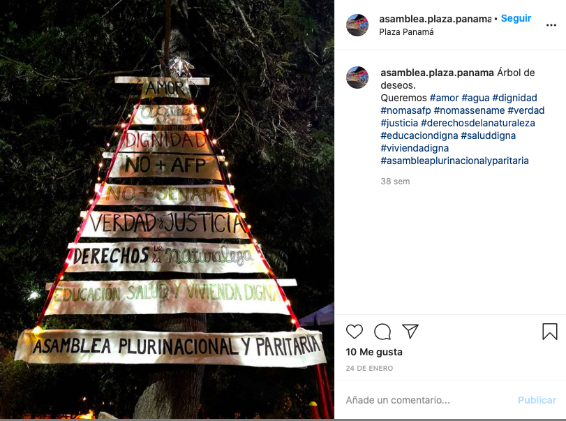
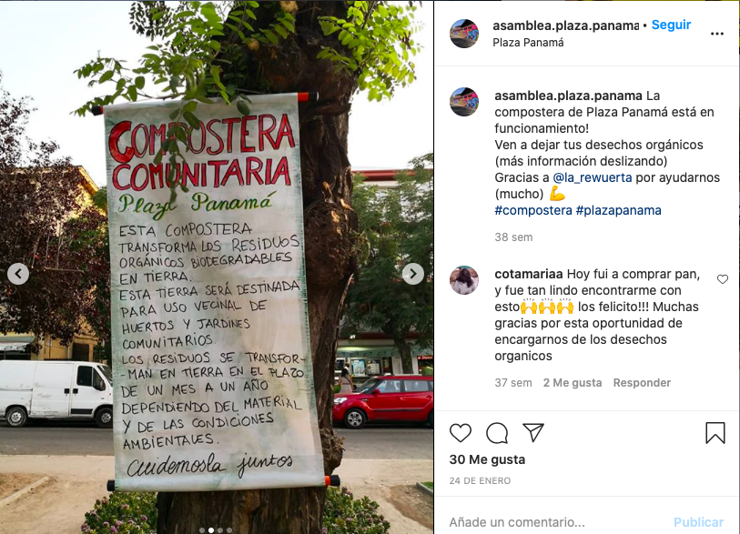
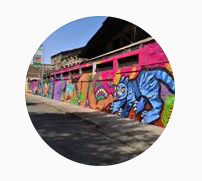

#### FOLIO: SAT20
# Asamblea Vecinal Autoconvocada Plaza Panamá

[instagram](https://www.instagram.com/asamblea.plaza.panama/)

---

### Representantes
#### No tiene representantes.

---
### Interacciones frecuentes
#### (listar otras organizaciones que habitualmente)

### Redes sociales
#### ¿Para qué se utiliza la red social?
| Instagram | 
|---|---|---|---|
|Difusión de actividades e información|

### **Instagram**
| seguidores | seguidos | publicaciones | hashtag 
|---|---|---|---|
|193|101|29| 0

* Primera Publicación IG: 24/01/2020

---
### Frecuencia de publicación.

Publicaciones: 
* Feed: Dos veces al mes
* Historias: tres veces a la semana

Actividades: Una vez al mes.

---
### Ubicación
* Plaza Panamá (Cumming/Mapocho)

---
### Describir temas de interés y/o trabajo
* Nueva constitución
* Unión barrial
* Colaboración y apoyo vecinal

---
### Describir la imagen ideal por la cual se trabaja.
#### (El horizonte hacia el cual se quiere avanzar.)
> Queremos #amor #agua #dignidad #nomasafp #nomassename #verdad #justicia #derechosdelanaturaleza #educaciondigna #saluddigna #viviendadigna #asambleaplurinacionalyparitaria.

---
### ¿Que se hace?
#### (Manifestaciones, marchas, intervenciones, actividades culturales, conversatorios, intercambio de saberes, actividades solidarias o de apoyo mutuo, abastecimiento, contra información, emplazamiento a autoridades etc.)
* Jornadas de reflexion para una nueva constitución
* Huerto Comunitario
* Compostera comunitaria

* Cine al aire libre
* Actividades culturales familiares
* Biblioteca itinerante y comunitaria
* Cicletadas por el apruebo y convención constitucional
* Difusión ollas comunes cercanas al sector

---
### Describir y distinguir demandas más reivindicativas de espacios sin relación con lo contencioso o con lo político mas prefigurativo
#### (lo contencioso; demanda al Estado, a alguna autoridad, privados, etc), (prefigurativo, transformación desde lo cotidiano, etc.).
* Dignidad
* Justicia
* Organización barrial y apoyo vecinal

---
### Tipo de organización interna.
#### Asambleismo y horizontalidad.

---
### Describir los temas / imágenes- iconos / conceptos mas habitualmente presentes en sus publicaciones. Describir cambios/ transformaciones en los contenidos desde Octubre.
El contenido siempre ha estado focalizado a los vecinos del sector y a mostrar los alrededores de la plaza. No toman postura frente a temas controversiales del contexto sociopolitico. 

**Iconos:**
No tienen icono especificado, su icono de instagram es una fotografía de un mural que está cerca al sector de encuentro de la asamblea. 

**Diseño estético:**
No tienen diseño estético claro. La mayoria son fotos con imagenes informativas hechas a mano y qu están pegadas por el barrio.

---
### Percepciones que se tiene del Estado
#### (Aparato burocrático)
> No se posicionan frente al rol del Estado.

| Declaraciones | Link | 
|---|---|
|Anotar los comunicados | [Link]() |

---
### Percepciones que se tiene de las Fuerzas de Orden
#### (Aparato represivo)
> No se posicionan frente al rol de las fuerzas de orden.

| Declaraciones | Link | 
|---|---|
|Anotar los comunicados | [Link]() |

---
### Incorporar aca notas, citas textuales, links, etc. extra a los ya incorporados, que sean de interés para comprender tanto la forma como los contenidos asociados a la organización.
