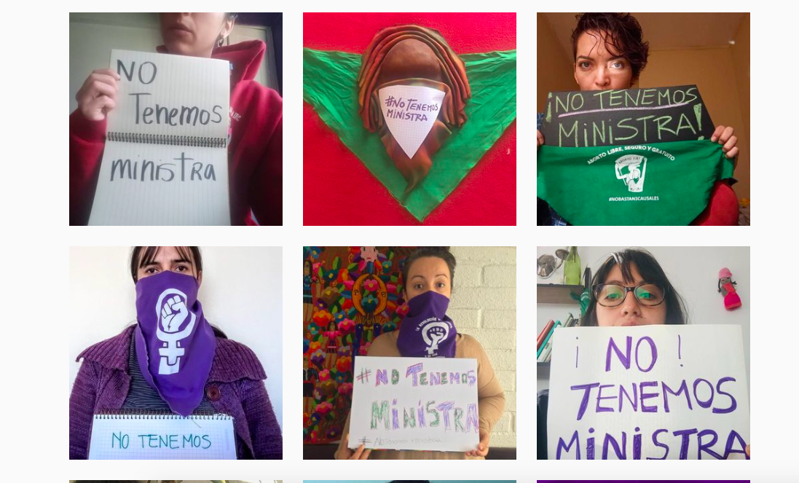
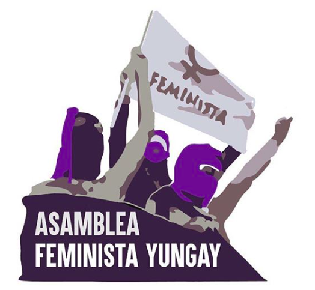

#### FOLIO: SAT21
# Asamblea Autoconvocada Feminista Barrio Yungay

[instagram](https://www.instagram.com/feministasyungay/)

---

### Representantes
#### No presentan representantes.

---
### Interacciones frecuentes
#### 
* Asamblea autoconvocada barrio yungay
* Comisión feminista de republica, santa ana y brasil

### Redes sociales
#### ¿Para qué se utiliza la red social?
| Instagram | Facebook | Twitter | Otra 
|---|---|---|---|
|Difusión de información y actividades|

### **Instagram**
| seguidores | seguidos | publicaciones | hashtag 
|---|---|---|---|
|918|333|98| #mujeresartistas #abortolegalseguroygratuito #abortolegal #feministartista #feminista

* Primera Publicación IG: 04/04/2020

---
### Frecuencia de publicación.

Publicaciones:
* Feed: Semanalmente
* Historias: Diariamente

Actividades: Una vez al mes

---
### Ubicación
* Barrio Yungay

---
### Describir temas de interés y/o trabajo
* Feminismo
* organizacion barrial

---
### Describir la imagen ideal por la cual se trabaja.
#### (El horizonte hacia el cual se quiere avanzar.)
* Sociedad feminista
* No más violencia contra las mujeres y disidencias

---
### ¿Que se hace?
#### (Manifestaciones, marchas, intervenciones, actividades culturales, conversatorios, intercambio de saberes, actividades solidarias o de apoyo mutuo, abastecimiento, contra información, emplazamiento a autoridades etc.)
* Manifestaciones
    * Cacerolazos
    * Panfleteos
    * Velatones
* Rifas solidarias por perritos
* Cicletadas
* Conmemoración de fechas relevantes
* Difusión de información 
* Declaraciones contra la violencia patriarcal
* Muralismo
* Activismo feminista

---
### Describir y distinguir demandas más reivindicativas de espacios sin relación con lo contencioso o con lo político mas prefigurativo
#### (lo contencioso; demanda al Estado, a alguna autoridad, privados, etc), (prefigurativo, transformación desde lo cotidiano, etc.).
* Sociedad feminista
* Fin de la violencia contra la mujer y las disidencias sexuales

---
### Tipo de organización interna.
#### 
Asambleismo y horizontalidad. Se organizan en comisiones de trabajo.

---
### Describir los temas / imágenes- iconos / conceptos mas habitualmente presentes en sus publicaciones. Describir cambios/ transformaciones en los contenidos desde Octubre.
Utilizan colores morado y negro. La variación de contenido se vincula con el contexto sociopolitico de Chile.

**Iconos:**
Su icono son tres sombras mujeres encapuchadas con un cartel que señala el nombre de la organización.

**Banderas:**

**Diseño estético:**
No tienen diseño estetico especifico, suben información de diferentes organizaciones e imagenes sin editar.

---
### Percepciones que se tiene del Estado
#### (Aparato burocrático)
> No hay información sobre la percepción del Estado.

| Declaraciones | Link | 
|---|---|
|Declaración| [Link]() |

---
### Percepciones que se tiene de las Fuerzas de Orden
#### (Aparato represivo)
> Justicia patriarcal, policia patriarcal que le da la razón a los violadores o abusadores. No confian en el aparato represivo.

| Declaraciones | Link | 
|---|---|
|Violencia contra feministas en Chiloé | [Link](https://www.instagram.com/p/CGlJewmpCNQ/) |
|Declaración Martín Pradenas | [Link](https://www.instagram.com/p/CC9-dqRJgbr/) |

---
### Incorporar aca notas, citas textuales, links, etc. extra a los ya incorporados, que sean de interés para comprender tanto la forma como los contenidos asociados a la organización.
 
* Manual de autocuidado para mujeres
[Link](https://drive.google.com/file/d/16TbcN1eLeMsSqeRFqD4s8hri4vJ2M620/view)

* Declaración de principios [link](https://www.instagram.com/p/B-xo1VjB_14/)