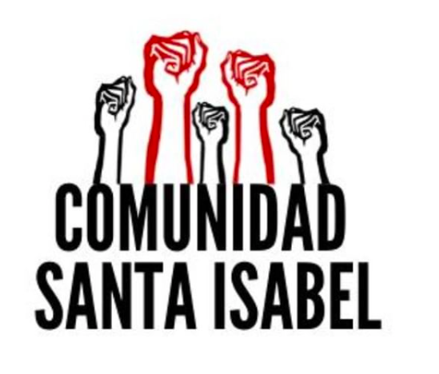

#### FOLIO: SAT22
# Comunidad Santa Isabel

[instagram](https://www.instagram.com/comunidadsantaisabel/)
[facebook](https://www.facebook.com/santa.isabel.18007)

---

### Representantes
#### No tiene representantes.

---
### Interacciones frecuentes
#### 
* Asamblea el claustro
* Asamblea marín y alrededores
* Asambleas eje dignidad

### Redes sociales
#### ¿Para qué se utiliza la red social?
| Instagram | Facebook |  
|---|---|---|---|
|Difusión de información y actividades|Difusión de noticias de otras fuentes, videos y |
### **Instagram**
| seguidores | seguidos | publicaciones | hashtag 
|---|---|---|---|
|1.384|626|380| 0

* Primera Publicación IG: 22/12/2019

---
### Frecuencia de publicación.

Publicaciones:
* Feed: tres veces por semana
* Historias: diariamente

Actividades: Semanalmente.

---
### Ubicación
* Sector Santa Isabel / Carmen

---
### Describir temas de interés y/o trabajo
* Construir comunidad
* Organización vecinal
* "Hacer comunidad"

---
### Describir la imagen ideal por la cual se trabaja.
#### (El horizonte hacia el cual se quiere avanzar.)
* Comunidad organizada que sea la protagonista
* Dignidad

---
### ¿Que se hace?
#### (Manifestaciones, marchas, intervenciones, actividades culturales, conversatorios, intercambio de saberes, actividades solidarias o de apoyo mutuo, abastecimiento, contra información, emplazamiento a autoridades etc.)
* Manifestaciones
    * Cacerolazos
    * Velatones
    * Marchas barriales
* Conversatorios y jornadas de reflexión
* Proyección audiovisual en la calle
* Contrainformación de manifestaciones
* Muralismo
* Jornada de creación de afiches
* Actos conmemorativos de diversas fechas
* Apoyo solidario a vecinxs

---
### Describir y distinguir demandas más reivindicativas de espacios sin relación con lo contencioso o con lo político mas prefigurativo
#### (lo contencioso; demanda al Estado, a alguna autoridad, privados, etc), (prefigurativo, transformación desde lo cotidiano, etc.).
> Los cambios que queremos generar deben ser construidos por nosotras/os como única forma de resguardar lo que queremos, partiendo así desde la autonomía y el protagonismo.

---
### Tipo de organización interna.
#### Asambleismo y horizontalidad.

---
### Describir los temas / imágenes- iconos / conceptos mas habitualmente presentes en sus publicaciones. Describir cambios/ transformaciones en los contenidos desde Octubre.
Su contenido ha variado según el contexto sociopolitico de Chile. Incrementando el posteo de informaciones cuando hay acontecimientos especificos. 

**Iconos:**
Son cinco puños en alto, unos de color negro y otros de color rojo.

**Diseño estético:**
No tienen un diseño estético fijo. Suben imagenes e información variada y sin filtro.

---
### Percepciones que se tiene del Estado
#### (Aparato burocrático)
> Utilización de tácticas represivas contra el pueblo. "No hay plata para ayuda al pueblo, solo para pintar las estatuas y para carabineros".

| Declaraciones | Link | 
|---|---|
|Anotar los comunicados | [Link]() |

---
### Percepciones que se tiene de las Fuerzas de Orden
#### (Aparato represivo)
> Complices del estado. 

| Declaraciones | Link | 
|---|---|
|Anotar los comunicados | [Link]() |

---
### Incorporar aca notas, citas textuales, links, etc. extra a los ya incorporados, que sean de interés para comprender tanto la forma como los contenidos asociados a la organización.

* Principios y motivaciones de la asamblea [Link](https://www.instagram.com/p/B6ZZNmzgq_H/)

* Creación de mascaras faciales con mensajes alusivos a la revuelta [link](https://www.instagram.com/p/CDR9sKwJAkr/)