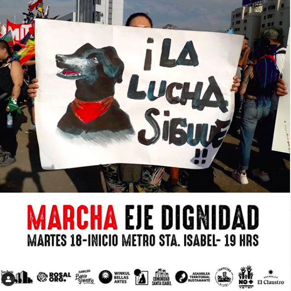
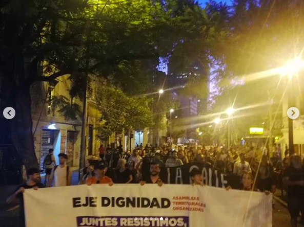
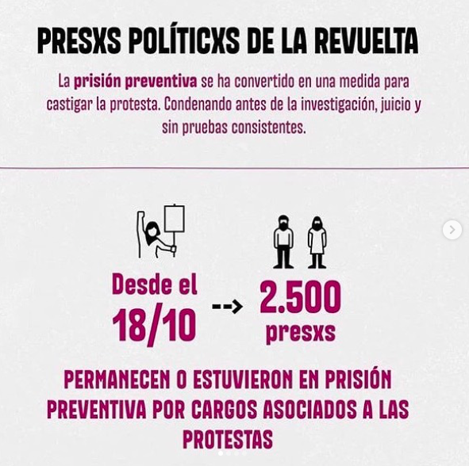
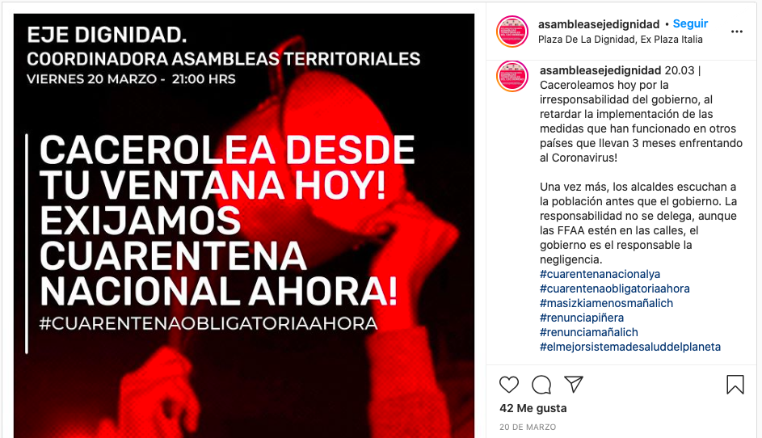
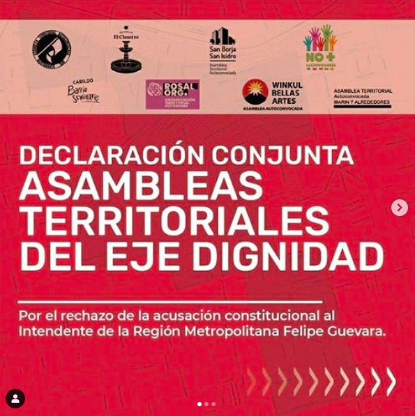

#### FOLIO: SAT3
# Asambleas eje dignidad

[instagram](https://www.instagram.com/asambleasejedignidad/)
[facebook](https://www.facebook.com/eje.dignidad.96)

---
### Representantes
#### No hay representantes.

---
### Seguidores
#### Principalmente son organizaciones sociocomunitarias de todo Chile y personas naturales.

---
### Seguidos
#### Siguen a instituciones, museos y medios de comunicación, como también las organizaciones con las que trabajan y algunas personas individuales.

---
### Interacciones frecuentes
#### **Organizaciones que son parte del eje dignidad**
* Nueva Vulva
* Rosal Organizado
* Winkul bellas artes
* Cabildo seminario
* Asamblea bustamante sur
* Huelen Organizado
* Asamblea el claustro
* Asamblea san borja san isidro
* Comunidad Santa Isabel 

---
### Describir:
Las organizaciones que componen el **eje dignidad** se ubican en sectores aledaños a Plaza Dignidad (Plaza Baquedano).

### Actividad:  

* Primera Publicación IG
    * 12/02/2020

**Instagram**
| seguidores | seguidos | publicaciones |
|---|---|---|
|1.350|212|49|

---
### Frecuencia de publicación

Publicaciones:
* 7 publicaciones mensuales en promedio.

Actividades:
* Dependiendo de si hay una actividad programada, utilizan las historias de instagram para recordarles a sus seguidores que asistan.

---
### Describir temas de interés y/o trabajo
* Difusión de actividades de las organizaciones. 
* Coordinadora de trabajo colectivo entre organizaciones. 
* Ciclo de actividades socioeducativas con temáticas de relevancia nacional actual. Ej. plebiscito, ddhh.

---
### Describir la imagen ideal por la cual se trabaja.
#### (El horizonte hacia el cual se quiere avanzar.)
* Hacemos el llamado a unirse a asambleas y trabajar juntos por la #dignidad. ¡Hasta que la dignidad se haga costumbre!
* No hay mayores detalles sobre el horizonte al cual se quiere avanzar pero establecen claras señalas que están a favor del cambio constitucional y que esta sea a través de una convención constitucional.

---
### ¿Que se hace?
* Manifestaciones como:
    * Cacerolazos
    * Marchas territoriales
    
    
    * Cicletadas
    * Velatones

* Conversatorios
* Emplazamiento a autoridades
* Declaraciones 
* Videos de contrainformación
* Infografías de diversas temáticas

* El discurso cambia según el objetivo sociopolitico actual, previo al plebiscito se utiliza el #EXIGIMOSDIGNIDAD y desde principios de septiembre 2020 comienzan con #APROBAMOSDIGNIDAD.
* Increpan al gobierno sobre vulneración de derechos de los ciudadanos
* Emplazan a las autoridades para tomar decisiones.

* **Dignidad** es la palabra más repetida desde la creación de la cuenta. 

---
### Describir y distinguir demandas más reivindicativas de espacios sin relación con lo contencioso o con lo político mas prefigurativo
#### 
* Realizan declaraciones para dar a conocer sus posturas ante decisiones politicas gubernamentales, unificar los sentires y sensaciones respecto a los hechos sociales que se producen en Chile
* Trabajo mancomunado de nueve organizaciones sociocomunitarias del autodenominado Eje Dignidad.
* Redes comunitarias de colaboración, difusión y recreación. **Fortalecimiento** de vinculos territoriales.

---
### Tipo de organización interna.
#### 
La participación en la organización se compone por un representante por cada asamblea territorial del eje dignidad. No se distingue una vocería en particular.

---
### Describir los temas / imágenes- iconos / conceptos mas habitualmente presentes en sus publicaciones. Describir cambios/ transformaciones en los contenidos desde Octubre.

* **DIGNIDAD** como concepto de fuerza de todas las publicaciones. Se utilizan # que la aluden.
* Desde la llegada de la pandemia, todos los viernes llaman a que sus seguidores suban carteles de la protesta. 
* Conmemoran los 18 como "a X meses de la revuelta social".

**Iconos:**
Organización nace con el objetivo de dar a conocer declaraciones para sobre temáticas en particular. Su primera imagen de declaración es la misma que su icono.

**Diseño estético:**
* Se utilizan colores como el negro, blanco y rojo. Esto también varia según la temática de la declaración, actividad o información. Para publicaciones feminismo se utiliza morado, para publicaciones de ddhh el amarillo.
* Sus imagenes contienen el #exigimosdignidad

---
### Percepciones que se tiene del Estado
####
| Declaraciones | Link | 
|---|---|
|Por el rechazo de la acusación constitucional al intendente RM Felipe Guevara | [Link](https://www.instagram.com/p/B8fCKVUhWfa/) |
|Amenazas a vecina del Barrio San Borja | [Link](https://www.instagram.com/p/B9Vjz4pJLvC/) |
|Situación COVID19 | [Link](https://www.instagram.com/p/B97lj3DpXMM/) |
|Presos políticos de la revuelta | [Link](hhttps://www.instagram.com/p/B-QXLQ4puVP//) |

---
### Percepciones que se tiene de las Fuerzas de Orden
#### 
| Declaraciones | Link | 
|---|---|
|Vídeo difusión de represión vivida por vecinos del sector eje dignidad | [Link](https://www.instagram.com/p/B9fsu3opAxX/) |
|Actuar de carabineros y el gobierno| [Link](https://www.instagram.com/p/CAiXPHop-tb/)

---
### Incorporar aca notas, citas textuales, links, etc. extra a los ya incorporados, que sean de interés para comprender tanto la forma como los contenidos asociados a la organización.
