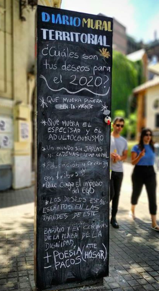
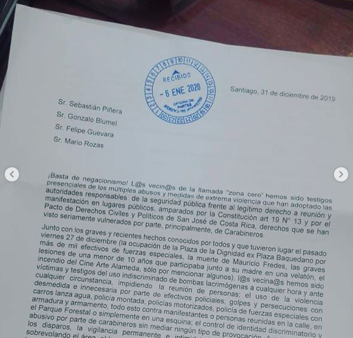
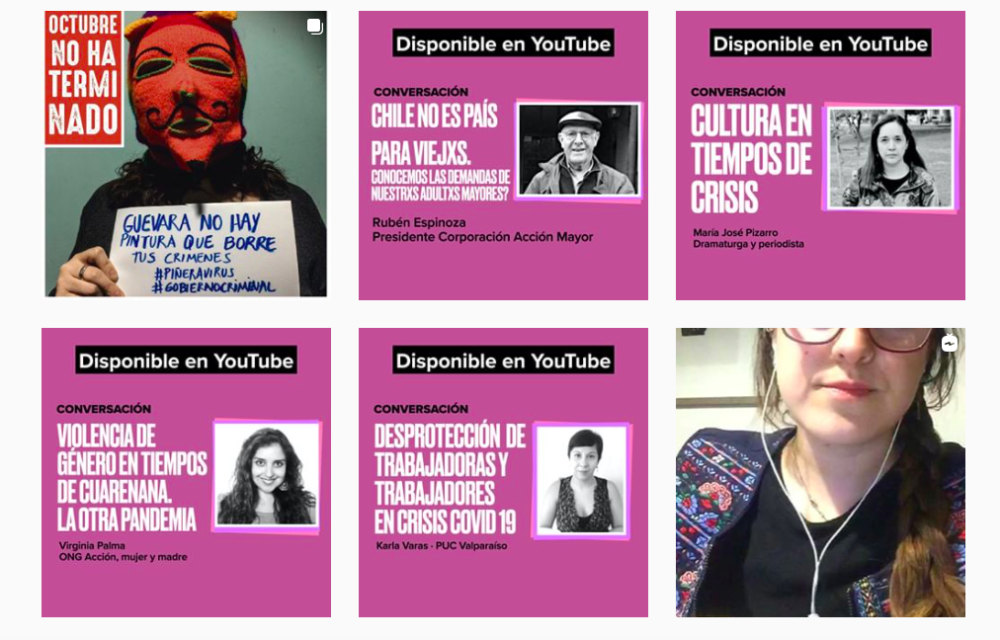
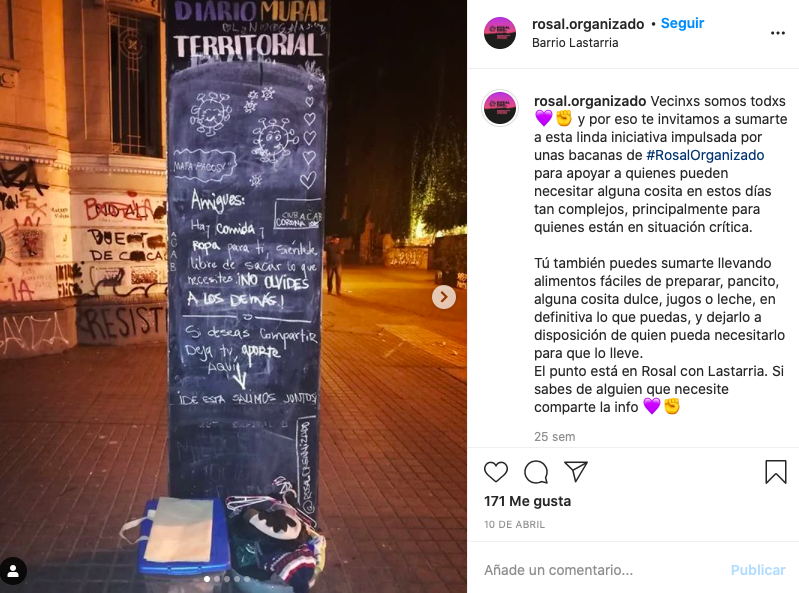
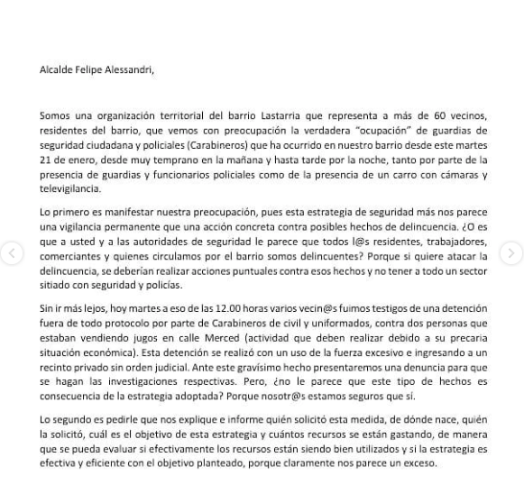

#### FOLIO: SAT4
# Rosal Organizado

[Instagram](https://www.instagram.com/rosal.organizado/)

### Representantes
#### No tienen representantes.

---
### Seguidores
#### Población general, organizaciones sociocomunitarias, perfiles de venda de productos.

---
### Seguidos
#### Siguen organizaciones sociocomunitarias en su mayoria, personas individuales y personas reconocidas por ser parte activa del estallido. Instituciones y fundaciones.

---
### Interacciones frecuentes
* Rosal feminista [Link](https://www.instagram.com/p/CBhNpiTJ5iL/)
* Eje dignidad
    * Comunidad santa isabel
    * Asamblea El claustro
* Cabildo Parque Forestal
* Primavera huelen
* Huelen Organizado

---
### Describir:
Organización Territorial Autónoma de vecinos del Barrio Lastarria.

#### (Actividad continua desde octubre, discontinua, actualmente inactiva, etc.)

**Actividad:**   
* Primera Publicación IG
    * 07/11/2019

#### Instagram
| Seguidores | Seguidos | Publicaciones | hashtag |
|---|---|---| --- |
|2.368|799|201|0|

---
### Frecuencia de publicación.

Publicaciones: 
* **Feed**: semanalmente.
* **Historias**: diariamente. 

Actividades: Cada dos semanas.

---
### Describir temas de interés y/o trabajo
* Organización vecinal
* Derechos humanos
* Feminismo
* Actualidad nacional

---
### Describir la imagen ideal por la cual se trabaja.
#### (El horizonte hacia el cual se quiere avanzar.)
**CONSIGNAS**
* Chile despertó, nosotros también. Organizate y empoderate el espacio público.
* Hasta que la dignidad se haga costumbre.
* Sociedad justa y digna.

---
### ¿Que se hace?

* CONTRAINFORMACIÓN:
    * Balines utilizados por las FFEE | [Link](https://www.instagram.com/p/B5IKrnCJUIW/)
* Cartas de emplazamiento a autoridades de gobierno y a la Alcaldía.

* Manifestaciones como:
    * Cacerolazos
    * Velatones 
* Actividades solidarias y de apoyo mutuo para vecinxs del sector o personas en situación de calle. 
* Actividades de autocuidado
* Malones y actividades 
* Propaganda electoral apruebo+cc
* Conmemoraciones de fechas relevantes de la historia de Chile.
* Conversatorios y charlas sobre temáticas de interés como el proceso constituyente, la vida en cuarentena, entre otros. 

---
### Describir y distinguir demandas más reivindicativas de espacios sin relación con lo contencioso o con lo político mas prefigurativo
#### (lo contencioso; demanda al Estado, a alguna autoridad, privados, etc), (prefigurativo, transformación desde lo cotidiano, etc.).
* Barrrio organizado
* Organizacion barrial y comunitaria para el bienestar de todxs lxs vecinxs.
* Cooperación de la comunidad hacia quienes han tenido problemas con el estallido o pandemia.

---
### Tipo de organización interna.
#### Asambleismo y horizontalidad. 

---
### Describir los temas / imágenes- iconos / conceptos mas habitualmente presentes en sus publicaciones. Describir cambios/ transformaciones en los contenidos desde Octubre.
El contenido ha ido variando según el acontecer nacional. Principalmente sus transformaciones de contenido se han vinculado al plebiscito del 25/10.

**Iconos:**
Su icono principal se representa con una rosa ("el rosal") con un color rosado oscuro. 

**Diseño estético:**
La mayoría de sus gráficas tienen colores rosados y negros. Dependiendo del tipo de actividad pueden tener o no una linea estetica similar para todas las actividades. Ej. conversatorios de cuarentena TODOS tienen el mismo diseño gráfico. 

---
### Percepciones que se tiene del Estado
#### (Aparato burocrático)

| Declaraciones | Link | 
|---|---|
| Copamiento policial sector lastarria - Emplazamiento Alcaldía de Stgo | [Link](https://www.instagram.com/p/B7qjVC5p9oU/) |

---
### Percepciones que se tiene de las Fuerzas de Orden
#### (Aparato represivo)

| Declaraciones | Link | 
|---|---|
| Violencia vivida por los vecinos del sector lastarria | [Link](https://www.instagram.com/p/B69NoPFJ9Io/) |

---
### Incorporar aca notas, citas textuales, links, etc. extra a los ya incorporados, que sean de interés para comprender tanto la forma como los contenidos asociados a la organización.