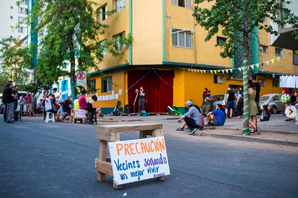
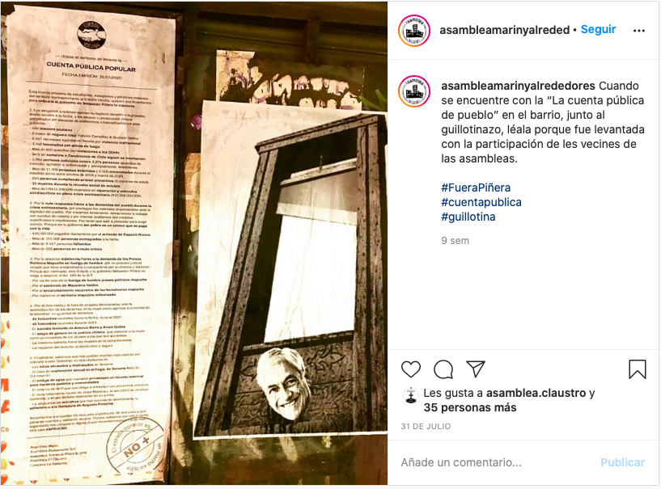
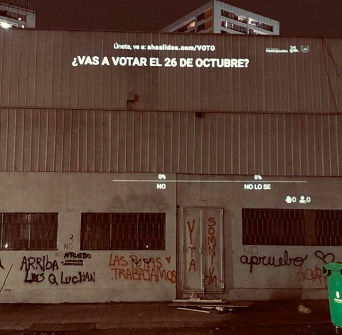
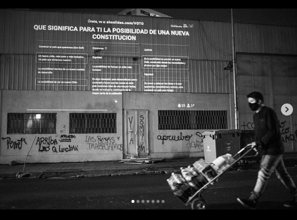

#### FOLIO: SAT5
# Asamblea Marín y Alrededores

[Instagram](https://www.instagram.com/asambleamarinyalrededores/)

---

### Representantes
#### No tiene representantes.

---
### Seguidores
#### Asambleas territoriales de Chile, personas individuales, medios de comunicación altenativos, perfiles de compra y venta, fundaciones.

---
### Seguidos
#### Asambleas que interactuan frecuentemente, asambleas de Chile, personas individuales y fundaciones/organizaciones/museos conocidos a nivel nacional.

---
### Interacciones frecuentes
* Eje dignidad
    * Asamblea El Claustro
    * Comunidad santa isabel
    * Asamblea bustamante sur
* Cordón Vicuña
* Asamblea Las Parcelas
* Coordinadora de Asambleas Territoriales (CAT)

---
### Describir:
Nos organizamos a pesar del #covid_19. Se ubican en el sector entre las calles marín, santa isabel y camilo henriquez.

**Actividad:**   
* Primera Publicación IG:
    * 14/11/2019

#### Instagram
| seguidores | seguidos | publicaciones |
|---|---|---|
|1.773|486|216|

---
### Frecuencia de publicación

Publicaciones:
* Feed: Semanalmente
* Historias: Diariamente

Actividades:
* Semanalmente

---
### Describir temas de interés y/o trabajo
* Nueva constitución
* Derechos humanos
* Feminismo
* Vinculación territorial
* Democratización del conocimiento

---
### Describir la imagen ideal por la cual se trabaja.
#### (El horizonte hacia el cual se quiere avanzar.)
**CONSIGNAS**
* ¡Cuidado! Vecinxs soñando un mejor vivir
* Reconstruir redes y relaciones vecinales y territoriales
* Nueva constitución
* Dignidad

---
### ¿Que se hace?
* Manifestaciones:
    * Velatones
    * Cicletadas
    * Pintatones
* Almuerzos y onces comunitarias
* Reuniones semanales (presenciales/virtuales)
* Ciclo de conversatorios (presenciales/virtuales)
* Red de apoyo mutuo solidario para vecinxs y personas en situación de calle
* Emplazamiento a autoridades locales (Alcaldía Stgo) y de gobierno
* Espacios de contención emocional para vecinxs
* Actividades culturales familiares:
    * Cine al aire libre
    * Cuenta cuentos
* "Pichangas" mixtas entre vecinxs
* Difusión de empredimientos vecinales [Link](https://www.instagram.com/p/B-aw8sfpFV1/)

---
### Describir y distinguir demandas más reivindicativas de espacios sin relación con lo contencioso o con lo político mas prefigurativo
#### 
* Organización, propaganda y vinculación vecinal
* Colaboración vecinal en tiempos de crisis socioeconomica 
    * *Red solidaria Marín* [Link](https://www.instagram.com/p/B_yJDaLpDd7/)

---
### Tipo de organización interna.
#### Asambleismo y horizontalidad.

---
### Describir los temas / imágenes- iconos / conceptos mas habitualmente presentes en sus publicaciones. Describir cambios/ transformaciones en los contenidos desde Octubre.
Los contenidos se han ajustado a la variacion de tematicas sociales, especialmente el proceso constituyente, el 8M, jornadas culturales y tejido social vecinal.

**Iconos:**
El simbolo de la asamblea se representa por unas casas y un edificio. 

**Diseño estético:**
No tienen un diseño estetico unico, utilizan colores variados y se destaca el uso de morado con las tematicas feministas.

---
### Percepciones que se tiene del Estado
#### (Aparato burocrático)

| Declaraciones | Link | 
|---|---|
|Emplazamiento Alcaldía STGO por *consultas ciudadanas*| [Link](https://www.instagram.com/p/B59AYnEpyBo/) |
|Emplazamiento Alcaldía STGO por desalojo a personas en situación de calle que habitan el sector | [Link](https://www.instagram.com/p/CAszmO5pvj9/) |

---
### Percepciones que se tiene de las Fuerzas de Orden
#### (Aparato represivo)

| Declaraciones | Link | 
|---|---|
|Anotar los comunicados | [Link]() |

---
### Incorporar aca notas, citas textuales, links, etc. extra a los ya incorporados, que sean de interés para comprender tanto la forma como los contenidos asociados a la organización.

* Cuenta pública popular

* Declaración sobre agrupaciones fascistas que sacan propaganda del barrio [Link](https://www.instagram.com/p/CFgMqQ2JDAQ/)
* Boletín cultural [Link](https://www.instagram.com/p/B-sAWKyJog2/)

* Proyecciones barriales

