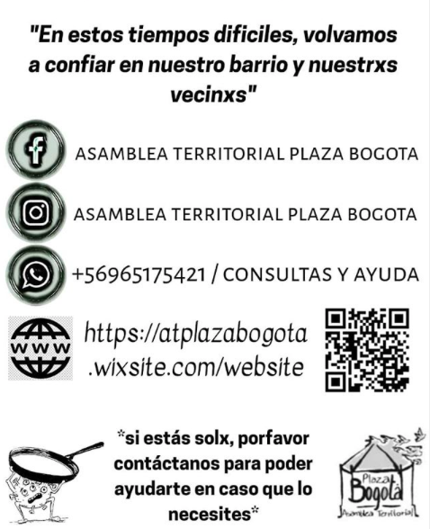
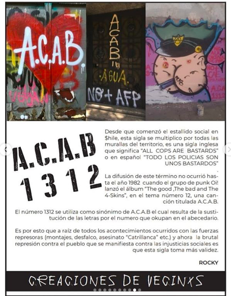
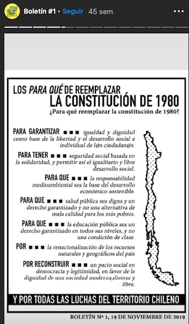

#### FOLIO: SAT6
# Asamblea Territorial Plaza Bogotá

[Instagram](https://www.instagram.com/asambleaterritorialplazabogota/)
[Facebook](https://www.facebook.com/asambleaterritorialplazabogota/)
[Página web](https://atplazabogota.wixsite.com/website)

---

### Representantes
#### No tiene representantes ni voceros.

---
### Interacciones frecuentes
#### 
* Comunidad Santa Isabel
* Asamblea san borja san isidro
* Cordón Vicuña
* Coordinadora de Asambleas Territoriales (CAT)

### Redes sociales
#### ¿Para qué se utiliza la red social?
| Instagram | Facebook | Otra 
|---|---|---|---|
|Difusión, información y propaganda |Difusión, información y propaganda| Suben sus boletines a *tinly.co*|

### **Instagram**
| seguidores | seguidos | publicaciones | hashtag 
|---|---|---|---|
|1.536|339|138| 1

---

* **Actividad:**   

* Primera Publicación IG
    * 10/11/2019

---
### Frecuencia de publicación.

* Publicaciones: 
    * Feed: Semanalmente    
    * Historias: Diariamente

* Actividades:
    *  Reuniones: Semanalmente
    * Actividades varias: cada dos semanas.

---
### Ubicación
* Plaza bogotá / Sector Matta Sur. Todas las actividades y reuniones las realizan en la plaza bogotá.

---
### Describir temas de interés y/o trabajo
* Vinculación territorial
* Organización vecinal
* Derechos humanos

---
### Describir la imagen ideal por la cual se trabaja.
#### (El horizonte hacia el cual se quiere avanzar.)
* Buscar nuevas formas de vida más justas y de convivencia solidaria, desde el trabajo en comunidad, aquí y ahora entre vecinos. 
[Link](https://www.instagram.com/stories/highlights/18115164511050375/)
*

---
### ¿Que se hace?
#### 
* Boletines informativos 
* Actividades culturales familiares
* Abastecimiento comunitario
* Talleres de autoeducación
* Manifestaciones
    * Marchas
    * Velatones
    * Cacerolazos
    * Banderazos
* Colaboración con ollas comunes cercanas (barrio franklin)
* Conversatorios y charlas de temáticas de interés comunitario: seguridad, feminismo, derechos humanos, entre otros.
* Reuniones vecinales semanales
* Almuerzos, onces y cenas comunitarias

---
### Describir y distinguir demandas más reivindicativas de espacios sin relación con lo contencioso o con lo político mas prefigurativo
#### (lo contencioso; demanda al Estado, a alguna autoridad, privados, etc), (prefigurativo, transformación desde lo cotidiano, etc.).
**CONSIGNAS**
* El despertar de la plaza.
* Pueblo organizado.
* Vamos aprendiendo, creando y formando juntos vecinxs el camino a la libertad y el amor.
* Apoyo mutuo vecinal

* Realizan boletines con el objetivo de disponer canales de información y difusión que contribuyan a la organizacion barrial, que requiere de las ideas y manos de todxs. 
* Constuir nuestra libertad desde el territorio y en comunidad para una vida digna.

---
### Tipo de organización interna.
#### Asambleismo y horizontalidad.

---
### Describir los temas / imágenes- iconos / conceptos mas habitualmente presentes en sus publicaciones. Describir cambios/ transformaciones en los contenidos desde Octubre.
No ha cambiado mucho su contenido, no han focalizado sus publicaciones a tomar postura sobre el plebiscito. Sus publicaciones son principalmente vinculadas a los hechos actuales y actividades para los vecinos.

**Iconos:**
Su logo se representa por una fuente, esta es caracteristica de la plaza Bogotá. 

**Diseño estético:**
No cuentan con una línea gráfica única, su feed de instagram se compone por difusión de actividades, información actualizada y toma de posición respecto a temas.

---
### Percepciones que se tiene del Estado
#### (Aparato burocrático)
> Quieren dividir al pueblo para gobernar, buscan salidas altenativas para terminar el conflicto sin preguntarle al mismo pueblo que se ha movilizado. Solicitan la renuncia del presidente. Gobierno tramita leyes en contra la protesta social. 

| Declaraciones | Link | 
|---|---|
|Rechazo al acuerdo por la paz |[Link](https://www.instagram.com/p/B5L2fhaBPQa/) |
|Boletín #2 |[Link](https://www.instagram.com/p/B59G7fjJqjX/) |
|Criminalización de la protesta social|[Link](https://atplazabogota.wixsite.com/website/post/criminalización-de-la-protesta) |

---
### Percepciones que se tiene de las Fuerzas de Orden
#### (Aparato represivo)
> Persiguen a manifestantes pero no al narcotráfico. Complices del gobierno.

| Declaraciones | Link | 
|---|---|
|Comunicado represión en Villa Portales |[Link](https://www.instagram.com/p/B6X_L5vJz_F/) |
|¿Qué es ACAB? | | 
|Criminalización de la protesta social |[Link](https://www.instagram.com/p/B7Rmc1apZZM/) | 

---
### Incorporar aca notas, citas textuales, links, etc. extra a los ya incorporados, que sean de interés para comprender tanto la forma como los contenidos asociados a la organización.

* ¿Por qué cambiar la constitución? Boletín #1

* Introducción a la asamblea **autoconvocada** plaza bogotá [Link](https://www.instagram.com/p/B5Ib2BFBthq/)