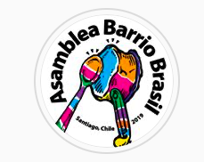
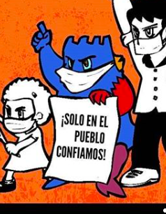
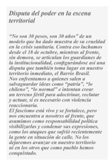
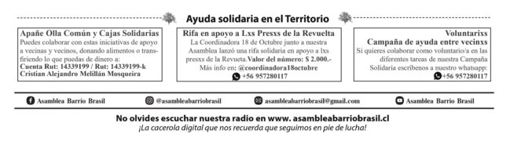

#### FOLIO: SAT7
# Asamblea Barrio Brasil

[Instagram](https://www.instagram.com/asambleabarriobrasil/)
[facebook](https://www.facebook.com/groups/965807110437131/)
[Youtube](https://www.youtube.com/results?search_query=asamblea+barrio+brasil)
[whatsapp](+56957280117)
<asambleabarriobrasil@gmail.com>
---

### Representantes
#### Vocera: Francisca Guerrero.

---
### Interacciones frecuentes
#### 
* Asamblea Autoconvocada Barrio Yungay
* Coordinadora 18 de octubre
* LaTorre321 Santiago
* PACGOL (organizacion sociodeportiva en Pedro Aguirre Cerda)
* Bloque de Organizaciones Populares (BOP)
* Asamblea Autoconvocada Plaza Santa Ana
* Asamblea Constituyente Autoconvocada Plaza Panamá

### Redes sociales
#### ¿Para qué se utiliza la red social?
| Instagram | Facebook | Youtube | Otra 
|---|---|---|---|
|Difusión de todo tipo de contenido| El contenido no está disponible para ser observado|Transmisiones en vivo| Contacto de la asamblea, informaciones varias y columnas de opinion de participantes|

### **Instagram**
| seguidores | seguidos | publicaciones | hashtag 
|---|---|---|---|
|3.491|466|291| #barriobrasil

 * Primera publicación IG: 25/10/2019

---
### Frecuencia de publicación.
* Publicaciones: 
    * Feed: Semanalmente
    * Historias: Diarias
* Actividades: Semanalmente.

---
### Ubicación: 
Barrio Brasil

---
### Describir temas de interés y/o trabajo
* Derechos humanos
* Organizacion, colaboración y apoyo entre vecinxs
* Proceso constituyente y nueva constitución
* Difusión informativa vecinal

---
### Describir la imagen ideal por la cual se trabaja.
#### (El horizonte hacia el cual se quiere avanzar.)
* Nueva constitución a través de un plebiscito y proceso participativo con la ciudadanía.
* Barrio colaborativo y organizado con apoyo mutuo.
* Dignidad para la vida.

---
### ¿Que se hace?
####
* Radio Online [Link](http://asambleabarriobrasil.cl/?page_id=177)
* Actividades culturales virtuales y presenciales
* Revista Mural de la Asamblea Barrio Brasil [Link](http://asambleabarriobrasil.cl/?page_id=152)
* Propaganda por la Nueva Constitución 
* Ciclos de conversatorios constituyente
* Manifestaciones:
    * Cicletadas
    * Cacerolazos
    * Marchas
* Olla Popular BBA
    * Campaña "apañe solidario"
    * Transparencia de donaciones y de tareas realizadas [Link](https://www.instagram.com/p/CEQj7sNJtHQ/)
    * Campaña "levantando la olla" 
* Rifas solidarias por los presos politicos de la revuelta
* Informaciones y conversatorios sobre actualidad

---
### Describir y distinguir demandas más reivindicativas de espacios sin relación con lo contencioso o con lo político mas prefigurativo
#### (lo contencioso; demanda al Estado, a alguna autoridad, privados, etc), (prefigurativo, transformación desde lo cotidiano, etc.).

* Fortalecer los lazos entre vecinos y reactivar la socialización en el barrio. Nos unimos porque queremos ser partícipes de los cambios en la reflexión, discusión y la toma de decisiones para el futuro de nuestro barrio y país.

---
### Tipo de organización interna.
#### Vocería externa por Francisca Guerrero. Asambleismo y horizontalidad en la toma de decisiones.

---
### Describir los temas / imágenes- iconos / conceptos mas habitualmente presentes en sus publicaciones. Describir cambios/ transformaciones en los contenidos desde Octubre.
Los contenidos se han ajustado al contexto sociosanitario y politico de Chile. Se mantienen contenidos como conversatorios, charlas e informativos comunitarios.

**Iconos:**
Su icono se representa por una olla y una cuchara, estos tienen muchos colores, similares a los que hay en la plaza brasil. 

Utilizan una figura representativa/personaje de color azul en la mayoría de las publicaciones que informan o interpelan a la comunidad.

**Diseño estético:**
Utilizan colores como amarillo, naranjo, rosado y blanco cuando son actividades familiares. Rojas y moradas cuando son informativas. La mayoria son muy coloridas en su mayoria. En sus imagenes siempre va su logo y el personaje de la ABB.

---
### Percepciones que se tiene del Estado
#### (Aparato burocrático)
> Solicitan renuncia de piñera y que haya justicia por las victimas de trauma ocular de la revuelta. Justicia y reparación. "Gobierno criminal, que se vayan todos". Gobierno inepto y opresor.

| Declaraciones | Link | 
|---|---|
|Disputa del poder en la escena territorial | |
|Llamado a movilización contra el gobierno | [Link](https://www.instagram.com/p/CCJuGObJyFu/) |

---
### Percepciones que se tiene de las Fuerzas de Orden
#### (Aparato represivo)
> La policia reprime y no protege. Las fuerzas de orden son complices del gobierno, criminalizando la protesta social.

| Declaraciones | Link | 
|---|---|
|Construcción de un barrio seguro | [Link](https://www.instagram.com/p/B_8cICmJ5uJ/) |

---
### Incorporar aca notas, citas textuales, links, etc. extra a los ya incorporados, que sean de interés para comprender tanto la forma como los contenidos asociados a la organización.
* Actividades musicales virtuales para sustentar la olla común barrial [Link](http://asambleabarriobrasil.cl/?p=760)
* Parte final del "periodico" voz barrial: Ayuda solidaria en el territorio 
    > En esta sección encontrarás  nuestra revista por si no alcanzaste a leerla en las calles. Acá te dejamos la última edición dedicada a «La lucha por una nueva Constitución» la que podrás encontrar en almacenes y muros del Barrio Brasil.
* *DEL CORONAVIRUS Y DEL GOBIERNO ¡NOS PROTEGEMOS TODXS!*  [Link](https://www.instagram.com/p/B923ZMzJY3a/)
