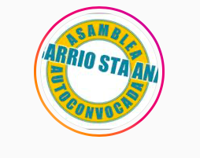

#### FOLIO: SAT8
# Asamblea Barrio Santa Ana

[Instagram](https://www.instagram.com/vecinosbarriosantaana/)
[Facebook](https://www.facebook.com/asambleabarriosantaana/)
[Twitter]((https://www.twitter.com/vecinosbarriosantaana/))
<vecinosbarriosantaana@gmail.com>
---

### Representantes
#### No tienen representantes.

---
### Interacciones frecuentes
* Vecinos barrio republica
* Asamblea Autoconvocada Barrio Brasil
* Apruebo Barrio Yungay
* Asamblea Autoconvocada Plaza Panamá

### Redes sociales
#### ¿Para qué se utiliza la red social?
| Instagram | Facebook | 
|---|---|---|---|
|Difusión| Difusión|

### **Instagram**
| seguidores | seguidos | publicaciones | hashtag 
|---|---|---|---|
|925|625|132| #apruebonuevaconstitucion

---

**Actividad:**   
* Primera Publicación IG: 28/10/2019

---
### Frecuencia de publicación.

Publicaciones: 
* Feed: Semanalmente
* Historias: Diarias

Actividades:

---
### Ubicación: Barrio Santa Ana

---
### Describir temas de interés y/o trabajo
* Proceso constituyente y participación ciudadana
* Educación popular entre vecinxs "*Nos educamos para el 25/10*"
* Vinculación, organización y colaboración barrial
* Apoyo mutuo

---
### Describir la imagen ideal por la cual se trabaja.
#### (El horizonte hacia el cual se quiere avanzar.)
* Dignidad
* Unidad vecinal
* Construcción de una sociedad justa y con igualdad de género

---
### ¿Qué se hace?
####
* Manifestaciones
    * Cacerolazos
    * Marchas
    * Cicletadas
    * Banderazos
* Propaganda de apruebo convención constituyente
* Actividades culturales familiares
    * Cine al aire libre
    * Cuenta cuentos
    * Cabildo para NNA
* Jornadas de discusión y cabildos ciudadanos
* Difusión e infografías con temáticas relevantes
* Feria de las pulgas
* Almuerzos solidarios (por motivo covid)

---
### Describir y distinguir demandas más reivindicativas de espacios sin relación con lo contencioso o con lo político mas prefigurativo
#### (lo contencioso; demanda al Estado, a alguna autoridad, privados, etc), (prefigurativo, transformación desde lo cotidiano, etc.).
* Organización barrial
* Colaboración y apoyo mutuo entre vecinxs

---
### Tipo de organización interna.
#### Asambleismo y horizontalidad.

---
### Describir los temas / imágenes- iconos / conceptos mas habitualmente presentes en sus publicaciones. Describir cambios/ transformaciones en los contenidos desde Octubre.
El principal proposito de la asamblea es la **unión vecinal** por lo que no se han manifestado tanto sobre la actualidad. Sus contenidos se basan principalmente en actividades familiares, conversatorios y cabildos en sus inicios, información sobre el covid y ahora propaganda sobre el plebiscito del 25/10.

**Iconos:**
Es un circulo blanco con letras celestes y un circulo amarillo, dice ASAMBLEA AUTOCONOVOCAA BARRIO STA ANA

**Diseño estético:**
No tienen diseño estético claro, utilizan colores alegres.

---
### Percepciones que se tiene del Estado
#### (Aparato burocrático)
> No se manifiestan frente al actuar del Estado.

| Declaraciones | infografía | 
|---|---|
|Anotar los comunicados |  |

---
### Percepciones que se tiene de las Fuerzas de Orden
#### (Aparato represivo)
> No se manifiestan frente al actuar de las fuerzas de orden.

| Declaraciones | infografía | 
|---|---|
|Anotar los comunicados |  |

---
### Incorporar aca notas, citas textuales, links, etc. extra a los ya incorporados, que sean de interés para comprender tanto la forma como los contenidos asociados a la organización.

* Defunsión de un vecino [Link](https://www.instagram.com/p/CBwurWTJju8/)