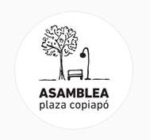

#### FOLIO: SAT9
# Asamblea territorial Copiapó

[instagram](https://www.instagram.com/asambleaterritorialcopiapo/)
<vecinxscopiapo@gmail.com>
---

### Representantes
#### No tiene representantes.

---
### Interacciones frecuentes
####
* Cordón Vicuña
* Comunidad Santa Isabel

### Redes sociales
#### ¿Para qué se utiliza la red social?
| Instagram | Facebook | Twitter | Otra 
|---|---|---|---|
|Difusión de actividades|0|0| 0|

### **Instagram**
| seguidores | seguidos | publicaciones | hashtag 
|---|---|---|---|
|590|213|54| 0

---

**Actividad:**   
* Primera Publicación IG: 31/10/2020

---
### Frecuencia de publicación.
* Publicaciones: Tres veces por mes.
* Actividades: Una vez por mes.

---
### Ubicación: Plaza Copiapó

---
### Describir temas de interés y/o trabajo
* Actividades comunitarias
* Organización Vecinal

---
### Describir la imagen ideal por la cual se trabaja.
#### (El horizonte hacia el cual se quiere avanzar.)
* Dignidad y justicia
* Nueva constitución

---
### ¿Que se hace?
#### (Manifestaciones, marchas, intervenciones, actividades culturales, conversatorios, intercambio de saberes, actividades solidarias o de apoyo mutuo, abastecimiento, contra información, emplazamiento a autoridades etc.)
* Cabildos
* Actividades culturales familiares
    * Tardes de cine
    * Malones
* Almuerzos comunitarios
* Actividades solidarias virtuales
* Compras colectivas (es la única actividad que no ha parado desde que se constituyeron como asamblea)

---
### Describir y distinguir demandas más reivindicativas de espacios sin relación con lo contencioso o con lo político mas prefigurativo
#### (lo contencioso; demanda al Estado, a alguna autoridad, privados, etc), (prefigurativo, transformación desde lo cotidiano, etc.).
* Vinculación y organización territorial
* Compras colectivas como barrio/vecinxs

---
### Tipo de organización interna.
#### Asambleismo.

---
### Describir los temas / imágenes- iconos / conceptos mas habitualmente presentes en sus publicaciones. Describir cambios/ transformaciones en los contenidos desde Octubre.
Pasaron de ser "cabildo" a "asamblea". Pasaron de tener reuniones semanales a encontrarse una vez al mes de manera virtual. 

**Iconos:**
Su icono se representa po un arbol, una banca y un poste de luz. Representa una parte de la plaza. 

**Diseño estético:**
No tienen diseño estetico fijo. 

---
### Percepciones que se tiene del Estado
#### (Aparato burocrático)
No hay información respecto a las percepciones del Estado.

| Declaraciones | infografía | 
|---|---|
|Anotar los comunicados |  |

---
### Percepciones que se tiene de las Fuerzas de Orden
#### (Aparato represivo)
No hay información respecto a las percepciones de las Fuerzas de Orden.

| Declaraciones | infografía | 
|---|---|
|Anotar los comunicados |  |

---
### Incorporar aca notas, citas textuales, links, etc. extra a los ya incorporados, que sean de interés para comprender tanto la forma como los contenidos asociados a la organización.
