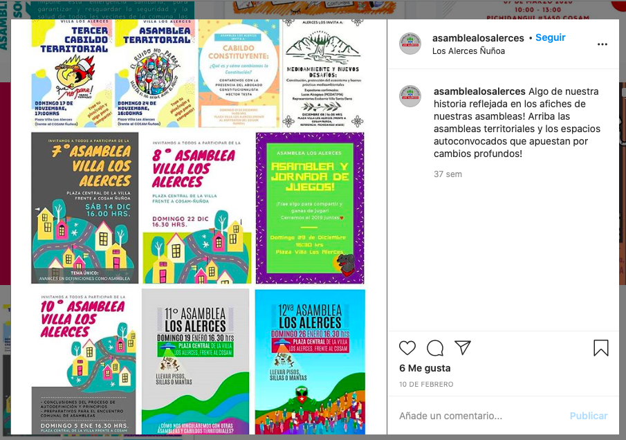
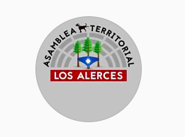

#### FOLIO: NUN1
# Asamblea Territorial Los Alerces

[instagram](https://www.instagram.com/asamblealosalerces/)
[facebook](https://www.facebook.com/AsambleaTerritorialLosAlerces)
[twitter](https://twitter.com/AAlerces)
---

### Representantes
#### No señala tener representantes

---
### Interacciones frecuentes
####
* Fanzine big data (parte de la organización)
* Cultura los alerces (parte de la organización)
* Coordinadora de asambleas territoriales
* Cabildos y asambleas territoriales Ñuñoa

### Redes sociales
#### ¿Para qué se utiliza la red social?
| Instagram | 
|---|
|Difusión de actividades e informaciones|

### **Instagram**
| seguidores | seguidos | publicaciones | hashtag 
|---|---|---|---|
|529|117|49| 0

* Primera Publicación IG: 10/02/2020 
La actividad de la organizacion comienza en noviembre 2019, el instagram se crea 2020.

---
### Frecuencia de publicación.

Publicaciones: 
* Feed: Semanalmente
* Historias: Semanalmente

Actividades: Mensual

---
### Ubicación
* Plaza central villa los alerces

---
### Describir temas de interés y/o trabajo
* Organizacion territorial y vecinal
* Pueblos originarios
* Derechos humanos
* Feminismo
* Cultura

---
### Describir la imagen ideal por la cual se trabaja.
#### (El horizonte hacia el cual se quiere avanzar.)
> "Apostamos a enfocarnos en aquello que nos une, como esa decisión irrenunciable de organizarnos, avanzar juntxs, reconstruir el tejido social y seguir movilizadxs. En todo aquello seguiremos poniendo nuestra energía y la pasión que haga falta"
* Colaboración y apoyo mutuo vecinal para una mejor calidad de vida en base a la organización y autogestión

---
### ¿Que se hace?
#### (Manifestaciones, marchas, intervenciones, actividades culturales, conversatorios, intercambio de saberes, actividades solidarias o de apoyo mutuo, abastecimiento, contra información, emplazamiento a autoridades etc.)
* Fanzines (librillos)
* Jornadas de actividades culturales
* Actividades conmemorativas
* Infografías
* Difusión de actividades de otras organizaciones
* Reuniones y asambleas mensuales/semanales
* Cronograma de actividades de la asamblea
* Rifas solidarias
* Acopio solidario
* Manifestaciones
    * Cacerolazos
    * Protesta digital

---
### Describir y distinguir demandas más reivindicativas de espacios sin relación con lo contencioso o con lo político mas prefigurativo
#### (lo contencioso; demanda al Estado, a alguna autoridad, privados, etc), (prefigurativo, transformación desde lo cotidiano, etc.).
* Solidaridad, igualdad, democracia y horizontalidad como principios
* Que no se renuncie nunca a la organizacion territorial *no nos soltemos jamás*

---
### Tipo de organización interna.
#### Asambleismo y horizontalidad.

---
### Describir los temas / imágenes- iconos / conceptos mas habitualmente presentes en sus publicaciones. Describir cambios/ transformaciones en los contenidos desde Octubre.

**Iconos:**
Tienen un logo que son tres alerces, la bandera mapuche y un semicirculo. También sale el perro matapacos.

**Diseño estético:**
Tienen un diseño estetico similar en la mayoría de sus publicaciones, se notan diferencias cuando suben fotografías sin información. Utilizan colores vivos como azul, verde, naranjo, amarillo y rosado. 

---
### Percepciones que se tiene del Estado
#### (Aparato burocrático)
> Estado neoliberal que no se preocupa de la población. Utilizacion del estado de catastrofe con fines de control y represión. Criminalizacion de la protesta. Violadores de ddhh.

| Declaraciones | Link | 
|---|---|
|Declaracion publica | [Link](https://www.instagram.com/p/B-pcUixJ5Vm/) |
|Criminalizacion de la protesta | [Link](https://www.instagram.com/p/CF5v8w9J9Ud/) |

---
### Percepciones que se tiene de las Fuerzas de Orden
#### (Aparato represivo)
> Abuso de poder y violencia desmedida. Hostigamiento policial a los vecinos. Brazo armado del gobierno. 

| Declaraciones | Link | 
|---|---|
|Criminalizacion de la protesta | [Link](https://www.instagram.com/p/CF5v8w9J9Ud/) |

---
### Incorporar aca notas, citas textuales, links, etc. extra a los ya incorporados, que sean de interés para comprender tanto la forma como los contenidos asociados a la organización.
* Fanzine de la organización version oct 2020 [link](https://drive.google.com/file/d/1fQ_PkXOzADSSnS9y8EWaZ0Bbb54HXWvm/view)