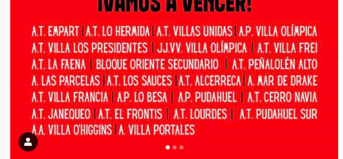
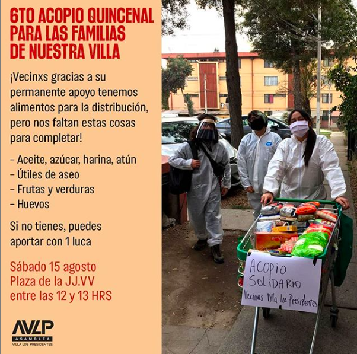
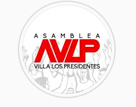
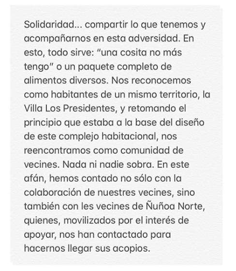
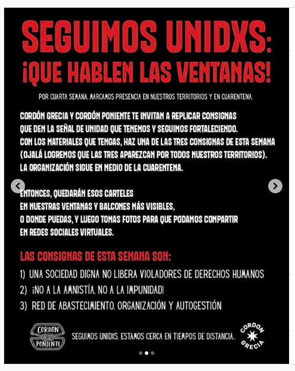

#### FOLIO: NUN10
# Asamblea Villa Los Presidentes

[instagram](https://www.instagram.com/asambleavillalospresidentes/)
---

### Representantes
####
No señalan tener representantes.

---
### Interacciones frecuentes
#### (listar otras organizaciones que habitualmente)
* Cordon grecia
* asambleas territoriales ñuñoa

### Redes sociales
#### ¿Para qué se utiliza la red social?
| Instagram | 
|---|---|---|---|
|Difusión de información y actividades|

### **Instagram**
| seguidores | seguidos | publicaciones | hashtag 
|---|---|---|---|
|1.401|235|184| 0|

* Primera Publicación IG: 25/10/2019

---
### Frecuencia de publicación.

Publicaciones:
* Historias: diariamente
* Feed: semanalmente

Actividades: semanalmente

---
### Ubicación
* Plaza JJVV villa los presidentes

---
### Describir temas de interés y/o trabajo
* Organizacion territorial
* Derechos humanos
* Apoyo mutuo entre vecinos

---
### Describir la imagen ideal por la cual se trabaja.
#### (El horizonte hacia el cual se quiere avanzar.)
* CONSIGNA: *Con organizaciçon y solidaridas creamos poder territorial*
    * Hasta que la dignidad se haga costumbre
    * Memoria territorial ante quienes han caido
    * Con valentía y solidaridad construimos comunidad
---
### ¿Que se hace?
#### (Manifestaciones, marchas, intervenciones, actividades culturales, conversatorios, intercambio de saberes, actividades solidarias o de apoyo mutuo, abastecimiento, contra información, emplazamiento a autoridades etc.)
* Manifestaciones
    * Cacerolazos
    * Marchas
    * Velatones
    * Jornadas de agitación y manifestación
* Asambleas vecinales presenciales y virtuales
* Escuela de verano VLP 
* Jornadas informativas anticarcelarias, feminismo, derechos humanos, entre otros.
* Declaraciones sobre posturas por situaciones del contexto nacional
* Apoyo mutuo y abastecimiento vecinal
    * Acopio de alimentos y utiles de aseo

* Caminatas por la memoria barrial y colectiva
* Jornadas de apoyo a los presos politicos de la revuelta social
* Cine popular en la plaza o por web
* Acopio de productos para ollas comunes
* Jornadas culturales y de oficios
* Catastro comunitario
* Recomendaciones y consejos para la cuarentena con niños en la casa

---
### Describir y distinguir demandas más reivindicativas de espacios sin relación con lo contencioso o con lo político mas prefigurativo
#### (lo contencioso; demanda al Estado, a alguna autoridad, privados, etc), (prefigurativo, transformación desde lo cotidiano, etc.).
* Construir comunidad y territorios organizados
* Tejer redes de solidaridad y autoorganización entre territorios
* Articularse y sembrar lazos vecinales y territoriales

---
### Tipo de organización interna.
#### 
Asambleismo y horizontalidad. Funcionan con comisiones de trabajo.

---
### Describir los temas / imágenes- iconos / conceptos mas habitualmente presentes en sus publicaciones. Describir cambios/ transformaciones en los contenidos desde Octubre.
El contenido se ha ajustado a los acontecimientos nacionales. En ese sentido, han comenzado campañas vinculadas a la alimentación y se han manifestado ante sucesos de la actualidad nacional.

**Iconos:**
Su icono son las siglas de la asamblea AVLP.

**Diseño estético:**
No tienen un diseño estetico definido para todas sus publicaciones, sin embargo, siempre utilizan colores como el rojo, naranjo y negro. También utilizan fuentes de letras similares en cada publicacion realizada, a menos que pertenezca a otra organización o sea una declaración.

---
### Percepciones que se tiene del Estado
#### (Aparato burocrático)
> Vivimos en una evidente violencia estatal. No a la criminalizacion de la protesta. Renuncia de piñera. No a la impunidad. 

| Declaraciones | Link | 
|---|---|
|Infografía Cordón Grecia | [Link](https://www.instagram.com/p/B6Et669pSAF/) |

---
### Percepciones que se tiene de las Fuerzas de Orden
#### (Aparato represivo)
> Repudian el accionar de carabineros y a toda la institucionalidad que los respalda. Ellos son la cara armada del poder, quienes no quieren que la gente se organice. Reprimen hasta matar o herir. Violencia policial.

| Declaraciones | Link | 
|---|---|
|Declaración sobre hostigamientos y desaolojos violentos | [Link](https://www.instagram.com/p/CCooDUSpPqG/) |

---
### Incorporar aca notas, citas textuales, links, etc. extra a los ya incorporados, que sean de interés para comprender tanto la forma como los contenidos asociados a la organización.

* Reflexiones en torno al plebiscito y el aniversario del estallido social [Link](https://www.instagram.com/p/CGqqiFzJ3vQ/)

* Reflexiones de vecinos mapuche sobre los acontecimientos de discriminación en IX región [link](https://www.instagram.com/p/CDctbNOpIrq/)

* *𝗔𝗵í 𝗱𝗼𝗻𝗱𝗲 𝗻𝗼 𝗲𝘀𝘁á 𝗲𝗹 𝗘𝘀𝘁𝗮𝗱𝗼, 𝗻𝗶 𝗲𝗹 𝗴𝗼𝗯𝗶𝗲𝗿𝗻𝗼 𝗰𝗲𝗻𝘁𝗿𝗮𝗹 𝗻𝗶 𝗲𝗹 𝗠𝘂𝗻𝗶𝗰𝗶𝗽𝗶𝗼, 𝗲𝘀𝘁á 𝗹𝗮 𝗼𝗿𝗴𝗮𝗻𝗶𝘇𝗮𝗰𝗶ó𝗻 𝗹𝗼𝗰𝗮𝗹! ¡𝗦𝗼𝗹𝗶𝗱𝗮𝗿𝗶𝗱𝗮𝗱, 𝗱𝗶𝗴𝗻𝗶𝗱𝗮𝗱 𝘆 𝗮𝘂𝘁𝗼𝗴𝗲𝘀𝘁𝗶ó𝗻!* [Link](https://www.instagram.com/p/CBruhfDJyoQ/)

* Unificación de consignas para ver un territorio organizado y unido 

