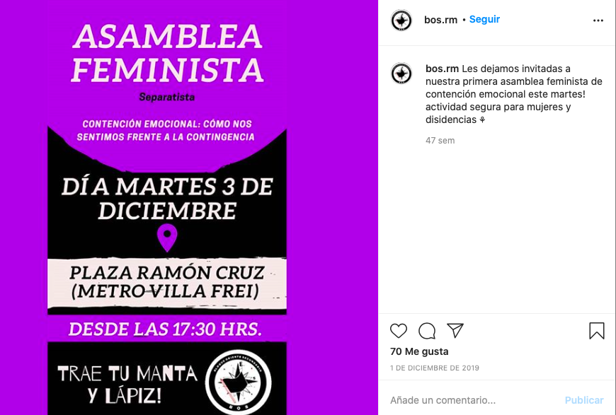

#### FOLIO: NUN8
# Bloke Oriente Secundario RM

[instagram](https://www.instagram.com/bos.rm/)

---

### Representantes
#### 
No señalan tener representantes.

---
### Interacciones frecuentes
#### 
* asamblea villa frei
* asamblea parque ramon cruz
* coordinadora 18 de octubre
* esquina de la dignidad

### Redes sociales
#### ¿Para qué se utiliza la red social?
| Instagram | 
|---|---|---|---|
|Difusión de información y actiidades|

### **Instagram**
| seguidores | seguidos | publicaciones | hashtag 
|---|---|---|---|
|630|73|38| 3

* Primera Publicación IG: 09/11/2019

---
### Frecuencia de publicación.

Publicaciones:
* Feed: dos veces al mes
* Historia: semanalmente

Actividades: Una vez al mes.

---
### Ubicación
* Ñuñoa / Sector oriente 

---
### Describir temas de interés y/o trabajo
* Reunir y articular los colegios de la comuna

---
### Describir la imagen ideal por la cual se trabaja.
#### (El horizonte hacia el cual se quiere avanzar.)
* Trabajar desde el compañerismo y la fraternidad para constuir un mejor país

---
### ¿Que se hace?
#### (Manifestaciones, marchas, intervenciones, actividades culturales, conversatorios, intercambio de saberes, actividades solidarias o de apoyo mutuo, abastecimiento, contra información, emplazamiento a autoridades etc.)
* Cabildo estudiantil
* Jornadas artisticas estudiantiles
* Jornadas de clases abiertas 
* Jornadas de agitacion secundaria por el sector oriente
* Material sobre la PTU
* Declaración de principios y objetivos
* Difusión de información del Cordon Grecia
* Mochilazos (manifestacion)
    * Cacerolazos
* Funas a la PSU / PTU
* Asambleas territoriales presenciales y virtuales
* Jornadas de trueke y ferias libres anticapitalistas
* Ciclo de capsulas sobre el mov secundario en dictadura

* Asamblea feminista

---
### Describir y distinguir demandas más reivindicativas de espacios sin relación con lo contencioso o con lo político mas prefigurativo
#### (lo contencioso; demanda al Estado, a alguna autoridad, privados, etc), (prefigurativo, transformación desde lo cotidiano, etc.).
* Trabajar colectivamente sin ningun tipo de discriminación
* Busca crear un país libre y justo donde no sea delito salir a luchar
* Unir voces para construir un mejor país y un mejor futuro

---
### Tipo de organización interna.
#### 
Horizontalidad.

---
### Describir los temas / imágenes- iconos / conceptos mas habitualmente presentes en sus publicaciones. Describir cambios/ transformaciones en los contenidos desde Octubre.
Su contenido se enmarca en la actualidad nacional, no hay una gran variación. Se unieron a trabajar con otras organizaciones entonces subian contenido más abierto que las demandas estudiantiles.

**Iconos:**
Una bandera y una brujula componen su icono/logo. Encerrado en un circulo negro y con letras de color blanco con el nombre de la organización.

**Diseño estético:**
No tienen un diseño estetico fijo, sin embargo, utilizan colores como rojo y negro. 

---
### Percepciones que se tiene del Estado
#### (Aparato burocrático)
> Criminalización de la protesta social. No hay justicia, solo acuerdos pro gobierno. Renuncia piñera. Gobierno dictatorial

| Declaraciones | Link | 
|---|---|
|Anotar los comunicados | [Link](https://www.instagram.com/p/B6O_0mJFoxl/) |

---
### Percepciones que se tiene de las Fuerzas de Orden
#### (Aparato represivo)
> Reprimer y matan al pueblo. brazo armado del gobierno dictatorial.

| Declaraciones | Link | 
|---|---|
|Anotar los comunicados | [Link]() |

---
### Incorporar aca notas, citas textuales, links, etc. extra a los ya incorporados, que sean de interés para comprender tanto la forma como los contenidos asociados a la organización.
* Declaran sus objetivos e intenciones como secundarios articulados

