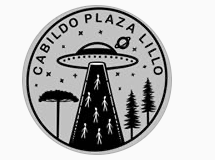
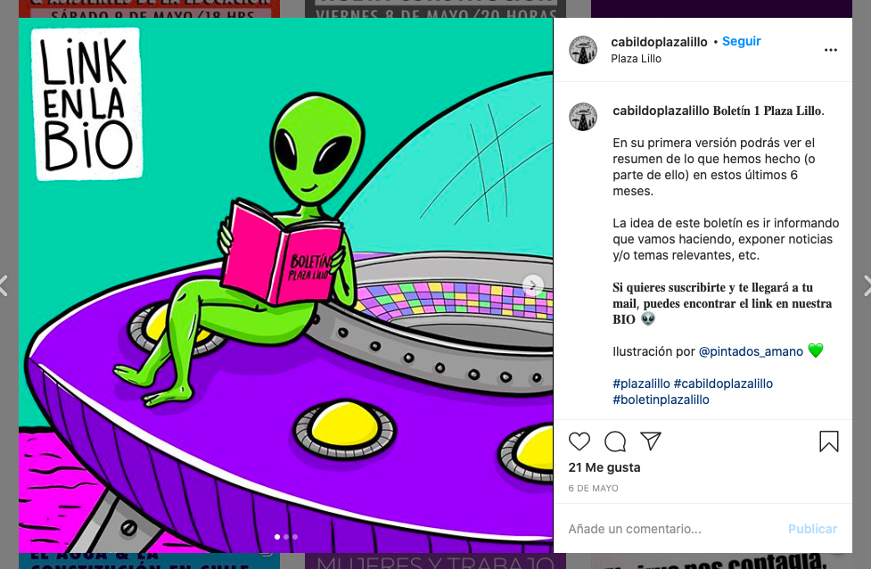
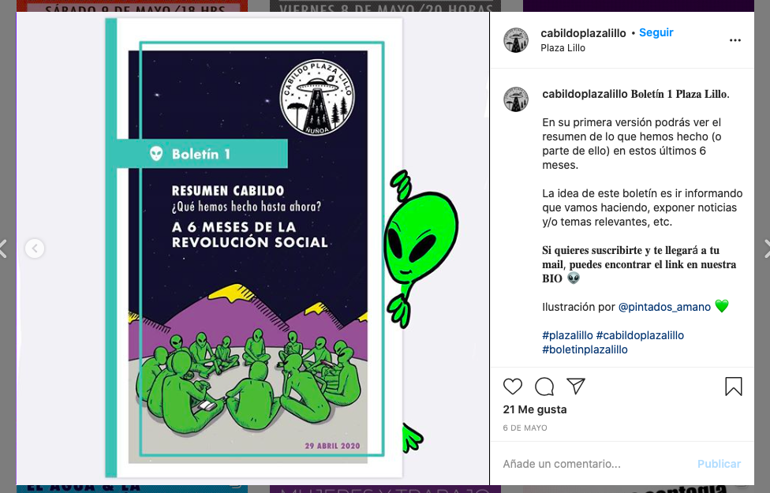
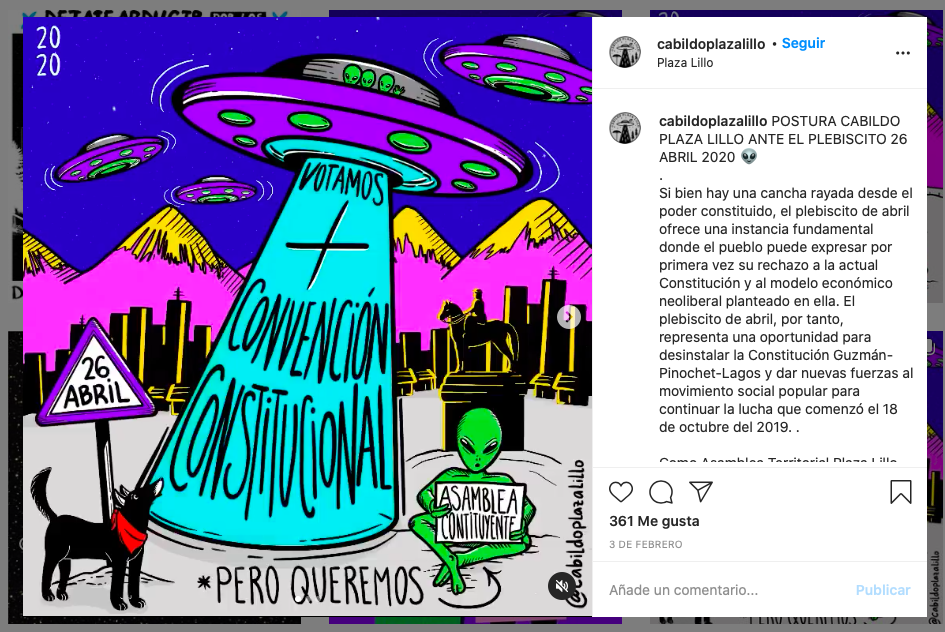

#### FOLIO: NUN2
# Cabildo Plaza Lillo

[instagram](https://www.instagram.com/cabildoplazalillo/)
[facebook](https://www.facebook.com/cabildoplazalillo2019)
[pagina web](https://linktr.ee/cabildoplazalillo)
<cabildoplazalillo@gmail.com>
---

### Representantes
#### No señala tener representantes.

---
### Interacciones frecuentes
#### 
* Voces x la dignidad
* Constitución 2021
* Cordón trinidad
* Cabildo plaza 18

### Redes sociales
#### ¿Para qué se utiliza la red social?
| Instagram | Facebook |  Pagina web
|---|---| ----
|Difusión de contenido audiovisual, actividades e información|Difusión de contenido audiovisual, actividades e información|
Información, documentos y otros|

### **Instagram**
| seguidores | seguidos | publicaciones | hashtag 
|---|---|---|---|
|1.571|762|244| #ollacomún

* Primera Publicación IG: 31/10/2020

---
### Frecuencia de publicación.

Publicaciones: 
* Feed: semanalmente
* Historias: semanalmente

Actividades: semanalmente

---
### Ubicación
* Plaza Eusebio Lillo

---
### Describir temas de interés y/o trabajo
* Organizacion territorial y barrial
* Feminismo
* Derechos humanos
* EDUCAR CONSTRUIR MOVILIZAR (sus objetivos)
* Proceso constituyente

---
### Describir la imagen ideal por la cual se trabaja.
#### (El horizonte hacia el cual se quiere avanzar.)
* Proceso constituyente que desde todos los puntos de vista, se arme desde las necesidades y sueños de la sociedad. [Link](https://www.instagram.com/p/B4dFhswBgCg/)
* Colaboración, organización y apoyo mutuo desde el barrio

---
### ¿Que se hace?
#### (Manifestaciones, marchas, intervenciones, actividades culturales, conversatorios, intercambio de saberes, actividades solidarias o de apoyo mutuo, abastecimiento, contra información, emplazamiento a autoridades etc.)
* Ciclos de cine en la plaza
* Cabildos y asambleas presenciales y virtuales
* Picnic comunitario
* Apoyo y colaboración a ollas comunes
    * Difusión sobre dónde se ubican y cómo aportar
* Newsletter comunitario
* Malón cultural y familiar
* Emplazamiento autoridades comunales y regionales
* Ciclos de articulación del poder constituyente
* Intervenciones artisticas 
* Manifestaciones
    * Marchas
    * Cacerolazos
* Actividades conmemorativas
* Difusión de emprendimientos vecinales
* Boletín mensual

---
### Describir y distinguir demandas más reivindicativas de espacios sin relación con lo contencioso o con lo político mas prefigurativo
#### (lo contencioso; demanda al Estado, a alguna autoridad, privados, etc), (prefigurativo, transformación desde lo cotidiano, etc.).
* Desean propiciar la reconstrucción del tejido social
* Vinculación barrial

---
### Tipo de organización interna.
#### 
Asambleismo y horizontalidad. Trabajan en comisiones.

---
### Describir los temas / imágenes- iconos / conceptos mas habitualmente presentes en sus publicaciones. Describir cambios/ transformaciones en los contenidos desde Octubre.

**Iconos:**
Tienen un logo que se representa por una nave espacial que abduce a siete personitas.

**Diseño estético:**
Tienen un diseño estetico bastante fijo. Utilizan dibujos de marcianos con pequeños mensajes entremedio de sus infografías o imagenes. Utilizan colores como el verde fluor, azul, rojo y rosado/morado.

---
### Percepciones que se tiene del Estado
#### (Aparato burocrático)
> Criminalización de la protesta. Gobierno criminal que no protege a los ciudadanos sino que a las empresas y la economía.

| Declaraciones | Link | 
|---|---|
|Anotar los comunicados | [Link]() |

---
### Percepciones que se tiene de las Fuerzas de Orden
#### (Aparato represivo)
> Violencia y abuso de poder. 

| Declaraciones | Link | 
|---|---|
|Anotar los comunicados | [Link]() |

---
### Incorporar aca notas, citas textuales, links, etc. extra a los ya incorporados, que sean de interés para comprender tanto la forma como los contenidos asociados a la organización.
* Percepción del proceso constituyente: hubieran preferido votar por una asamblea constituyente en vez de una *convención constitucional* 

* Feministas en duelo por violencia patriarcal. Archivo audiovisual. [Link](https://www.instagram.com/p/CDuP-TaJeQ1/)

* Boletín 6: aparte de contenido, posee herramientas para la orientacion socioemocional de los vecinos. Libros para la cuarentena y iniciativas de apoyo a otras organizaciones. [Link](https://mailchi.mp/01eb8ae5c79c/boletin6_cabildoplazalillo)