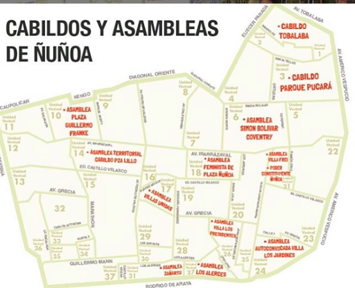

#### FOLIO: NUN3
# Asamblea Plaza D'Halmar

[instagram](https://www.instagram.com/asambleaplazadhalmar/)

---

### Representantes
#### No señalan tener representantes.

---
### Interacciones frecuentes
#### 
* Voces por la dignidad
* Asamblea villa frei
* asamblea los presidentes

### Redes sociales
#### ¿Para qué se utiliza la red social?
| Instagram |  
|---|
|Difusión actividades e información varias|

### **Instagram**
| seguidores | seguidos | publicaciones | hashtag 
|---|---|---|---|
|820|502|369| 0

* Primera Publicación IG: 25/01/2020
En las primera fotografía sale *Cabildo 2019* supongo que la organización comienza post protestas sociales y la apertura del instagram fue en verano. 

---
### Frecuencia de publicación.

Publicaciones: 
* Feed: Tres veces por semana
* Historias: diariamente
Actividades: Semanalmente

---
### Ubicación
* Plaza D’Halmar

---
### Describir temas de interés y/o trabajo
* Proceso constituyente
* Organizacion vecinal
* Recuperación del espacio publico

---
### Describir la imagen ideal por la cual se trabaja.
#### (El horizonte hacia el cual se quiere avanzar.)
* Comunidades organizadas que dialoguen sobre su territorio y se apropien del espacio publico
* Vivir con dignidad 

---
### ¿Que se hace?
#### (Manifestaciones, marchas, intervenciones, actividades culturales, conversatorios, intercambio de saberes, actividades solidarias o de apoyo mutuo, abastecimiento, contra información, emplazamiento a autoridades etc.)
* Asambleas ciudadanas
* Cine en la plaza
* Difusión de geolocalización de asambleas y cabildos de la comuna

* Jornadas de organizacion y asambleas barriales
* Manifestaciones
    * Cacerolazos
    * Velatones
* Muralismo y lienzos
* Propaganda apruebo y convencion constitucional
* Difusión de información de manifestaciones
* Cabildos y reuniones vecinales
* Contrainformación

---
### Describir y distinguir demandas más reivindicativas de espacios sin relación con lo contencioso o con lo político mas prefigurativo
#### (lo contencioso; demanda al Estado, a alguna autoridad, privados, etc), (prefigurativo, transformación desde lo cotidiano, etc.).
* Recuperación del espacio publico para los vecinos
* Organizacion territorial y barrial para el bienestar de los vecinos

---
### Tipo de organización interna.
#### 
Asambleismo y horizontalidad. Trabajan en comisiones.

---
### Describir los temas / imágenes- iconos / conceptos mas habitualmente presentes en sus publicaciones. Describir cambios/ transformaciones en los contenidos desde Octubre.
Su contenido se ha transformado segun el acontecer nacional. El ultimo tiempo su contnido se focalizó en el proceso constituyente y en la participación de los vecinos en distintas actividades de propaganda.

**Iconos:**
Es su icono de instagram y su logo. 

**Diseño estético:**
No tienen un diseño estetico fijo, suben información y actividades de muchas organizaciones, sin embargo, cuando son actividades propias le ponen su logo.

---
### Percepciones que se tiene del Estado
#### (Aparato burocrático)
> Complices de la violencia de FFEE. 

| Declaraciones | Link | 
|---|---|
|Anotar los comunicados | [Link]() |

---
### Percepciones que se tiene de las Fuerzas de Orden
#### (Aparato represivo)
> Ejecutores de violencia. Reprimen a matar. Amedrentan y usan indiscriminadamente aparatos de control de masas tales como gas pimienta, balines y gases lacrimogenos.

| Declaraciones | Link | 
|---|---|
|Ataque a vecina de villa Olimpica| [Link](https://www.instagram.com/p/CCRSBoypSrP/) |

---
### Incorporar aca notas, citas textuales, links, etc. extra a los ya incorporados, que sean de interés para comprender tanto la forma como los contenidos asociados a la organización.
