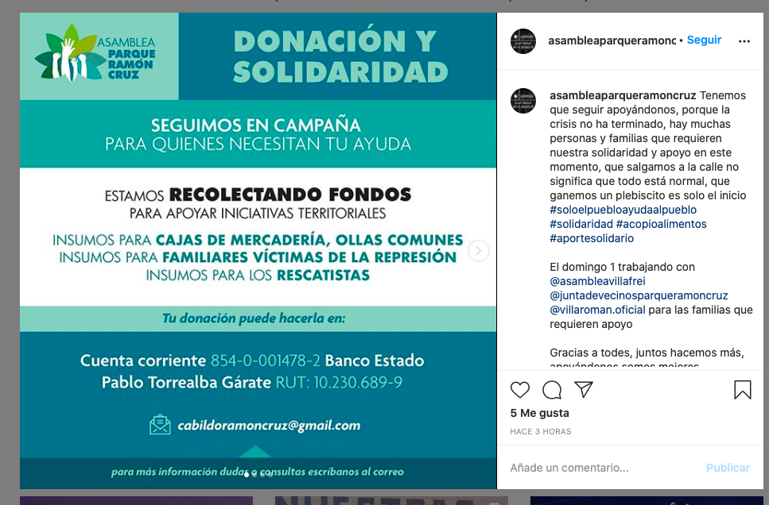
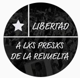

#### FOLIO: NUN4
# Asamblea Parque Ramón Cruz

[instagram](https://www.instagram.com/asambleaparqueramoncruz/)
<cabildoramoncruz@gmail.com>
---

### Representantes
#### No señalan tener representantes.

---
### Interacciones frecuentes
#### 
* JJVV Ramón Cruz
* Asamblea Villa Frei
* Voces x la dignidad

### Redes sociales
#### ¿Para qué se utiliza la red social?
| Instagram |  
|---|
|0|

### **Instagram**
| seguidores | seguidos | publicaciones | hashtag 
|---|---|---|---|
|703|213|195| 0

* Primera Publicación IG: 01/12/2020

---
### Frecuencia de publicación.

Publicaciones:
* Feed: Semanalente
* Historias: Semanalmente

Actividades: Una vez al mes

---
### Ubicación
* Parque Ramón Cruz / Villa Frei

---
### Describir temas de interés y/o trabajo
* Proceso constituyente
* Organizacion vecinal y barrial
* Derechos humanos

---
### Describir la imagen ideal por la cual se trabaja.
#### (El horizonte hacia el cual se quiere avanzar.)
* Co-educación para una nueva constitución
* Transformaciones sociales desde los territorios

---
### ¿Que se hace?
#### (Manifestaciones, marchas, intervenciones, actividades culturales, conversatorios, intercambio de saberes, actividades solidarias o de apoyo mutuo, abastecimiento, contra información, emplazamiento a autoridades etc.)
* Manifestaciones
    * Cacerolazos
    * Velatones
    * Marchas territoriales
* Donaciones monetarias a iniciativas territoriales
* Emplazamiento de autoridades locales
* DIufisón información de actividades
* Propaganda y campaña por el apruebo cc
* Asambleas y reuniones virtuales
* Jornadas de autoformación
* Conversatorios sobre el proceso constituyente
* Feria de las pulgas
* Marchas hacia plaza dignidad

---
### Describir y distinguir demandas más reivindicativas de espacios sin relación con lo contencioso o con lo político mas prefigurativo
#### (lo contencioso; demanda al Estado, a alguna autoridad, privados, etc), (prefigurativo, transformación desde lo cotidiano, etc.).
* Apoyo mutuo entre iniciativas territoriales de toda indole

---
### Tipo de organización interna.
#### 
Asambleismo y horizontalidad. Las donaciones monetarias se realizan en la cuenta de Pablo Torrealba. 

---
### Describir los temas / imágenes- iconos / conceptos mas habitualmente presentes en sus publicaciones. Describir cambios/ transformaciones en los contenidos desde Octubre.
Su contenido se transforma principalmente con la llegada de la cuarentena, comienzan con campañas de recoleccion de viveres para vecinos u ollas comunes. También se intensifican las publicaciones ligadas a las opciones apruebo y convencion constitucional en octubre hasta el dia de la votación.

**Iconos:**
Su icono de instagram no es el mismo que su logo. 

**Diseño estético:**
No tienen un diseño estetico fijo, suben información y actividades de muchas organizaciones, sin embargo, cuando son actividades propias le ponen su logo.

---
### Percepciones que se tiene del Estado
#### (Aparato burocrático)
> Estado asesino. Persecusión a protestantes y criminalización de la protesta. Priorizan la economia antes que la salud del pueblo. Violacion sistematica de dddhh.

| Declaraciones | Link | 
|---|---|
|Declaración pública CAÑU | [Link](https://www.instagram.com/p/B-uNbWKJC7V/) |
|Declaración dictadura en Chile 2020 | [Link](https://www.instagram.com/p/CA8nnQ9JHzy/) |

---
### Percepciones que se tiene de las Fuerzas de Orden
#### (Aparato represivo)
> Repudian el actuar de las fuerzas de orden. Uso excesivo de la violencia y detenciones arbitrarias. Utilización de aparatos para dispersar manifestantes sin una causa real. 

| Declaraciones | Link | 
|---|---|
|Declaración pública JJVV Parque Ramón Cruz | [Link](https://www.instagram.com/p/CCubYoDJBNk/) |

---
### Incorporar aca notas, citas textuales, links, etc. extra a los ya incorporados, que sean de interés para comprender tanto la forma como los contenidos asociados a la organización.
