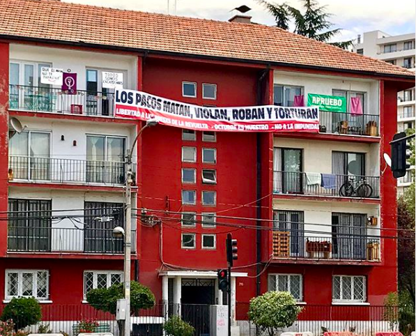

#### FOLIO: NUN5
# Asamblea Territorial Empart

[instagram](https://www.instagram.com/asambleaterritorialempart/)
[facebook]()
[twitter]()
<correo@correo.cl>
---

### Representantes
#### No señalan tener representantes.

---
### Interacciones frecuentes
#### 
* Asamblea villa olimpica
* cultura villa olimpica
* coordinadora asambleas ñuñoa
* cordón poniente
* cordón grecia

### Redes sociales
#### ¿Para qué se utiliza la red social?
| Instagram | 
|---|---|---|---|
|Difusión de informaciones y actividades|

### **Instagram**
| seguidores | seguidos | publicaciones | hashtag 
|---|---|---|---|
|1.324|605|222| 0

* Primera Publicación IG: 22/01/2020
Sin embargo, señalan en algunas previas tener actividades en diciembre 2019.

---
### Frecuencia de publicación.

Publicaciones:
* Feed: semanalmente
* historias: diariamente

Actividades: dos veces al mes.

---
### Ubicación
* Plaza Julio Guerra / Sector grecia y salvador

---
### Describir temas de interés y/o trabajo
* Organizacion territorial
* Derechos humanos
* Colaboración vecinal

---
### Describir la imagen ideal por la cual se trabaja.
#### (El horizonte hacia el cual se quiere avanzar.)
* Construir un país más justo para todas y todos
* Autoformación entre vecinos para transformar los territorios

---
### ¿Que se hace?
#### (Manifestaciones, marchas, intervenciones, actividades culturales, conversatorios, intercambio de saberes, actividades solidarias o de apoyo mutuo, abastecimiento, contra información, emplazamiento a autoridades etc.)
* Manifestaciones
    * Cacerolazos
    * Velatones
    * Marchas territoriales
* Actividades conmemorativas
* Canastas solidarias y dignas para vecinos
* Pintatones
* Difusión de contrainformación
* Difusión de actividades con otras organizaciones
* Conversatorios y charlas de autoeducacion
* Informacion de prevencion ante covid
* *Domingadas*: Jornadas culturales presenciales y virtuales

---
### Describir y distinguir demandas más reivindicativas de espacios sin relación con lo contencioso o con lo político mas prefigurativo
#### (lo contencioso; demanda al Estado, a alguna autoridad, privados, etc), (prefigurativo, transformación desde lo cotidiano, etc.).
* Soñar en conjunto el país y los territorios que queremos vivir y habitar
* *Nos volveremos a llamar pueblo* 

---
### Tipo de organización interna.
####
Asambleismo y horizontalidad. Funcionan con comisiones de trabajo.

---
### Describir los temas / imágenes- iconos / conceptos mas habitualmente presentes en sus publicaciones. Describir cambios/ transformaciones en los contenidos desde Octubre.
Su contenido ha variado por la actualidad nacional. Se manifiestan respecto a hechos noticiosos y toman postura ante estos.

**Iconos:**
Se representa por un conjunto de edificios rojos.

**Diseño estético:**
No tienen diseño estetico fijo. Utilizan mucho el color rojo y negro. Suben imagenes creadas pero también muchos videos y fotografías especificas ante cierta información que quieren dar.

---
### Percepciones que se tiene del Estado
#### (Aparato burocrático)
> Estado represor. violador de los ddhh. responsables directos de la violencia. impunes de sus crimenes [Link](https://www.instagram.com/p/CDU-dluJeu0/)

---
### Percepciones que se tiene de las Fuerzas de Orden
#### (Aparato represivo)
> Brazo armado del estado. violencia desmedida a matar. impunes de sus crimenes.

| Declaraciones | Link | 
|---|---|
|Anotar los comunicados | [Link]() |

---
### Incorporar aca notas, citas textuales, links, etc. extra a los ya incorporados, que sean de interés para comprender tanto la forma como los contenidos asociados a la organización.
