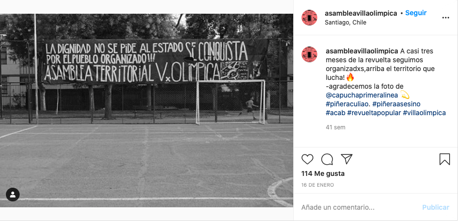
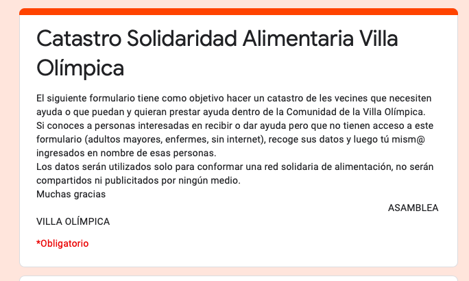
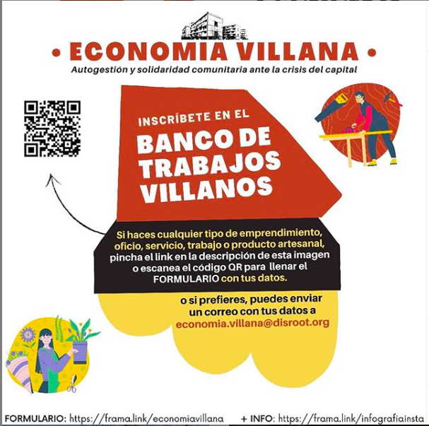
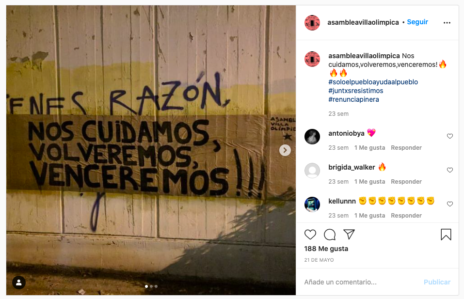
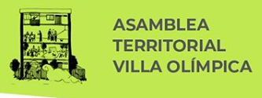

#### FOLIO: NUN6
# Asamblea Popular Villa Olimpica

[instagram](https://www.instagram.com/asambleavillaolimpica/)
[facebook](https://www.facebook.com/Asamblea-Villa-Ol%C3%ADmpica-113143126775585/)
<difusionvillaolimpika@gmail.com>
---

### Representantes
#### 
No señalan tener representantes.

---
### Interacciones frecuentes
#### 
* Cordon grecia
* Cordon macul
* Coordinadora asambleas ñuñoa

### Redes sociales
#### ¿Para qué se utiliza la red social?
| Instagram |  
|---|---|---|---|
|Difusión de informaciones y actividades|

### **Instagram**
| seguidores | seguidos | publicaciones | hashtag 
|---|---|---|---|
|4.210|1.145|232| 6

* Primera Publicación IG: 24/10/2019
**No** ha subido publicaciones desde el 31/07/2020. En facebook su ultima publicacion es el 24/08/2020.

---
### Frecuencia de publicación.

Publicaciones: 
* Feed: Dos veces a la semana
* Historias: semanalmente

Actividades: Semanalmente

---
### Ubicación
* Villa Olimpica

---
### Describir temas de interés y/o trabajo
* Organización barrial
* Derechos humanos
* Apoyo mutuo

---
### Describir la imagen ideal por la cual se trabaja.
#### (El horizonte hacia el cual se quiere avanzar.)
> La dignidad no se pide al estado, se conquista por el pueblo organizado

* Apoyo y solidaridad barrial
* Apropiacion del espacio publico

---
### ¿Que se hace?
#### (Manifestaciones, marchas, intervenciones, actividades culturales, conversatorios, intercambio de saberes, actividades solidarias o de apoyo mutuo, abastecimiento, contra información, emplazamiento a autoridades etc.)
* olla común
* acopio solidaro
* contrainformación
* cabildos y asambleas ciudadanas
* manifestaciones
    * marchas territoriales
    * pasacalles
    * cacerolazos
    * velatones
* Talleres y jornadas culturales familiares
    * obras de teatro
    * talleres de creacion artistico musical para niñes
    * taller de creacion de mascaras
    * Cine al aire libre
* Ferias de artes y oficios
* Onces comunitarias
* Dialogos sobre el proceso constituyente
* Jornadas de mantencion de bicicletas
* Jornadas de talleres feministas
* proyecto de solidarida alimentaria
* Catastro para ayuda solidaria

* Economia villana / bancos de trabajo

---
### Describir y distinguir demandas más reivindicativas de espacios sin relación con lo contencioso o con lo político mas prefigurativo
#### (lo contencioso; demanda al Estado, a alguna autoridad, privados, etc), (prefigurativo, transformación desde lo cotidiano, etc.).
* Organizacion territorial para un mejor vivir
* Dignidad para la vida
* Resistir y cuidarse para vencer

---
### Tipo de organización interna.
#### 
Asambleismo y horizontalidad. Funcionan con comisiones de trabajo.

---
### Describir los temas / imágenes- iconos / conceptos mas habitualmente presentes en sus publicaciones. Describir cambios/ transformaciones en los contenidos desde Octubre.
Su contenido variaba segun los diversos hechos noticiosos que acontecian en el país. 

**Iconos:**
Se representa con un edificio.

**Diseño estético:**
No tienen un diseño estetico fijo, esto se puede fundamentar con que trabajan en comisiones entonce scada comision hace sus propios afiches. 

---
### Percepciones que se tiene del Estado
#### (Aparato burocrático)
> Piñera asesino. Criminalizacion de la protesta social, diciendo que el movimiento es delictual y no social. Inventan guerras, no les interesa el pueblo sino sus propios intereses.

| Declaraciones | Link | 
|---|---|
|COMUNICADO 8/11/2019 | [Link](https://www.instagram.com/p/B4nFMWEH7C9/) |

---
### Percepciones que se tiene de las Fuerzas de Orden
#### (Aparato represivo)
> Fuera los militares de la calle. Pacos asesinos.

| Declaraciones | Link | 
|---|---|
|Anotar los comunicados | [Link]() |

---
### Incorporar aca notas, citas textuales, links, etc. extra a los ya incorporados, que sean de interés para comprender tanto la forma como los contenidos asociados a la organización.

* Foco actual de la asamblea al abastecimiento comunitario y apoyo mutuo ante la crisis sociosanitaria [link](https://www.instagram.com/p/CCevqZkn66B/)