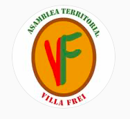
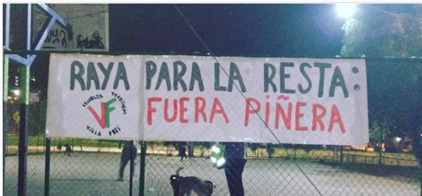

#### FOLIO: NUN7
# Asamblea Villa Frei

[instagram](https://www.instagram.com/asambleavillafrei/)
[facebook](https://www.facebook.com/asambleavillafrei/)
[twitter](https://www.twitter.com/asamblea_t_vf)
---

### Representantes
####
No señalan tener representantes.

---
### Interacciones frecuentes
#### 
* Unidad de género villa frei
* cordon grecia
* asamblea parque ramón cruz
* Cordon poniente
* Coordinadora asambleas la florida

### Redes sociales
#### ¿Para qué se utiliza la red social?
| Instagram | Facebook | Twitter | Otra 
|---|---|---|---|
|Difusión de información y actividades |Difusión de información, imagenes audiovisuales y actividades| Difusión de declaraciones e información compartida de otros medios|

### **Instagram**
| seguidores | seguidos | publicaciones | hashtag 
|---|---|---|---|
|2.877|185|211| 0

* Primera Publicación IG: 08/11/2019

---
### Frecuencia de publicación.

Publicaciones:
* Feed: semanalmente
* Historias: semanalmente

Actividades: Dos veces al mes.

---
### Ubicación
* Villa Frei / Parque Ramón Cruz 

---
### Describir temas de interés y/o trabajo
* Organizacion comunitaria y barrial
* Apoyo mutuo

---
### Describir la imagen ideal por la cual se trabaja.
#### (El horizonte hacia el cual se quiere avanzar.)
* Organizacion y resistencia para el buen vivir
* Bienestar comunitario

---
### ¿Que se hace?
#### (Manifestaciones, marchas, intervenciones, actividades culturales, conversatorios, intercambio de saberes, actividades solidarias o de apoyo mutuo, abastecimiento, contra información, emplazamiento a autoridades etc.)
* Manifestaciones
    * Marchas intercomunas
    * Cacerolazos
    * Velatones
* Actos politicos culturales
* Actividades conmemorativas
* Asambleas presenciales y virtuales
* Cooperativas de abastecimiento
* Jornadas de acopio y apoyo mutuo vecinal
* Jornadas de agitación y propaganda
* Jornadas de feminismos
* Actividades culturales familiares
* Escuela de Verano Villa Frei
    * Talleres para niñes
    * Conversatorios contrainformativos
* Quema del mono - año nuevo 

---
### Describir y distinguir demandas más reivindicativas de espacios sin relación con lo contencioso o con lo político mas prefigurativo
#### (lo contencioso; demanda al Estado, a alguna autoridad, privados, etc), (prefigurativo, transformación desde lo cotidiano, etc.).
* Ahora que nos encontremos, no nos soltemos
* Autogestión y organización para la revolución
* Pueblo organizado consciente y combatiente

---
### Tipo de organización interna.
#### 
Asambleismo y horizontalidad. Funcionan con comisiones de trabajo.

---
### Describir los temas / imágenes- iconos / conceptos mas habitualmente presentes en sus publicaciones. Describir cambios/ transformaciones en los contenidos desde Octubre.
Su contenido se ha mantenido a lo largo del tiempo. Se generan quiebres en el contenido cuando sucede algun acontecimiento noticioso, sin embargo, siempre retornar los contenidos que ya han levantado como asamblea. 

**Iconos:**
Su icono son las iniciales de los nombres de la asamblea. 

**Diseño estético:**
Utilizan estrellas encima de las fotos con el objetivo de proteger la identidad de quienes participan en la asamblea.

No tienen un diseño estetico definido para todas sus publicaciones, pero las actividades que se realizan en *jornadas* tienen diseños similares ya que están "englobadas" en una actividad más grande.

---
### Percepciones que se tiene del Estado
#### (Aparato burocrático)
> Gobierno represor, violador de derechos humanos. Piñera asesino, renuncia Piñera. Politica sistematica de represion a la protesta social y hostigamiento politico hacia integrantes de la asamblea.

| Declaraciones | Link | 
|---|---|
|Declaración ¡Que se vayan los pacos! | [Link](https://www.instagram.com/p/CGkwDPNpus_/) |

---
### Percepciones que se tiene de las Fuerzas de Orden
#### (Aparato represivo)
> Hay plata para la represión y no para el pueblo. Hostigan amedrentan y persiguen a vecinxs de la villa. Criminalizan la protesta. 

| Declaraciones | Link | 
|---|---|
|Declaracion covid19 | [Link](https://www.instagram.com/p/B_TR-GTJ175/) |
|Declaración 15/07 | [Link](https://www.instagram.com/p/CCv4ROGJpm9/) |

---
### Incorporar aca notas, citas textuales, links, etc. extra a los ya incorporados, que sean de interés para comprender tanto la forma como los contenidos asociados a la organización.
