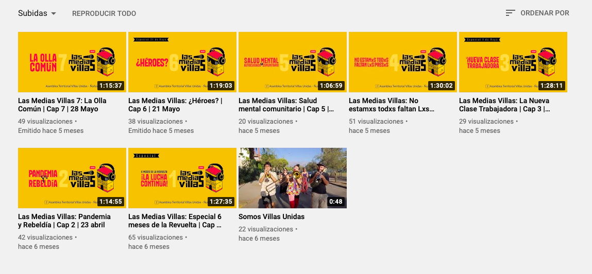
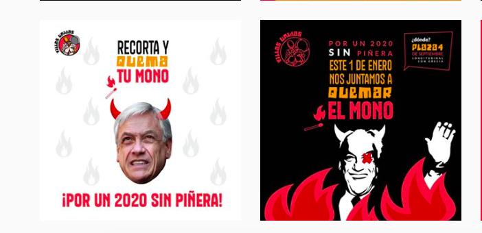
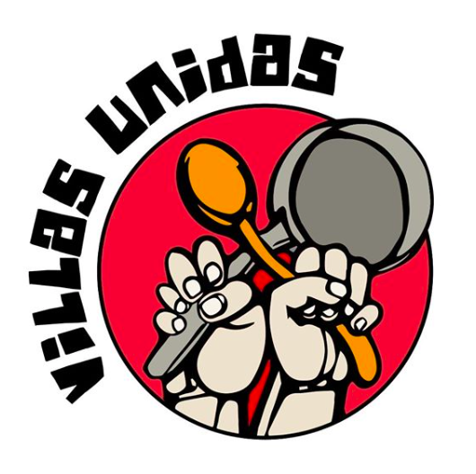
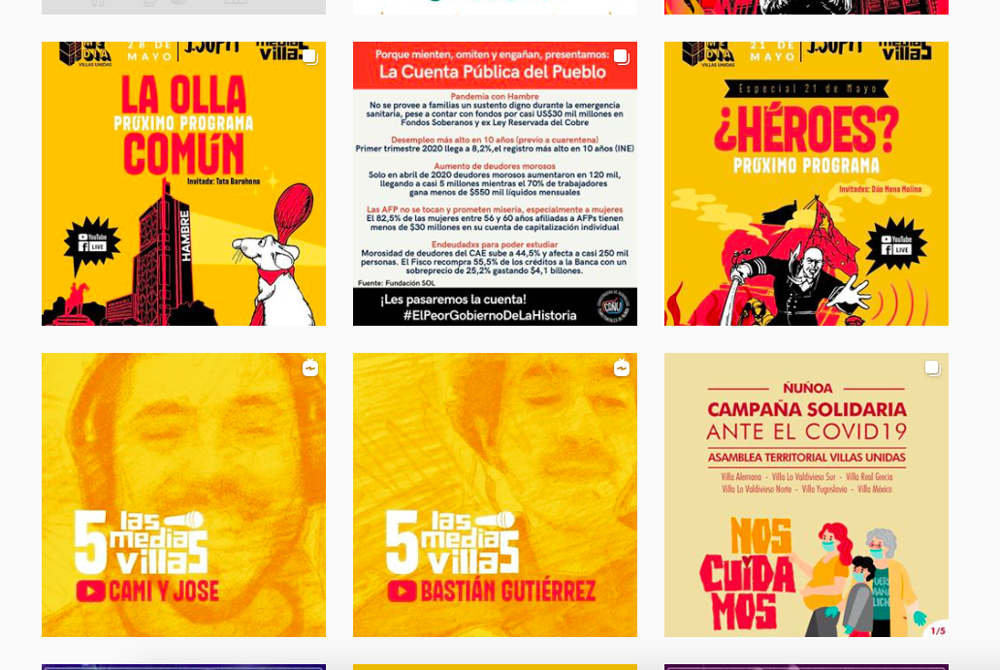
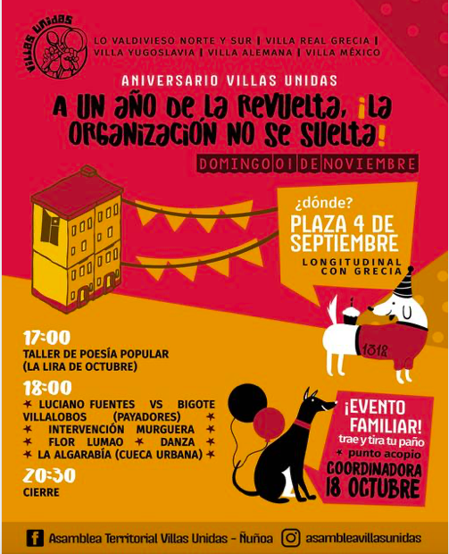

#### FOLIO: NUN8
# Asamblea Villas Unidas - Nuñoa

[instagram](https://www.instagram.com/asambleavillasunidas)
[facebook](https://www.facebook.com/asambleavillasunidas/)
[youtube](https://www.youtube.com/channel/UCMLUP1wOQYToSjpncYnd44w)
<asambleacabildogrecia@gmail.com>

---

### Representantes
#### 
No señalan tener representantes.

---
### Interacciones frecuentes
#### 
* Cordon grecia
* coordinadora asambleas la florida
* cordon poniente

### Redes sociales
#### ¿Para qué se utiliza la red social?
| Instagram | Facebook | Youtube |
|---|---|---|---|
|Difusión de información y actividades | Difusión de actividades |Podcast y presentacion de la asamblea| 0|

### **Instagram**
| seguidores | seguidos | publicaciones | hashtag 
|---|---|---|---|
|1.624|537|165| 3

* Primera Publicación IG: 17/11/2019

---
### Frecuencia de publicación.

Publicaciones:
* Feed: semanalmente
* Historias: diariamente

Actividades: dos veces al mes.

---
### Ubicación 
Longitudinal con Grecia / Plaza 4 de septiembre. La organizacion reune diversas villas de blocks:
1. Villa Lo valdivieso norte y sur
2. Villa real grecia
3. Villa yugoslavia
4. Villa alemana
5. Villa mexico

---
### Describir temas de interés y/o trabajo
* Apoyo mutuo
* Organizacion barrial y vecinal
* Derechos humanos

---
### Describir la imagen ideal por la cual se trabaja.
#### (El horizonte hacia el cual se quiere avanzar.)
* Construir organización territorial
* Vivir en dignidad, organizarse para el mejor vivir colectivo 

---
### ¿Que se hace?
#### (Manifestaciones, marchas, intervenciones, actividades culturales, conversatorios, intercambio de saberes, actividades solidarias o de apoyo mutuo, abastecimiento, contra información, emplazamiento a autoridades etc.)
* Podcast y conversaciones en vivo de tematicas

* Manifestaciones
    * Cacerolazos
    * Marchas barriales 
    * Velatones
* Actividades conmemorativas
    * Intervenciones conmemorativas
    * Muralismo conmemorativo
* Apoyo mutuo por la crisis
    * Jornadas solidarias
    * Donaciones monetarias
    * Acopio de alimentos
* Celebración de año nuevo

* Jornadas de agitacion y propaganda por los presos politicos
* Asambleas virtuales y presenciales
* Apoyo a vecinos emprendedores con campaña ¡Vecinx yo te compro!

---
### Describir y distinguir demandas más reivindicativas de espacios sin relación con lo contencioso o con lo político mas prefigurativo
#### (lo contencioso; demanda al Estado, a alguna autoridad, privados, etc), (prefigurativo, transformación desde lo cotidiano, etc.).
* Memoria, justicia y dignidad
* Autogestion y organizacion para la revolución

---
### Tipo de organización interna.
#### 
Asambleismo y horizontalidad. Funcionan con comisiones de trabajo.

---
### Describir los temas / imágenes- iconos / conceptos mas habitualmente presentes en sus publicaciones.  Describir cambios/ transformaciones en los contenidos desde Octubre.

**Iconos:**
Se representa por unas manos, una cacerola y una cuchara.

**Diseño estético:**
Tienen un diseño estetito fijo. La mayoria de las publicaciones que se salen de este estilo es porque son invitaciones a actividades de otras organizaciones. Utilizan los colores amarillos y rojo, con letras blancas y negras. 

---
### Percepciones que se tiene del Estado
#### (Aparato burocrático)
> Gobierno negligente que no se interesa por el pueblo. Criminalizacion de la protesta social. Normalizacion de la violencia en las protestas. 

| Declaraciones | Link | 
|---|---|
|Anotar los comunicados | [Link]() |

---
### Percepciones que se tiene de las Fuerzas de Orden
#### (Aparato represivo)
> Disolucion total de carabineros. Criminales que han asesinado al pueblo que lucha. 

| Declaraciones | Link | 
|---|---|
|Ante el actuar de carabineros | [Link](https://www.instagram.com/p/CF6ENXRpILx/) |

---
### Incorporar aca notas, citas textuales, links, etc. extra a los ya incorporados, que sean de interés para comprender tanto la forma como los contenidos asociados a la organización.

* Celebracion aniversario de la asamblea

* Creación de protocolo de violencia de género para la asamblea por denuncias hacia un integrante [Link](https://www.instagram.com/p/CCjDwqep4Q8/)