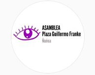
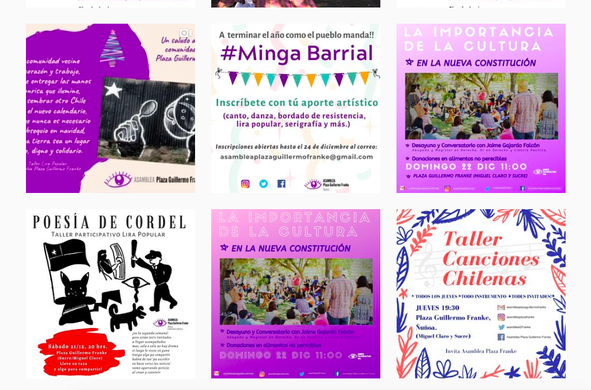

#### FOLIO: NUN9
# Vecinxs autoconvocados Plaza Guillermo Franke

[instagram](https://www.instagram.com/asambleaplazafranke/)
[facebook](https://www.facebook.com/AsambleaplazaGF)
[twitter](https://twitter.com/asambleaGFranke)
<asambleaplazaguillermofranke@gmail.com>
---

### Representantes
#### 
No señalan tener representantes.

---
### Interacciones frecuentes
#### 
* Coordinadoras vecinales ñuñoa
* Bloque secundario oriente
* Esquina de la dignidad
* Asamblea Plaza D'halmar

### Redes sociales
#### ¿Para qué se utiliza la red social?
| Instagram | Facebook | Twitter | Otra 
|---|---|---|---|
|Difusión de información y actividades|Difusión de información, videos y actividades|Difusión de información| 0|

### **Instagram**
| seguidores | seguidos | publicaciones | hashtag 
|---|---|---|---|
|1.005|565|256| 0

* Primera Publicación IG: 17/11/2019

---
### Frecuencia de publicación.

Publicaciones:
* Historias: Semanalmente
* Feed: Dos veces a la semana

Actividades: Mensualmente

---
### Ubicación
* Sector miguel claro / manuel montt. Se consideran como ñuñoa/providencia

---
### Describir temas de interés y/o trabajo
* Proceso constituyente
* Organización barrial
* Apoyo mutuo barrial
* Democratización del conocimiento

---
### Describir la imagen ideal por la cual se trabaja.
#### (El horizonte hacia el cual se quiere avanzar.)
* Territorios organizados
* Autoeducación barrial

---
### ¿Que se hace?
#### (Manifestaciones, marchas, intervenciones, actividades culturales, conversatorios, intercambio de saberes, actividades solidarias o de apoyo mutuo, abastecimiento, contra información, emplazamiento a autoridades etc.)
* Manifestaciones
    * Cacerolazos
    * Marchas
    * Banderazos
* Actividades conmemorativas
* Intervenciones callejeras y muralismo
* Asambleas informativas y de debate
* Conversatorios y talleres virtuales
* Desayunos barriales
* Jornadas culturales
    * Malones
    * Mingas
    * Ferias libres
* Exposición trabajo de comisiones
* Concursos literarios de poesia pandemica
* Campañas solidarias de recoleccion de enseres para personas en situacion de calle

---
### Describir y distinguir demandas más reivindicativas de espacios sin relación con lo contencioso o con lo político mas prefigurativo
#### (lo contencioso; demanda al Estado, a alguna autoridad, privados, etc), (prefigurativo, transformación desde lo cotidiano, etc.).
* Crear espacios de comunicación y educación desde el respeto y la diversidad de opiniones

---
### Tipo de organización interna.
#### 
Asambleismo y horizontalidad. Funcionan con comisiones de trabajo.

---
### Describir los temas / imágenes- iconos / conceptos mas habitualmente presentes en sus publicaciones. Describir cambios/ transformaciones en los contenidos desde Octubre.
Sus contenidos se han ajustado a sucesos nacionales y al calendario del proceso constituyente. También han conmemorado feriados y fechas relevantes para la comunidad.

**Iconos:**
Su icono se representa por un ojo y el nombre de la asamblea en color negro.

**Diseño estético:**
No tienen un diseño estetico fijo, sin embargo, siempre utilizan el color morado en las publicaciones propias de la asamblea. Comparten información de otras organizaciones y material audiovisual.

---
### Percepciones que se tiene del Estado
#### (Aparato burocrático)
> No han dado justicia ni reparacion a las victimas del aparato represivo en medio del estallido social. 

| Declaraciones | Link | 
|---|---|
|Anotar los comunicados | [Link]() |

---
### Percepciones que se tiene de las Fuerzas de Orden
#### (Aparato represivo)
> Criminales que reprimen al pueblo.

| Declaraciones | Link | 
|---|---|
|Anotar los comunicados | [Link]() |

---
### Incorporar aca notas, citas textuales, links, etc. extra a los ya incorporados, que sean de interés para comprender tanto la forma como los contenidos asociados a la organización.
